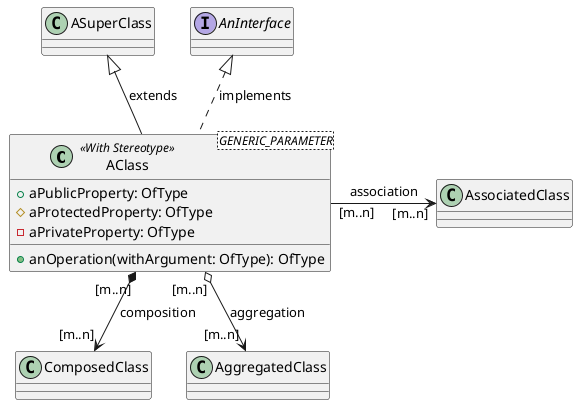
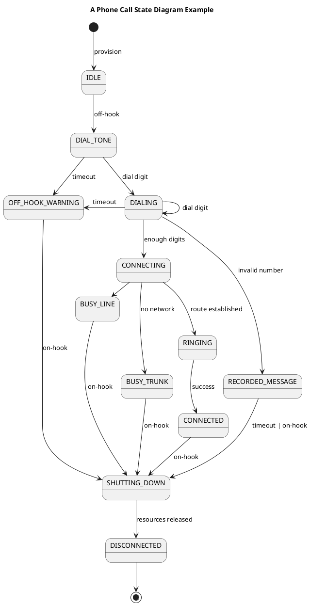

# The Information Model


This article is part of the series on [Impractical Domain Driven Development](https://medium.com/salduba/impractical-domain-driven-development-b9af36b0ede1) focusing on the creation of the information model of the system as part of architectural design activities. The framework article describes the information model:

> **Information Model**: What does the system keep as its internal state during and between activities and the structure of this state in smaller, well defined data structures.

The role of the information model in a computing system is to be able to describe the state of the system in a way that a development team, and possibly external stakeholders can understand the information it stores and then how the system uses it to respond to inputs and affect its environment.

## What is *State*

In following the impractical approach of the series, we will anchor the concept of *State* onto solid first principles, when talking about something as fuzzy as *state*, it is actually useful to go back to Turing's own formulation [Turing Machines.](https://plato.stanford.edu/entries/turing-machine/) In the original formulation the *state* state of the machine is simply an identifier of one of a finite number of possible states. In any binary (or discrete in general) system, this does not pose any constraints, one just needs to add more bits to the representation of the state to make it as granular as needed. So, at the bottom of it all the state is just a big binary number. Clearly this is not a reasonable answer for any real world system because of a couple of fundamental issues:

1. Systems need to be built, operated and maintained by people, so the state, together with the rest of the system needs to be understandable, and people are very bad at understanding unstructured bit fields of bits.

2. Regardless of [Moore's law](https://en.wikipedia.org/wiki/Moore%27s_law), performance limits of real computing, memory and communications hardware require the state to be partitioned, replicated, cached, etc..

To address these obstacles, we need to dig a bit deeper into how state is handled in computing systems by looking at their lifespan, the physical topology of storage and the technologies available to represent state.

The lifespan of specifics part of the state may be:

- Tied to the processing of a single input or request. In traditional programming languages this state is commonly kept in the "call stack" of the program. Usually this state can be purely "local" to the processing element.

- Used as "context" for a set of inputs or requests that occur in a reasonably short time interval. This context takes the form of "session" parameters in web applications, processing windows in event processing or data blocks in batch processing.

- Operational state that is modified/updated in the normal course of use of the system and it is expected to survive system restarts and other operational incidences. File systems, databases (in memory or permanent storage), etc... are commonly used to store and manage this state. Parts of this state may also have multiple replicas in the system for redundancy, performance, etc. which need to be synchronized.

- Configuration state, which is similar in implementation to the Operational State, but not usually updated during normal use of the system. Configuration state is updated only when the behavior of the system needs to change. Changes to the configuration state may involve system restarts or upgrades.

For each of these tiers, there are tradeoffs to be made between access speed, storage capacity and cost, which lead to the selection of different technologies for the different tiers.

It is very unusual to deal with a single storage space for the complete state. Even in small applications, storage is structured into some form of working stack, a global memory heap and some form of persistent storage, which in the simplest applications can just be a flat file in the operating system. Current applications and systems are much larger and increasingly subject to non functional requirements like jurisdictional data residency, privacy and security etc. As systems grow in complexity, so does the sophistication of the storage systems available to keep state, including:

- Working "stack" and "heap" memory in a thread or process. 
- Local and remote (network) file systems. 
- Databases using their own structure and access mechanisms. E.g. SQL databases partition the storage available to the application into databases, schemas, tables, rows and columns while internally using their own storage structures to optimize performance and scalability.
- Web or API based storage services with their own API's and structures.

The takeaway from this discussion is that in any real system state will be partitioned and the architecture and design of the system must explicitly address how to split the state and select the right technologies and storage topologies for the system. Fortunately, for broad classes of systems, design patterns have emerged that provide a good default recipe for the architecture, sometimes embodied in programming frameworks like [Ruby on Rails](https://rubyonrails.org/) or the [Java Platform, Enterprise Edition (Java EE) \| Oracle Technology Network](https://www.oracle.com/java/technologies/java-ee-glance.html). The downside of these patterns and frameworks is that they get ingrained in the practices of development teams and end up being applied "by-default" to systems that don't fit them (e.g. µ-services environments), frequently with disastrous results.

If the design of a system needs to address how state will be kept and managed, and even more importantly, understanding the state of the system is critical for a development, we need a solid set of practices and tools to express it.


---

# Describing System State


Describing the state of a system is at its core a problem of organizing and presenting information about the world. This is probably one of the oldest and most studied topics in history ever since Philosophy is practiced. There are a few tools coming from the field of [Ontology](https://en.wikipedia.org/wiki/Ontology) that are used everyday by engineers and architects, many times without even realizing, that are worth reviewing. When needing to describe a domain, we describe the object or entities that are in the domain, how we identify them, how they are similar or different, what attributes they have, how they are related to each other and what events and changes we can effect or observe in those objects. The conceptual tools to do this systematically are well understood.

## Identity

In any description of the objects of a domain, the ability to define whether two presented objects are the same or not is a critical consideration in modeling. THis may feel very abstract and theoretical, but it has direct implications for how we design databases with natural or synthetic keys, how to implement equality comparisons in code and whether we are dealing with "Pass by Value" or "Pass by reference" semantics in a system.

## Categorization and Classification

When presented with objects of the domain, we can group them in categories based on some criteria of similarity or equality. These categories may themselves be grouped in larger categories, resulting in a Classification, which can be purely hierarchical or form a graph-like structure.

## Decomposition and Properties

Objects in a domain can be described by providing descriptions of "parts" that together form it. Each part is itself subject to categorization and is a "property" of the object. Properties may take the form of a database column, an attribute of an object or a method that retrieves a value. The essential characteristic of a property is that it must be observable, that is that its value can be obtained from the object or the domain.

## Relations and References

A particular kind of "part" of an object may be a reference to another object that is not the object itself. A reference to another object in its most general form any mechanism that allows the holder of the reference to access the target object. The common implementation of a reference is to define a value that is a "pointer" to the referred object and an underlying mechanism that, given the "pointer" value, retrieves the object. In programming languages, the pointer may be a memory address, the look up logic in the memory heap and the associated class code to interpret the memory contents. In databases it may be a Table name, column name and value that represent a Foreign key/Primary Key pair, plus the database engine and its indexes to retrieve the appropriate record. In distributed systems a reference needs to identify the network address (the endpoint) where the object will be located plus an identification of the object local to the endpoint. Note that there may be other forms of "reference" for an object, for example an assertion on the properties of the object that uniquely identify it.

References between objects may have associated meaning or interpretations, providing the way to describe relationships between objects like "father of" or "supported by".

## Patterns

The Objects in a domain can be arranged in [patterns](https://www.amazon.com/Design-Patterns-Elements-Reusable-Object-Oriented/dp/0201633612/?&_encoding=UTF8&tag=saldubatechno-20&linkCode=ur2&linkId=205da23e03bd852215de12c4a7afac05&camp=1789&creative=9325) which are significant in the description of the domain. The usefulness of patterns is that they can describe the behavior of groups of objects independent of specific properties of those objects, similarly to how [abstract algebra](https://www.amazon.com/Book-Abstract-Algebra-Second-Mathematics/dp/0486474178?&_encoding=UTF8&tag=saldubatechno-20&linkCode=ur2&linkId=4cfde7ed3085580849f7f6a187286bf5&camp=1789&creative=9325) allows us to reason about the structure and behavior of sets without knowing all the specifics of the elements of those sets. Most programming languages and tools provide the basic patterns of collections (lists, lets, maps). Languages that provide [Generics or Templates](https://en.wikipedia.org/wiki/Generic_programming) in their type system directly support the definition of patterns by developers, with some languages (e.g. [Scala](https://www.scala-lang.org/)) providing higher level generics that support very sophisticated modeling of a domain's structure.


---

# Software Models


Computers don't know about apples, cars, birthdays, structural beams or colors, which are the concepts that end up being interesting to computer users. From the early computers and the decisions for how to represent data (binary, ASCII, EBCDIC), The evolution in software tools has been to create more expressive and flexible representations that allow designers to implement systems that can interact with users in their conceptual space. There are many high level paradigms available to designers, among them, the relational model, Abstract Data Types, Object Oriented Development and Functional Programming form the foundation of most modern designs.

## The Relational Model

One of the most important and powerful ways to describe data is the [Relational Model](https://www.amazon.com/Database-Relational-Model-Retrospective-Analysis/dp/0201612941?&_encoding=UTF8&tag=saldubatechno-20&linkCode=ur2&linkId=6426e9faa01f2226903c1dfdf83eb13e&camp=1789&creative=9325), originally proposed by [E.F. Codd](https://en.wikipedia.org/wiki/Edgar_F._Codd). The atopic elements of information in the model are values of a limited set of types representing numbers, text, dates, etc... which are then grouped in "Relations", which are tuples of named attributes with their associated primitive type. Each instance of such a relation becomes a "record" and the collection of records becomes a "table", or frequently also a "relation" overloading the original term. This structure is not original to the Relational Model. The innovation and power comes from defining a set of operations on them, and structuring those operations into a formal algebra or relational calculus. With that formal framework available, each record can be interpreted as a "fact" of the world that the system describes and operations (selects, joins, etc...) allow the system to synthesize derived facts on-demand to fit specific use cases or needs. The formalism of the relational model has also enabled a strong separation between the concepts that the application developers use (tables, records, columns, ..) and the lower level resources used to implement them (files, caches, etc...) with very little [abstraction leakage](https://en.wikipedia.org/wiki/Leaky_abstraction). This abstraction is so powerful that it enables designers to think in terms of "Entity-Relationships" to describe the structure and contents of their systems.

## Abstract Data Types

The relational model strength is in the representation of facts as entities and their relationships, offering relatively poor capabilities to express complex behavior, being usually limited to [CRUD operations](https://en.wikipedia.org/wiki/Create,_read,_update_and_delete) of records. [Abstract Data Types](https://en.wikipedia.org/wiki/Abstract_data_type), first proposed by [Barbara Liskov](https://en.wikipedia.org/wiki/Barbara_Liskov), are based on mathematical algebraic structures, lending them a strong foundation to support complex modeling activities. They emphasize the behaviors associated with a part of the system state by allowing an arbitrary number of operations on it. The internal structure of an abstract data type is opaque and is only "knowable" by observing the results of operations on it. The original definitions of ADT's proposed a complete algebraic description of those behaviors, which is very attractive in theory, but impractical beyond simple examples like the specification of an unbounded stack (in a Python-like syntax) due to its verbosity:

```python
# Signature

class Stack():
	def push(e): Stack
	def pop(): Stack
	def top(): Object
	def count(): Int

# Specification (assertions)

Stack().count() == 0
Stack().pop() == None
for all stack in Stack:
	assert(
		stack.pop().count() == stack.count() - 1 if stack.count() != 0
		else stack.pop().count() == 0
	)
	for all e in element:
		assert(stack.push(e).count() == stack.count() + 1)
		assert(stack.push(e).pop() == stack)
		assert(stack.push(e).pop().top() == e)		
``` 

Even without the benefit of formal specifications, the importance of ADT's for describing the state of a system cannot be overstated. The focus on definition by behavior and the introduction of the concept of a "Type" or "Class" of values in the system is essential in describing the information model of a system.

## Functional Programming

[Functional programming\'s](https://en.wikipedia.org/wiki/Functional_programming) main abstraction is that of a "function", understood as a transformation of a value into another value without any other side effects or actions. 

Functional Programming is based on lambda calculus, again providing a strong foundation for handling modeling complexity. The values subject to functional transformations are, like in the case of ADT's, instances of a *Type* that describes how they behave and what kinds of transformations (functions) can be applied to them. Functions apart from being applied to values, can be composed and referenced, being themselves values that can be acted on. Functional programming is also based on On the surface, a programming paradigm that explicitly excludes any side effects would be useless as it would even prevent interaction with the outside world as I/O would be considered a side effect. Modern functional languages have constructs to view these side effects as values themselves so that they fit in the theoretical model given by Lambda calculus. Focusing on value transformations, functional programming may not be as relevant in the description of the state of the system but the composability of behavior and the strong foundation of Lambda calculus are very valuable tools in the conceptual modeling of systems.

## Object Oriented Development

It is safe to say that [Object Oriented Development](https://en.wikipedia.org/wiki/Object-oriented_analysis_and_design) underlies the overwhelming majority of modern application development. It builds on ADT's concept of describing *Types* of values and the principle of combining state and behavior in a single abstraction, the *Class,*. Object Oriented tools and language also incorporate the concepts of inheritance and polymorphism, which , although not excluded, are not emphasized by ADT formalisms. Also, pure ADT formulations deal only with immutable values as instances of their Types, where OO systems make the Objects mutable and give them a distinct identity, separate from any other of their observable properties. This mutability and identity immediately introduce the concept of an "Object Reference" which is essential in the modeling of large systems.

Modern Object Oriented programming languages and frameworks support a lot of the concepts needed to describe domains. The details vary with each ecosystem of languages, tools and frameworks, here we only provide a brief summary of the most common ones.

- **Identity**: All OO languages provide the concept of object reference consisting of a class name and a "pointer" like value. Identity in databases is supported by the concept of "Key", primary or secondary keys in RDBMs, Id's in Document DB's or record keys in columnar DB's. All of them need to additionally specify the DB scope (Db name, table or collection name) to use to resolve the key/id. In distributed systems references must be supported in the API's. Proper Rest API's have the concept of Universal Resource Locator (URL) to serve as global identity for an object or resource. Other protocols have a specific construct for object identities (e.g. CORBA). In more "Service Oriented" protocols like gRpc or GraphQL, the concept of Identity needs to be provided by the application developers themselves.

- **Categorization and Classification**: All OO languages and most other languages provide a concept of "Type" that can be defined by the developer. Compatibility of the Type of an object with the operation being performed is sometimes left to the user, sometimes done at runtime and sometimes enforced at compile/build time. In OO languages, Types are organized in "inheritance" structures either pure hierarchies (single inheritance) or graph-like structures (multiple-inheritance). Languages also provide Polymorphism to model complex behaviors. In Databases, Categorization is implicit in the grouping of records into tables or collections. SQL based databases are strict in the uniformity of all records in a table by enforcing an explicit schema while other Databases (no-SQL, Schemaless) don't enforce them. In the world of distributed systems and Service Oriented Architectures, it is a common convention to dedicate specific service endpoints to support specific categories of objects, but this is more a design practice and convention than a technology supported discipline.

- **Decomposition and Properties**: All modern programming languages support the definition of [Product Types](https://en.wikipedia.org/wiki/Product_type). The SQL standard does not support composition of types other than at one level (the Table), which forces design decisions to either duplicate "sets of columns" by hand in multiple tables or create separate tables and use keys and joins for composition, with the corresponding complexity in the logic that uses them. API definition languages have varying support for type composition.

- **Relations and References**: Except for RDBM systems that are based on the relational algebra and Graph databases, relations and references are either not supported directly or supported implicitly with little control by the designer. OO languages represent relationships through object references/identity, but don't provide the ability to describe when a reference is a "composition" that could be represented by an embedded value or an "association" that is an explicit reference. The discrepancy of how RDBMs and OO languages handle relations and decomposition is at the core of the [Object-Relational Impedance](https://en.wikipedia.org/wiki/Object%E2%80%93relational_impedance_mismatch) that ORM tools try to resolve, at the cost of complexity and efficiency. API definition languages, except for CORBA, don't support the concept of relation other than providing a reference that needs to be explicitly managed by the developer. Even REST with its emphasis on resource identity does not have a uniform way to de-reference those identities or resolving them.

- **Patterns**: This is the area where tools, frameworks and languages are least mature yet. Most of the work on patterns is done by frameworks (e.g. Web Application frameworks like [The Spring Framework](https://spring.io/projects/spring-framework)) that rely on documentation, examples and convention to implement them. Advanced languages like Kotlin and Scala provide a rich type system which includes generics and [Higher Order Kinds](https://en.wikipedia.org/wiki/Kind_(type_theory)) that offer a lot of promise to describe patterns in a way that can be reused and made part of the "underlying abstractions" that designers can use.

# UML

All Software models defined above are strongly tied to specific implementation mechanisms and the tools and languages that support them have features and constraints to support the intended implementation. Most of the time these additional features require a level of detail in the description that gets in the way of thinking and expressing the design when it is not fully defined. In response to this need, several graphical and textual notations to express the design in a "non-implementable" state have been proposed over time. The two most popular ones are Entity-Relationship diagrams and UML. Entity-Relationship diagrams are very close to the relational model described above. The [Unified Modeling Language](https://en.wikipedia.org/wiki/Unified_Modeling_Language) appeared in the mid 1990's from the work of Grady Booch, James Rumbaugh and Ivar Jacobson in early Object Oriented methodologies in the late 80's and early 90's as an attempt to provide methodology guidance and tools for the then emerging object oriented programming languages.

UML, particularly in its 2.X versions, has a large collection of different diagrams to support multiple aspects of the design, including real-time timing diagrams, deployment diagrams etc.. In the context of information models, the types of diagrams most useful are Class Diagrams, State Diagrams and Sequence Diagrams.

The full UML specification requires enough information to make the design almost executable, or almost directly compilable into an executable system. At that point, UML becomes way too burdensome for the purposes of communicating and discussing a design, particularly in the early stages of architectural design, while at the same time not giving the engineer enough flexibility to prescribe enough implementation details to make it a "production worthy" system. In the context of architectural design we recommend to constrain the use of UML to the engineer-to-engineer communication, with the level of detail and formalism appropriate for the organization.
## Class Models

Class Diagrams describe a fairly standard Object Oriented model with some interesting additions. A class is expressed as:



UML class models support the standard programming language concepts of:

- Classes and Interfaces
- Inheritance of Classes and Implementation of Interfaces (multiple inheritance)
- Public, Protected and Private properties and methods with types
- Generic Parameters for both Classes/Interfaces and methods

It also allows expressing different types of associations between classes with specific cardinalities, and specifying a *Stereotype* for the class.

A *Stereotype* is a convenient notation to indicate specific *Non-Functional* behaviors of a class to indicate, for example, what type of state it may be as defined above, or other patterned behaviors like being versioned, observable, etc... without having to clutter the diagram with additional inheritance or association relationships. 

The three types of associations can be used to represent containment vs. reference and lifecycle relationships between objects of the related classes.

- **Composition**: Represents the fact that values of a Class fully contain values of a different class in a parent-child relationship. The child class may have their own identity or be a "pure value" without a separate identity and be always accessed through the parent.
- **Association**: The two classes are related *by-reference* and may have different lifecycles. This requires them to have distinct identities for their objects.
- **Aggregation**: Similar to an association, but with some lifecycle constraints between the two classes.

Note that, as discussed above in the [Relations and References](#relations-and-references) section regular programming languages do not directly support the separate semantics of the different types of associations. UML does not support directly separate concepts for *Entities* with an identity and *Structured Values* without it, which some programming languages are starting to support (`value` classes in Java, `case` classes in Scala or `data` classes in Kotlin). This can be indicated using *Stereotypes*

## State Charts

In Object Oriented design, which is the basis of UML, classes include not only data structure but also behaviors. The full UML specification supports behavior with a number of constructs, including a formal version of constraints [OCL-Object Constraint Language](https://www.omg.org/spec/OCL/2.4/PDF) which, as mentioned before, it becomes very verbose and complex when trying to describe detailed behaviors. A good compromise between detail and verbosity is to use [State Diagrams](https://www.baeldung.com/cs/uml-state-diagrams), based on David Harel's [State Chart formalism](https://www.sciencedirect.com/science/article/pii/0167642387900359) Without describing the formalism in detail, state charts focus on a distinguished element of state of an object belonging to a class. This *State* is described as an enumeration of values, possibly nested values that determine the main *modes* of behavior of the object. A classic example of the power of this formalism is the representation of the state of a phone call. A phone call is a complex object that includes elements like a data channel, encoding, signaling, routing, etc. but for certain purposes it is useful to focus on what the different regimes of behavior are, codifying them in discrete states.



State Charts, and similar [Activity Diagrams](https://www.ibm.com/docs/en/rsm/7.5.0?topic=diagrams-activity) or the more formal description of [SDL-92 ](https://www.amazon.com/Systems-Engineering-Using-SDL-92-Olsen/dp/0444568360?&_encoding=UTF8&tag=saldubatechno-20&linkCode=ur2&linkId=9e45e04dc09719e018e31ebeaeecb027&camp=1789&creative=9325)can be used to describe multiple aspects of system design. In the context of the information model, they are best used to describe the overall behavior of classes (entities), or groups of entities that appear in Class Diagrams.
## The tools conundrum

There are a myriad tools to draw UML diagrams. Most popular diagraming tools like [Visio](https://www.microsoft.com/en-us/microsoft-365/visio/flowchart-software), [LucidChart](https://www.lucidchart.com/pages/) or [draw.io](https://www.drawio.com/) support UML shape templates. There are multiple [Open Source tools](https://medevel.com/open-source-uml-tools/) with different levels of support and comprehensive commercial tools like [Visual Paradigm](https://www.visual-paradigm.com/), [Enterprise Architect](https://sparxsystems.com/) or the venerable [IBM Rational Software Architect](https://www.ibm.com/docs/en/rsas/7.5.0) that traces its origins to the original Booch and Rumbaugh efforts. The more sophisticated the tools, the more commitment they require from a team and the steeper their learning curve, which makes it very difficult to adopt the more advanced tools in smaller and fast moving teams. In addition, the verbosity/expressiveness balance is very tricky to achieve. Many of these tools share what in my opinion is the original sin of the [UML Standard](https://www.omg.org/spec/UML/2.5.1/PDF) that originated as a Diagram standard in the first place. The Standard specification has moved to define metadata models, abstract syntax conformance, etc. At the same time, programming languages capabilities for information modeling have progressed enormously with the introduction of Generics, higher order functions, etc. which in some cases are more expressive than UML itself (e.g. Scala's Higher Order Kinds and type inference compiler does not have a clear parallel in UML). 

For the stated purpose of architectural design to build a *shared theory* of the system, I find it preferable to use text based descriptions that can be visualized as diagrams like [PlantUML](https://plantuml.com/), [Mermaid](https://mermaid.js.org/) or the [Eclipse Modeling Framework](https://www.amazon.com/EMF-Eclipse-Modeling-Framework-ebook/dp/B004YW6M52?&_encoding=UTF8&tag=saldubatechno-20&linkCode=ur2&linkId=17d48a46fffe6c5bb305a1cd2b2eadd5&camp=1789&creative=9325) and that can be embedded in documents and kept next to the source code in versioned repositories. While the layout of the diagrams sometimes is a bit clunky, these tools provide a very high productivity for the main task of expressing and communicating design ideas. The diagrams above were created with PlantUml directly embedded in a Markdown document.


---

# Building an Information Model


## The Conceptual Model

The first step in building the information model for a system is to capture the concepts and relationships of the domain that the system will support. This requires collecting information, organizing them in a cohesive structure and document that structure to ensure that the different pieces fit together and to support future uses and team members.
### Collect Information

There are no magic shortcut to create the information model for a system, or modify an information model that already exists. It relies on a deep understanding of the domain and the requirements of the system. The sources to achieve this should not be a surprise to any practitioner:

* **Formal Requirements Documents**: Most organizations have some mechanism to capture the needs/requirements that the system needs to fulfill, they can be take the form of [*User Stories*](https://en.wikipedia.org/wiki/User_story), Structured [Use Cases](https://en.wikipedia.org/wiki/Use_case) , PRD documents, etc..
* **[Personas](https://en.wikipedia.org/wiki/Persona_(user_experience))**: If an organization keeps a library of Personas, they are a very valuable source of information about the expected *edge behaviors* of the system and what kind of experience users will find acceptable. Personas can also identify candidates for direct interviews and conversations to elicit information.
* **Existing Systems**: Most development projects involve improvements and changes to existing systems. Even if the functionality is completely new, the existing system or similar systems provide paradigms of use, information structure, etc...
* **Domain Experts**: should be at the top of the list for information gathering. Not only their explicit, codified knowledge, but paying attention to their language, the way they use terms and discuss problems is a rich source of domain concepts.
* **Academic/Scientific Literature**: There are very few fields that are so special or original that don't have some related studies done in academia. Although academic work may feel too removed from the reality of building a *real-world* system, there is no need, and it is always counter productive to reinvent concepts that may have been defined and distilled. This is obvious in some disciplines like life sciences, engineering or physics, and certain business domains like accounting. There are other disciplines like project management, business operations, etc... where this reinventing of the wheel happens too many times when there is a rich set of concepts in Operations Research, Organizational Behavior, etc. available.

### Organize Concepts

There are a number of brainstorming or ideation techniques that can be applied to finding concepts and their relationships when building Information Models. A few techniques are very productive in the early phases of discovery:

* **[Object Modeling in Color](https://en.wikipedia.org/wiki/Object_Modeling_in_Color)**. Which directs the attention of the team to discover the different kinds of concepts in the domain.
* **[Affinity Diagrams](https://asq.org/quality-resources/affinity)** that help collect concepts, create categories, identify duplicates, etc.
* **[Class, Responsibility and Collaboration](https://wwwcgi.teach.cs.toronto.edu/~csc207h/winter/lectures/L0201/w5/CRC.pdf)** To distill early concepts into classes and their relationships.
* **[Semantic Networks](https://en.wikipedia.org/wiki/Semantic_network) and [Semantic Fields](https://en.wikipedia.org/wiki/Semantic_field)**: To discover and document the structure of relationships between concepts.

By going through these activities, a team will naturally achieve the goal of a shared understanding of the domain. 

### Document the Domain

Documenting the results of the information model achieves two critical purposes. The obvious one is to enable those who will become part of the team in the future to join into that shared understanding without requiring a complete redo of the discovery process. The second one is to honor Einsteins statement that *[you do not really understand something unless you can explain it to your grandmother](https://www.goodreads.com/quotes/271951-you-do-not-really-understand-something-unless-you-can-explain)*. Documenting a design, and having it peer reviewed by the team is a guarantee that the design is understood and sound. 

The level of detail of the documentation will depend on the size and maturity of the team/organization, the complexity of the domain and also external requirements for regulated fields (e.g. requirements of design auditability in health care, energy or defense domains). Each organization needs to decide what level is the right one for them. The three essential types of documents to consider are:

1. A Glossary/Dictionary of all the concepts (nouns and verbs) identified, ideally with references to sources and examples of use.
2. A set of [class diagrams](Software%20Models.md#Class%20Models) class diagrams and associated descriptions for the main concepts. Diagrams should be centered around connected [classification hierarchies](Describing%20System%20State.md#Categorization%20and%20Classification). The level of detail and formalism may vary from simply providing the name of the class/interface to an almost programming language complete definition of a class (minus implementation)
3. [State Charts](Software%20Models.md#State%20Charts) for the central classes that govern the behavior of the system.

## Introduce Storage Considerations

With the steps given so far, the team can expect to gain a solid understanding of the domain and the content of the state of the system. This is not enough to guide the development of the system. At this point, the information model needs to be reconciled with the proposed deployment structure and the implementation technologies available to the development team.

### Partitioned Storage

Real world systems rarely have the luxury of being able to have a single, *flat* memory space for all its state. As discussed in [[Software Models]], physical limitations and requirements on location of data, lifecycles, etc. dictate that the state of the system will be partitioned in multiple storage systems. The information model resulting from the conceptual model needs to be enriched by defining what parts of it will be supported in each partition and how relationships between entities that end up in separate partitions will be implemented and maintained. Entities in the conceptual model need to be augmented with:

- Identities that include the address of their *home* storage so that they can be referred to unequivocally. The *home* storage is the one that is usually considered the *source of truth*, or the *data authority* that maintains that part of the state of the system.
- Complete or partial copies of the information contents of the entity in different storage areas to improve performance, reliability, access, etc...
- Synchronizations mechanisms to keep the copies consistent, at least with *[eventual consistency ](https://en.wikipedia.org/wiki/Eventual_consistency)* semantics, and associated mechanisms at the system level for error correction and to preserve functionality in the event of inconsistencies (E.g. *[Saga patterns](https://learn.microsoft.com/en-us/azure/architecture/reference-architectures/saga/saga)* and similar).

### Storage Technologies

Modeling complex domains benefit from the use of rich and expressive modeling frameworks like UML and other OO technologies that include capabilities that storage technologies don't support directly like inheritance, polymorphic identities/behaviors and others. The resulting conceptual model needs to be mapped onto the actual capabilities of the selected technology capabilities. In this section we will give an overview of these mappings leaving specific details for dedicated technology articles

#### Relational Storage

Relational mappings of Object Oriented models are well known due to the popularity of Object Relational Mapping tools like [Hibernate](https://hibernate.org/orm/faq/) these tools solve the following aspects of the *Object-Relational Impedance mismatch*:

- Flattening inheritance hierarchies into a single table, one table per concrete class with a discriminator table or separate tables.
- Flattening nested data structures to multiple columns of simple SQL types
- Represent 1:1, n:1 or 1:n associations through foreign keys, potentially multiple of them that can be nullified.
- Represent m:n associations through intersections tables

None of these techniques address relationships with entities in separate storage areas that are not reachable through the associated SQL query engine and need to be handled separately.

#### Document Storage

Document storage systems are able to represent complex nested data structures with limited capabilities to handle references between documents. Also, document databases are frequently *schemaless*, meaning that they can work with polymorphic data. The main design challenge is to overcome the relative inefficiency of retrieving information across multiple instances like selecting orders based on attribute values that belong to the buyer or seller. The information involved in these use cases needs to be replicated and embedded into the orders data storage and incur the cost of maintaining this denormalization.

#### Key-Value stores or Columnar Stores

These storage technologies can be similar to document storage when they can store complex data structures (e.g. by storing JSON objects). These technologies have reduced capabilities of using property values for business use cases (e.g. filtered queries) and don't usually support representation or traversal of associations. Complex domain models may require duplication of records in this kind of storage to support lookup based on different properties, either of the entity in question or associated entities.

### API Endpoints

Even in the cases where the state storage is mostly monolithic (e.g. a big backend RDBMS), modern systems offer their functionality through a set of API endpoints which are the ones that provide access to the system's observable state. The conceptual model needs to be expressed in terms of those API endpoints in a consistent way. Three aspects need to be explicitly designed to do this:

- Identities across API Endpoints. Entity instances will need to be addressed through the API endpoints and need to be identifiable within their *home* endpoint. An entity reference will then need to include (or be able to resolve) the API endpoint address, the protocol to use and a local identifier, very much similar to how REST identifies resources.
- Serialization of the Information Model Graph: The conceptual information model describes relationships between entities that may be *many-to-many*, cyclic or very deep in the relationship graph. When retrieving an entity from an API endpoint, the designer needs to strike a balance between the amount of information to serialize and include in the response and forcing the client to make multiple calls to the API endpoint (or different endpoints) to retrieve the information required. This decision must be driven by the expected use cases (e.g. presenting a summary list vs. details, avoiding common $n+1$ query patterns, etc.)
- Define specialized projections of entity information for common use cases which may include parts of multiple *fundamental* entities into a synthetic entity for the use case.

## Other Non Functional Considerations

In the process of defining the [conceptual model](/#The%20Conceptual%Model) of the domain, it is convenient to ignore certain non-functional considerations to focus on understanding the domain itself. Once this model is built, it is necessary to re-introduce those considerations to provide guidance to implementation, as some decisions need to be made with a broader scope than what specific implementation tasks would allow for. These decisions can be expressed as Stereotypes in UML if they correspond to well understood patterns (e.g. a requirement for an entity or a group of entities to be replicated in multiple independent storage capabilities, or directly described in the document. It cannot be over emphasized that any effort put into documentation must support the goal of creating a shared understanding of the system by the team to avoid over documenting and wasted effort.

Aspects to consider include:

- **Reliability/Fault Tolerance**: Determine what parts of the state need to be replicated in multiple storage capabilities, what is the tolerance for delays in synchronization/liveliness of replicated data and what kind of fault tolerance will be implemented (active/passive, active/active, number of replicas, recovery latency, ...)
- **Survivability**: What kind of incidents particular parts of the state need to be able to survive without interruption of service or with a limited time to recover. Part of the state may be O.K. if it does not survive a system restart, a session interruption, etc.. up to major disruptions of the supporting infrastructure (single zone or multi zone failures, storage corruption, ...)
- **Security and Access**: Whether parts of the model have additional requirements of isolation (e.g. Split a *User* entity into public and sensitive entities to comply with privacy regulations) or encryption, and what constraints (e.g. querying functionality) isolation or encryption pose.
- **Auditability**: Auditability requirements may be simply to maintain a textual log of the API operations on the system, or can be more complex requiring online inspection and analysis of detailed updates to individual entities. In the latter cases, the Information model may need to be augmented with records of updates and the provenance of those updates (i.e. user, interface used, date-time, authority, ...).
- **Journalling**: Some systems that are the source of truth for decisions and actions, need to be able to answer queries about the state of the system with respect to the time when an update was made to the system (i.e. *recorded at time*), as well as the time when the change was effective in the real world (i.e. business effective time). This kind of system requires entities to be *Versioned* in the system, with an information model that resembles the [event sourcing pattern](https://learn.microsoft.com/en-us/azure/architecture/patterns/event-sourcing)
- **Idempotency**: If part of the state needs to support idempotency w.r.t. repeated updates, it may need to be modeled with special requirements for how to identify instances and resolve equality. When considered in combination with Auditability and Journalling, Idempotency needs to specify the behavior of repeated updates. E.g. An idempotent update may result in a timestamped confirmation of a value, considered only in an audit log or ignored altogether.

# Take Aways


In any non trivial information system its internal state is a key determinant of its behavior. The state of modern systems is large and complex, requiring dedicated effort to understand it and design it.

Software engineers and Computer Scientists have developed tools to describe this complexity and to implement large scale state storage and management.

In modern enterprise systems, Object Oriented Design provides a strong set of abstractions that address cognitive tools including Classification, Composition, Patterns, Relationships an identity. These concepts are expressed in programming languages, and in the UML notation, which is widely adopted to describe state structure in classes, their relationships and behaviors.

There are many storage technologies to implement state management in a system and a variety of them must be used in any real system. RDBMs, Document databases, key-value stores and other are widely available technologies, but they require adaptation and mapping of the information model. 

Before finalizing the design of the information model, non-functional considerations need to be taken into account before the work is split into implementation tasks, as some of the design decisions require the scope of the complete information model.
