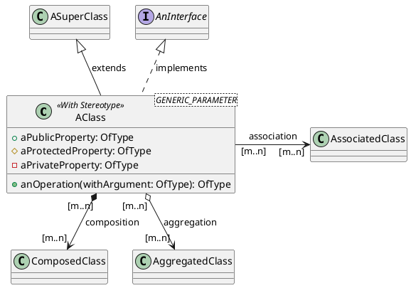
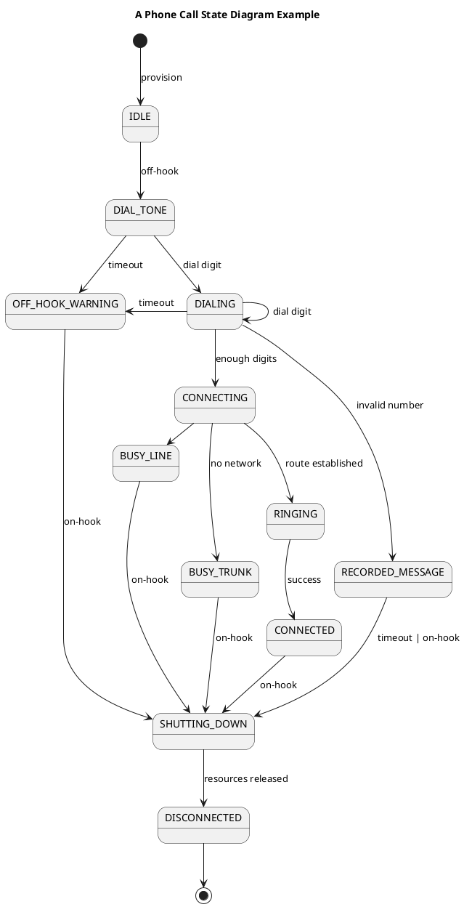

Computers don't know about apples, cars, birthdays, structural beams or colors, which are the concepts that end up being interesting to computer users. From the early computers and the decisions for how to represent data (binary, ASCII, EBCDIC), The evolution in software tools has been to create more expressive and flexible representations that allow designers to implement systems that can interact with users in their conceptual space. There are many high level paradigms available to designers, among them, the relational model, Abstract Data Types, Object Oriented Development and Functional Programming form the foundation of most modern designs.

## The Relational Model

One of the most important and powerful ways to describe data is the [Relational Model](https://www.amazon.com/Database-Relational-Model-Retrospective-Analysis/dp/0201612941?&_encoding=UTF8&tag=saldubatechno-20&linkCode=ur2&linkId=6426e9faa01f2226903c1dfdf83eb13e&camp=1789&creative=9325), originally proposed by [E.F. Codd](https://en.wikipedia.org/wiki/Edgar_F._Codd). The atopic elements of information in the model are values of a limited set of types representing numbers, text, dates, etc... which are then grouped in "Relations", which are tuples of named attributes with their associated primitive type. Each instance of such a relation becomes a "record" and the collection of records becomes a "table", or frequently also a "relation" overloading the original term. This structure is not original to the Relational Model. The innovation and power comes from defining a set of operations on them, and structuring those operations into a formal algebra or relational calculus. With that formal framework available, each record can be interpreted as a "fact" of the world that the system describes and operations (selects, joins, etc...) allow the system to synthesize derived facts on-demand to fit specific use cases or needs. The formalism of the relational model has also enabled a strong separation between the concepts that the application developers use (tables, records, columns, ..) and the lower level resources used to implement them (files, caches, etc...) with very little [abstraction leakage](https://en.wikipedia.org/wiki/Leaky_abstraction). This abstraction is so powerful that it enables designers to think in terms of "Entity-Relationships" to describe the structure and contents of their systems.

## Abstract Data Types

The relational model strength is in the representation of facts as entities and their relationships, offering relatively poor capabilities to express complex behavior, being usually limited to [CRUD operations](https://en.wikipedia.org/wiki/Create,_read,_update_and_delete) of records. [Abstract Data Types](https://en.wikipedia.org/wiki/Abstract_data_type), first proposed by [Barbara Liskov](https://en.wikipedia.org/wiki/Barbara_Liskov), are based on mathematical algebraic structures, lending them a strong foundation to support complex modeling activities. They emphasize the behaviors associated with a part of the system state by allowing an arbitrary number of operations on it. The internal structure of an abstract data type is opaque and is only "knowable" by observing the results of operations on it. The original definitions of ADT's proposed a complete algebraic description of those behaviors, which is very attractive in theory, but impractical beyond simple examples like the specification of an unbounded stack (in a Python-like syntax) due to its verbosity:

```python
# Signature

class Stack():
	def push(e): Stack
	def pop(): Stack
	def top(): Object
	def count(): Int

# Specification (assertions)

Stack().count() == 0
Stack().pop() == None
for all stack in Stack:
	assert(
		stack.pop().count() == stack.count() - 1 if stack.count() != 0
		else stack.pop().count() == 0
	)
	for all e in element:
		assert(stack.push(e).count() == stack.count() + 1)
		assert(stack.push(e).pop() == stack)
		assert(stack.push(e).pop().top() == e)		
``` 

Even without the benefit of formal specifications, the importance of ADT's for describing the state of a system cannot be overstated. The focus on definition by behavior and the introduction of the concept of a "Type" or "Class" of values in the system is essential in describing the information model of a system.

## Functional Programming

[Functional programming\'s](https://en.wikipedia.org/wiki/Functional_programming) main abstraction is that of a "function", understood as a transformation of a value into another value without any other side effects or actions. 

Functional Programming is based on lambda calculus, again providing a strong foundation for handling modeling complexity. The values subject to functional transformations are, like in the case of ADT's, instances of a *Type* that describes how they behave and what kinds of transformations (functions) can be applied to them. Functions apart from being applied to values, can be composed and referenced, being themselves values that can be acted on. Functional programming is also based on On the surface, a programming paradigm that explicitly excludes any side effects would be useless as it would even prevent interaction with the outside world as I/O would be considered a side effect. Modern functional languages have constructs to view these side effects as values themselves so that they fit in the theoretical model given by Lambda calculus. Focusing on value transformations, functional programming may not be as relevant in the description of the state of the system but the composability of behavior and the strong foundation of Lambda calculus are very valuable tools in the conceptual modeling of systems.

## Object Oriented Development

It is safe to say that [Object Oriented Development](https://en.wikipedia.org/wiki/Object-oriented_analysis_and_design) underlies the overwhelming majority of modern application development. It builds on ADT's concept of describing *Types* of values and the principle of combining state and behavior in a single abstraction, the *Class,*. Object Oriented tools and language also incorporate the concepts of inheritance and polymorphism, which , although not excluded, are not emphasized by ADT formalisms. Also, pure ADT formulations deal only with immutable values as instances of their Types, where OO systems make the Objects mutable and give them a distinct identity, separate from any other of their observable properties. This mutability and identity immediately introduce the concept of an "Object Reference" which is essential in the modeling of large systems.

Modern Object Oriented programming languages and frameworks support a lot of the concepts needed to describe domains. The details vary with each ecosystem of languages, tools and frameworks, here we only provide a brief summary of the most common ones.

- **Identity**: All OO languages provide the concept of object reference consisting of a class name and a "pointer" like value. Identity in databases is supported by the concept of "Key", primary or secondary keys in RDBMs, Id's in Document DB's or record keys in columnar DB's. All of them need to additionally specify the DB scope (Db name, table or collection name) to use to resolve the key/id. In distributed systems references must be supported in the API's. Proper Rest API's have the concept of Universal Resource Locator (URL) to serve as global identity for an object or resource. Other protocols have a specific construct for object identities (e.g. CORBA). In more "Service Oriented" protocols like gRpc or GraphQL, the concept of Identity needs to be provided by the application developers themselves.

- **Categorization and Classification**: All OO languages and most other languages provide a concept of "Type" that can be defined by the developer. Compatibility of the Type of an object with the operation being performed is sometimes left to the user, sometimes done at runtime and sometimes enforced at compile/build time. In OO languages, Types are organized in "inheritance" structures either pure hierarchies (single inheritance) or graph-like structures (multiple-inheritance). Languages also provide Polymorphism to model complex behaviors. In Databases, Categorization is implicit in the grouping of records into tables or collections. SQL based databases are strict in the uniformity of all records in a table by enforcing an explicit schema while other Databases (no-SQL, Schemaless) don't enforce them. In the world of distributed systems and Service Oriented Architectures, it is a common convention to dedicate specific service endpoints to support specific categories of objects, but this is more a design practice and convention than a technology supported discipline.

- **Decomposition and Properties**: All modern programming languages support the definition of [Product Types](https://en.wikipedia.org/wiki/Product_type). The SQL standard does not support composition of types other than at one level (the Table), which forces design decisions to either duplicate "sets of columns" by hand in multiple tables or create separate tables and use keys and joins for composition, with the corresponding complexity in the logic that uses them. API definition languages have varying support for type composition.

- **Relations and References**: Except for RDBM systems that are based on the relational algebra and Graph databases, relations and references are either not supported directly or supported implicitly with little control by the designer. OO languages represent relationships through object references/identity, but don't provide the ability to describe when a reference is a "composition" that could be represented by an embedded value or an "association" that is an explicit reference. The discrepancy of how RDBMs and OO languages handle relations and decomposition is at the core of the [Object-Relational Impedance](https://en.wikipedia.org/wiki/Object%E2%80%93relational_impedance_mismatch) that ORM tools try to resolve, at the cost of complexity and efficiency. API definition languages, except for CORBA, don't support the concept of relation other than providing a reference that needs to be explicitly managed by the developer. Even REST with its emphasis on resource identity does not have a uniform way to de-reference those identities or resolving them.

- **Patterns**: This is the area where tools, frameworks and languages are least mature yet. Most of the work on patterns is done by frameworks (e.g. Web Application frameworks like [The Spring Framework](https://spring.io/projects/spring-framework)) that rely on documentation, examples and convention to implement them. Advanced languages like Kotlin and Scala provide a rich type system which includes generics and [Higher Order Kinds](https://en.wikipedia.org/wiki/Kind_(type_theory)) that offer a lot of promise to describe patterns in a way that can be reused and made part of the "underlying abstractions" that designers can use.

# UML

All Software models defined above are strongly tied to specific implementation mechanisms and the tools and languages that support them have features and constraints to support the intended implementation. Most of the time these additional features require a level of detail in the description that gets in the way of thinking and expressing the design when it is not fully defined. In response to this need, several graphical and textual notations to express the design in a "non-implementable" state have been proposed over time. The two most popular ones are Entity-Relationship diagrams and UML. Entity-Relationship diagrams are very close to the relational model described above. The [Unified Modeling Language](https://en.wikipedia.org/wiki/Unified_Modeling_Language) appeared in the mid 1990's from the work of Grady Booch, James Rumbaugh and Ivar Jacobson in early Object Oriented methodologies in the late 80's and early 90's as an attempt to provide methodology guidance and tools for the then emerging object oriented programming languages.

UML, particularly in its 2.X versions, has a large collection of different diagrams to support multiple aspects of the design, including real-time timing diagrams, deployment diagrams etc.. In the context of information models, the types of diagrams most useful are Class Diagrams, State Diagrams and Sequence Diagrams.

The full UML specification requires enough information to make the design almost executable, or almost directly compilable into an executable system. At that point, UML becomes way too burdensome for the purposes of communicating and discussing a design, particularly in the early stages of architectural design, while at the same time not giving the engineer enough flexibility to prescribe enough implementation details to make it a "production worthy" system. In the context of architectural design we recommend to constrain the use of UML to the engineer-to-engineer communication, with the level of detail and formalism appropriate for the organization.
## Class Models

Class Diagrams describe a fairly standard Object Oriented model with some interesting additions. A class is expressed as:



UML class models support the standard programming language concepts of:

- Classes and Interfaces
- Inheritance of Classes and Implementation of Interfaces (multiple inheritance)
- Public, Protected and Private properties and methods with types
- Generic Parameters for both Classes/Interfaces and methods

It also allows expressing different types of associations between classes with specific cardinalities, and specifying a *Stereotype* for the class.

A *Stereotype* is a convenient notation to indicate specific *Non-Functional* behaviors of a class to indicate, for example, what type of state it may be as defined above, or other patterned behaviors like being versioned, observable, etc... without having to clutter the diagram with additional inheritance or association relationships. 

The three types of associations can be used to represent containment vs. reference and lifecycle relationships between objects of the related classes.

- **Composition**: Represents the fact that values of a Class fully contain values of a different class in a parent-child relationship. The child class may have their own identity or be a "pure value" without a separate identity and be always accessed through the parent.
- **Association**: The two classes are related *by-reference* and may have different lifecycles. This requires them to have distinct identities for their objects.
- **Aggregation**: Similar to an association, but with some lifecycle constraints between the two classes.

Note that, as discussed above in the [Relations and References](#relations-and-references) section regular programming languages do not directly support the separate semantics of the different types of associations. UML does not support directly separate concepts for *Entities* with an identity and *Structured Values* without it, which some programming languages are starting to support (`value` classes in Java, `case` classes in Scala or `data` classes in Kotlin). This can be indicated using *Stereotypes*

## State Charts

In Object Oriented design, which is the basis of UML, classes include not only data structure but also behaviors. The full UML specification supports behavior with a number of constructs, including a formal version of constraints [OCL-Object Constraint Language](https://www.omg.org/spec/OCL/2.4/PDF) which, as mentioned before, it becomes very verbose and complex when trying to describe detailed behaviors. A good compromise between detail and verbosity is to use [State Diagrams](https://www.baeldung.com/cs/uml-state-diagrams), based on David Harel's [State Chart formalism](https://www.sciencedirect.com/science/article/pii/0167642387900359) Without describing the formalism in detail, state charts focus on a distinguished element of state of an object belonging to a class. This *State* is described as an enumeration of values, possibly nested values that determine the main *modes* of behavior of the object. A classic example of the power of this formalism is the representation of the state of a phone call. A phone call is a complex object that includes elements like a data channel, encoding, signaling, routing, etc. but for certain purposes it is useful to focus on what the different regimes of behavior are, codifying them in discrete states.



State Charts, and similar [Activity Diagrams](https://www.ibm.com/docs/en/rsm/7.5.0?topic=diagrams-activity) or the more formal description of [SDL-92 ](https://www.amazon.com/Systems-Engineering-Using-SDL-92-Olsen/dp/0444568360?&_encoding=UTF8&tag=saldubatechno-20&linkCode=ur2&linkId=9e45e04dc09719e018e31ebeaeecb027&camp=1789&creative=9325)can be used to describe multiple aspects of system design. In the context of the information model, they are best used to describe the overall behavior of classes (entities), or groups of entities that appear in Class Diagrams.
## The tools conundrum

There are a myriad tools to draw UML diagrams. Most popular diagraming tools like [Visio](https://www.microsoft.com/en-us/microsoft-365/visio/flowchart-software), [LucidChart](https://www.lucidchart.com/pages/) or [draw.io](https://www.drawio.com/) support UML shape templates. There are multiple [Open Source tools](https://medevel.com/open-source-uml-tools/) with different levels of support and comprehensive commercial tools like [Visual Paradigm](https://www.visual-paradigm.com/), [Enterprise Architect](https://sparxsystems.com/) or the venerable [IBM Rational Software Architect](https://www.ibm.com/docs/en/rsas/7.5.0) that traces its origins to the original Booch and Rumbaugh efforts. The more sophisticated the tools, the more commitment they require from a team and the steeper their learning curve, which makes it very difficult to adopt the more advanced tools in smaller and fast moving teams. In addition, the verbosity/expressiveness balance is very tricky to achieve. Many of these tools share what in my opinion is the original sin of the [UML Standard](https://www.omg.org/spec/UML/2.5.1/PDF) that originated as a Diagram standard in the first place. The Standard specification has moved to define metadata models, abstract syntax conformance, etc. At the same time, programming languages capabilities for information modeling have progressed enormously with the introduction of Generics, higher order functions, etc. which in some cases are more expressive than UML itself (e.g. Scala's Higher Order Kinds and type inference compiler does not have a clear parallel in UML). 

For the stated purpose of architectural design to build a *shared theory* of the system, I find it preferable to use text based descriptions that can be visualized as diagrams like [PlantUML](https://plantuml.com/), [Mermaid](https://mermaid.js.org/) or the [Eclipse Modeling Framework](https://www.amazon.com/EMF-Eclipse-Modeling-Framework-ebook/dp/B004YW6M52?&_encoding=UTF8&tag=saldubatechno-20&linkCode=ur2&linkId=17d48a46fffe6c5bb305a1cd2b2eadd5&camp=1789&creative=9325) and that can be embedded in documents and kept next to the source code in versioned repositories. While the layout of the diagrams sometimes is a bit clunky, these tools provide a very high productivity for the main task of expressing and communicating design ideas. The diagrams above were created with PlantUml directly embedded in a Markdown document.
