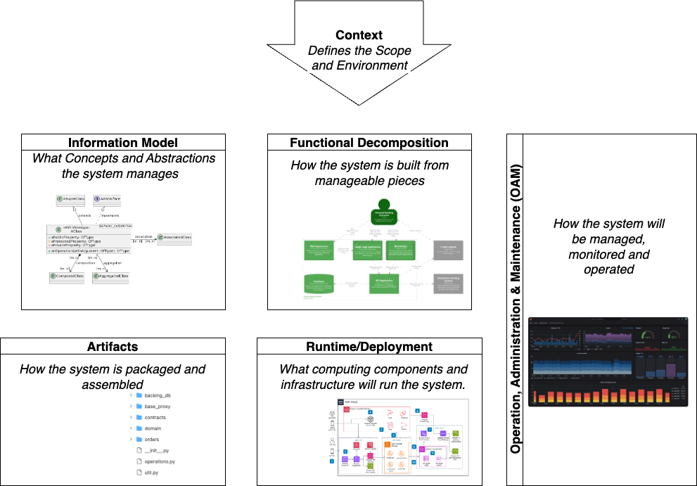

## Why Impractical?

There are plenty of excellent books, articles, methodologies and tools for practitioners or Domain Driven Design to learn and apply its techniques, this article is not even trying to improve or summarize them, but rather provide context, motivation and rationale for why DDD is a foundational idea in product engineering, then provide a framework to use DDD to structure teams and processes for effective product engineering.

## Why Domain-Driven Development

Going back to basics, Merriam-Webster's definition of domain that is relevant to product and systems development is:

> A sphere of knowledge, influence, or activity

When multiple persons need to share the knowledge or collaborate in the activities that constitute a domain, they must develop a set of concepts, conventions, procedures that give structure to the domain and create a shared understanding of the domain. Examples are all around us. People who work in the accounting domain have created concepts like *payables, accrual, account* conventions as captured in the GAAP standards and procedures like double entry. Similar structures have been created over and over again in business, law, science, etc...One of the most fundamental insights on the development of software systems was defined by the seminal article, that is the best advocacy for structuring systems around the shared knowledge of the teams that build them.

Domain Driven Development relies on the assumption that focusing and leveraging the concepts, conventions and procedures already articulated in the domain results in a better design and realization of the product at hand.

Proponents of Domain Driven Design justify this claim noting that the structured knowledge captured in a domain:

1. Is the result of thorough refinement and testing over time by a whole community of practitioners and therefore a good baseline to  describe the behaviors and functions of a product.

2. Have been already adapted and used in many variants in the domain,  giving confidence that they represent the essence of the domain  while retaining enough flexibility to be applied to real world use  cases.

3. They are shared by real-life practitioners, in some cases even with formal training available (again the accounting example). Making the communication between the domain experts and the technologists/engineers that will design and realize the product easier.

4. A consequence of their extended use and refinement, particularly in mature domains, the concepts and procedures are very stable and slow to change, providing a strong foundation for a system that will be resilient to change.

## What does DDD contribute to Product Engineering

Product Engineering, despite the emergence of more powerful tools, including AI, is the product of human intellectual activities. It consists of creating and organizing information that machines (e.g. compilers) or other humans will use. Regardless of whether it follows agile, iterative or more traditional waterfall processes, product engineering needs to produce and organize information that describes:

1. The specific definition of the need that the product will fulfill or the value that it will deliver.

2. What product's behaviors, information content and interactions with its users and the environment will lead to the fulfillment of the need or creation of the value.

3. What components will need to be built to perform those behaviors, manage information and enable interactions.

4. How the components will interact with each other in a cohesive way.

5. The selection and configuration of technologies and tools that will be used in the construction of the components.

6. Instructions for how to construct, assemble and, if appropriate, operate the components and the resulting product to actually realize the desired value.

This information is very rarely defined once and for all, as no product is ever complete or perfect. Improvements, extensions and changes constantly appear as a result of a changing environment or the continuous learning that successful product organizations exhibit.

For any real-life product, multiple people or teams work together to create this information. Furthermore, different areas require specialized knowledge and skills from different staff members. A well-structured and well understood Domain provides a shared workspace for these different specialists to effectively communicate and collaborate.

A common misunderstanding of Agile methodologies results in a blanket rejection of upfront design and even specifications. We believe that this is just that, a misconception. The points above imply neither creating large and heavy requirements, specifications and design documents nor spending protracted periods of valuable project time in requirements or design "phases" The demand these points make on an engineering team is more fundamental. A team must thoroughly understand what they set out to build, what it is supposed to accomplish and what "raw materials"(tools, systems, ... they have available. Without a deep understanding of these elements, any engineering effort will be doomed to failure. The specifics of when is this understanding achieved and what tools (documents, whiteboards, etc... are used depends on the size and culture of the team, the characteristics of the product and the methodologies used, but the underlying, fundamental need for understanding is not negotiable for any successful engineering team.

## DDD Conceptual Toolbox

DDD is sometimes reduced to the definition and implementation of "Entities"that represent domain concepts, usually by means of Class or ER models. As described above, a Domain defines a set of concepts that are the basis of these models, but it also includes conventions and procedures that all practitioners use, going beyond what traditional Class or ER models represent. Traditional tools of software engineering can be applied to DDD, together supporting the activities above.

- Business Process Engineering
- Persona Definition
- Use Cases
- Information Models
- Scenarios & Interactions
- Information Transformations, Algorithms and Domain Specific Languages

Each of these tools or methodologies have countless books, articles and blog posts that do a much better job than what could be done here. Wikipedia is always a good starting point to look for them.

## Defining: Answering Why and What

### Product Value

In the context of business, value is traditionally defined as financial gain over the life of the enterprise, with sophisticated tools and indicators to measure it like NPV, IRR, etc...Taking a broader view of value leads to including other values as promoted by books like the Balance Scorecard and the recent ESG aware investment strategies, which better reflect the overall contribution of a product or enterprise to all potential stakeholders.

We can still view value creation as the difference between the benefits that a business activity produces vs the resources it consumes. This perspective provides the key concepts to anchor the deliverables of product engineering.

The first deliverable must necessarily be a concise and concrete description of the benefits that the product should generate. Creating this description is not specific to DDD. DDD's contribution is to insist on using the "Domain Language"as much as possible to describe those benefits. This requires creating a Glossary of terms or referring to one if it already exists, like in the accounting domain. As an example, one key value of an Order Management System is to reduce the time orders take to ship. Introducing the rigor that DDD demands, the glossary of terms would need to define what is an "Order" what does "Shipping"mean and how "Order Lead Time"is measured. It is impossible to overstate how important it is to be rigorous at this stage, even if the definitions need to be tweaked later. Concepts that may seem simple like "Order" if used ambiguously may lead to uncontrolled scope and cost creep for the overall product. For example, an Order needs to be differentiated from an Invoice, it needs to be decided if it is a one-time transaction or it should include recurring transactions (e.g. a standing order), whether it is expected to be shipped in one unit or it is allowed to be split across multiple shipments, etc...An Order for a sales person may be a very different thing than an "Order"for a warehouse manager and postponing the effort to clarify them results in disastrous cost and time to market consequences.

Armed with a solid set of concepts, the value that the product will generate needs to be articulated by describing what new activities it will enable, what activities it will eliminate and what activities it will change. This is a key point worth emphasizing. Value, expressed either as increased benefits or reduced costs is achieved only by changing specific activities of stakeholders of the product. The activities can be those of an end consumer (e.g. taking a vacation, commuting to work, brushing their teeth, ..., business activities (e.g. create and manage promotions, adjudicate insurance claims, ... or even activities that are part of the product development process itself (e.g. create CI/CD automation, build or reconfigure a factory, adopt a new development tool, .... Together with a rigorous set of concepts, describing concrete changes to stakeholders activities drives specificity and provides a strong basis for other activities. At the same time, prescribing the description as changes to stakeholder activities barely constraints the actual value that can be described.

Activities can be uniformly described in terms of stakeholders and interactions among them and between them and the product itself and there are plenty of best practices to choose from like use cases, user stories, scenarios, BPM Maps, etc...

Activity descriptions frequently miss two important pieces of information as part of a product definition. First is that each change to an existing activity, new activity or elimination of an activity should be traceable contributions to the value of the product, either increasing benefits, reducing costs or both. This is not just for the desirable, although somewhat theoretical "requirements traceability" but in more practical terms, it provides context for decision making at all levels of the organization and all steps of product engineering, enabling agile and learning organizations with minimal red-tape.

The other kind of information that needs to be explicitly defined is a clear enumeration and definition of the stakeholders as a precondition to describing any activity. Stakeholders in this context refers to people that will use, operate, support or is affected in other ways by the product (e.g considering effects on the environment) as well as other systems or products that will be used in combination with the product itself, or that the product will interact with (e.g. services that the product uses like an electric grid for EV's or a geographical mapping service for a share-a-ride product). Stakeholders, with their definitions, are as instrumental as the initial rigorous glossary of terms of the domain. They are the foundation on which the whole product definition is built and they need to be expressed in terms of the domain, not in terms of technolo gy.

### Personas & Stakeholders

Identifying and characterizing Stakeholders is a very effective way to make the product value concrete and actionable. A product creates value exclusively when it interacts with stakeholders and the environment. Creating a catalog of Stakeholders is also a long term investment for an organization. Multiple products or product iterations can go back to this information to describe new value or activities, to check if there are any needs of a stakeholder that have not been addressed etc..

A common technique to capture information about stakeholders is to define . Personas originated in UX practice, but with just a bit of latitude, they can be extended to deal with other systems and "non-human"stakeholders that need to interact with the product. These extended personas become the anchor of the activities and interactions that describe the behavior of the product later. Providing unambiguous identities to use in the description of these behaviors is extremely important for effective product definition.

### Product Definition

When referring to Product Architecture or System Architecture, the emphasis is usually in decomposition, structure & interactions. The reality is that from the information in the product value definition there is a gap defining what the product will actually be, before architectural and design methodologies can be applied to decomposing and designing it. This gap in knowledge of the team is very commonly skipped because it is "obvious"in the context or a-priori assumptions that the product to design is going to be "a car" "a web app" "a power plant"or a "business metrics dashboard" It is nevertheless useful, and sometimes critical to explicitly describe what the product is intended to "be" Methodologies associated with "Product Conceptualization" or "Product Ideation"try to address this gap and rely on cognitive tools like structured brainstorming or the practices emerging from the Design Thinking practices. In the context of DDD it is essential that these methodologies are rooted in the rigorous definitions of concepts, values, concepts and activities described above. The result of this effort can be captured in a number of ways, from formal definitions of form, function and attributes, to prototypes, mock-ups, etc...The critical outcome, at the risk of being repetitive, is to create shared knowledge in the team of what needs to be built with a rich context and information for team members to make good decisions. The nature of this product definition activity which relies a lot on experience, intuition and ideation commonly creates a breakpoint between the value and requirements definitions and later activities in the design. While it is not practical or even possible to fully bridge that disconnect, it is worth at least considering it and apply techniques like [House of Quality](https://hbr.org/1988/05/the-house-of-quality) to at least provide some continuity between the "why"of the product (values, stakeholders, ... and the "what"expressed in the product concept.

## Designing: Answer the How

To describe "How"a product is realized, it is important to consider two very different types of decisions that are frequently blended together under the "Architecture"heading. Any non-trivial product or system needs to be split into smaller "chunks" possibly in multiple levels of decomposition until each "chunk"is small enough for a person or a small team to fully own it and build it. Also, very few products are built completely from basic raw materials, which in the case of information systems would be basic operating systems, compilers and languages, or even more extreme, hardware and machine code. The first aspect deals with how the desired behaviors of the product will be supported by the combined behavior of the components of the product, the second one is about the technology choices and external technologies will be used to realize those components. Here we will stick to using the word "Architecture"to describe how the product or system is decomposed and "Technology"to refer to the selection and use of the raw materials to build it.

### Architecture

Architecture is focused on decomposing the product in smaller components. Components can then be worked on semi-independently and later put back together to realize the final product. The Architecture of complex systems needs to be described from different viewpoints. For mechanical products, the different perspectives may be mechanical strength, kinetic analysis of moving parts, thermal analysis, spatial packaging, etc...For software systems, there are many different methodology proposals. At the end, they can be seen as variations of an underlying set of concerns to address:

- **Context**: What is the boundary of the product and how it will interact with its environment and stakeholders.

- **Functional**: The decomposition of the product in discrete, self-contained components and how the different functions/activities that the product needs to perform are allocated or partitioned to different components.

- **Information Model**: What does the system keep as its internal state during and between activities and the structure of this state in smaller, well defined data structures.

- **Runtime**: Once the technologies are chosen, what specific computing, networking, I/O and storage elements the product will use when in operation.

- **Artifacts**: How sources and intermediate artifacts will be produced by the engineering team, how they will be structured and managed.

- **Operation, Administration & Maintenance**: The mechanisms, tools, processes and documentation (e.g. Runbooks) that allow the product itself to operate and perform its functions, including configuration, observation, security, cost and fault management.

Domain Driven Design, with its emphasis on domain concepts and modeling, defacto gives primacy to the Information Model over other aspects. When deciding to use DDD for a product it is important to be aware of this built-in bias of the methodology to avoid costly mistakes.

### Technology

A product or system architecture relies on the knowledge of the *raw materials* that it will use. Obvious example is that product architecture documents do not need to describe relational algebra and how it will be used but simply decide that they will use a specific RDBMS to store part of its state, or describe the IP protocol when describing how two of its components will interact. Selection of the technologies to use may sometimes be a simple statement of using a specific ecosystem of technologies. E.g. deciding that a project is going to use Ruby on Rails defines the set of technologies that can be used and excludes others. For simpler products or products that are a variation of a well understood category, these "all-in"frameworks provide a very powerful starting point, although at the cost of a lack of extensibility if the product evolves in a direction not well supported by the chosen framework. For Information Systems, technology choices include resources to support Computing, Communication, Data Store and I/O.

**Computing Resources** provide execution capabilities for the algorithms that implement the required behaviors. They include the selection of the computing units (hardware, mobile devices, cloud instances, containers, etc..) and the basic Operating System functionality in those computing units. Volatile Memory, although strictly speaking should be considered part of the storage resources, it is usually considered part of the computing resources.

**Communication Resources** support the exchange of data between components of the product, they need to describe the protocols used (e.g. REST, gRpc, SFTP, ..., the network connectivity and topology that will be needed and how addresses in those networks are defined, named, organized and found.

**Storage Resources** allow the system to keep its state during and in between activities. Storage resources support creating, modifying and retrieving parts of the system state.

**I/O Resources** allow the system to communicate with its stakeholders, be them human users or other systems. They include User Interface technologies (e.g. Web, Mobile, Voice, ... as well as machine to machine communication technologies, which although they can be the same as those used for Communication Resources, they should be treated separately because external I/O typically has very different operational characteristics in terms of access, addressing and security.

The selection of specific technologies and the architectural design of a system are very interdependent. Specific components and their behaviors clearly determine what technologies are a better match (e.g. selecting a RDBMS or a Document DB) and the limitations and characteristics of the technologies determine the feasibility of components and therefore how the overall system needs to be structured. This may sound kind of esoteric, but it has been the case since the dawn of technology, where the parts of any design depend on the materials it is made of. A stone ax is very different that a steel ax, the former one probably has an additional component of twine to fix it to the handle, while the second one relies on a press-fit.

## Stopping here

This article has grown to about ten pages and has yet, it may feel incomplete because it does not get to the core of DDD techniques or even provide recommendations and methodologies. Still, I want to keep it to a reasonable size and hope it is helpful enough on its own and to set the context for other articles to follow on how to go about defining architectures and selecting technologies.

### Acknowledgements

Acknowledgements
This article uses some images available in their source web sites, in particular:

- [C4 Model](https://c4model.com) for [https://static.structurizr.com/workspace/76748/diagrams/Containers.png](https://static.structurizr.com/workspace/76748/diagrams/Containers.png)
- [AWS Architecture Diagrams](https://docs.aws.amazon.com/architecture-diagrams/latest/location-services-with-machine-learning-forecasting/location-services-with-machine-learning-forecasting.html?did=wp_card&trk=wp_card) for [https://docs.aws.amazon.com/images/architecture-diagrams/latest/location-services-with-machine-learning-forecasting/images/1-sample-web-application.png](https://docs.aws.amazon.com/images/architecture-diagrams/latest/location-services-with-machine-learning-forecasting/images/1-sample-web-application.png)
- [Grafana](https://grafana.com/grafana/) for [https://grafana.com/media/products/cloud/grafana/grafana-dashboard-english.png?w=900](https://grafana.com/media/products/cloud/grafana/grafana-dashboard-english.png?w=900)

**Summary of Artifacts**

- Value Definition
- Dictionary/Glossary of Terms
- Value Activities
- Stakeholders, Personas, Actors
- Use Cases, User Stories
- Business Process Maps