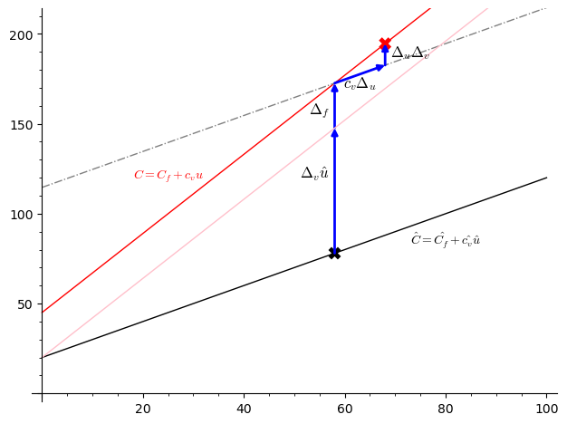

## Engineers need to understand Management Accounting

In my undergraduate, and I suspect this is a common case among engineers, I was required to develop a deep understanding of calculus and algebra and use them as the lingua-franca of the engineering conversation. These concepts were then very useful in understanding measurements, tolerances and control of engineering products and processes.

At the same time, the required business accounting or economics subjects, even when required, were seen as a *necessary evil* to graduate. Later in business school, I went through a thorough *re-education* to learn all the accounting and finance lingo needed to understand and manage business operations, where I used very little of the tools and concepts I developed as an engineer.

It was only in my doctoral study, and only thanks to [Professor James Patell](https://www.gsb.stanford.edu/faculty-research/faculty/james-m-patell) in his class about *Manufacturing Performance Measurement* that I was able to really put the two things together and see Management Accounting as a *measurement of business processes* and be able to apply the very rich and powerful toolbox that Calculus and Algebra provide. This article is a small tribute to Professor Patel with gratitude for all the learning that he made me do while his student.

While there are many rewarding technical engineering careers, many engineers by education take business management responsibilities at some point in their careers and I believe that making that strong connection between our training and the task of managing complex business operations can only help with being true professionals, let alone successful at our jobs.

## Understanding Management Accounting is hard

Management accounting is a very mature discipline with a deep body of knowledge behind it. Just looking at college course catalogs, it is clear that it requires a sustained effort to master it, yet many of us are supposed to start using it when we get promoted to manage a team or a department, almost learning it *on-the-job*. At the same time, engineers and other STEM graduates usually have a strong background in formal mathematics to model and measure real world systems. By seeing business as a system to measure and having rigorous definitions of the variables involved, I believe we can mitigate the learning curve of the concepts in Management Accounting.

The definition of cost given by [Investopedia](https://www.investopedia.com/ask/answers/101314/what-difference-between-cost-and-price.asp#:~:text=Cost%20is%20typically%20the%20expense%20incurred%20for%C2%A0creating%20a%20product%20or%20service%20a%20company%20sells) is fairly straightforward:

> *Cost is typically the expense incurred for creating a product or service a company sells*

### Cost and Cost Variances

When seen from the point of view of *creating a product*, it is common to consider that some costs will depend of how much product we make (*variable costs*) and some others will be constant (*fixed costs*) no matter how much product we make. Obviously this is an oversimplification that works for a reasonable stable set of conditions. If we are going to make so much product that we need to build another factory altogether, even the most *fixed* costs become *variable costs* once we let the context change too much. Still, that simplification is useful in most cases. As engineers, we can't say we really understand something until we see the math, so we rather write:

$$
C = C_f + c_v u
$$

with $C$ being the total cost, $C_f$ the fixed cost (again for the range of conditions we expect), $u$ is the number of units of the product we create and $c_v$ the variable cost per unit of product created. The units of product depend on what kind of stuff we create, it can be just the count like bolts and nuts, some grouping like packs or pallets or continuous measurements like meters of cloth.

Management Accounting, as described in [Relevance Lost](https://www.amazon.com/Relevance-Lost-Rise-Management-Accounting/dp/0875841384?&_encoding=UTF8&tag=saldubatechno-20&linkCode=ur2&linkId=c89ed29715bb7fe647691ce5a401b838&camp=1789&creative=9325), originated as a way to measure business performance, not just as a financial reporting mechanism. The actual cost that a company incurs needs to be compared against the budgeted or estimated costs, with the difference called [Budget Variance](https://www.investopedia.com/terms/b/budget-variance.asp) or Cost Variance. Using the same line of thought, we write, for the budget:

$$
\hat{C} = \hat{C_f} + \hat{c_v} \hat{u}
$$

with the decoration ($\hat{\;\;}$) to denote the *estimated* value of the corresponding variable. We express the deviation of any of the involved variables as:

$$
\begin{align*}
\\
C &= \hat{C} + \Delta _c
\\
C_f &= \hat{C_f} + \Delta _f
\\
c_v &= \hat{c_v} + \Delta _v
\\
u &= \hat{u} + \Delta _u
\\
\end{align*}
$$

and the cost expression, this time relating it back to the estimate values results, with a little bit of reordering..

$$
\hat{C} + \Delta_c = (\hat{C_f} + \Delta_f) + (\hat{c_v} + \Delta_v)(\hat{u} + \Delta_u) = \hat{C_f} + \hat{c_v} \hat{u} + \hat{c_v}\Delta_u + \hat{u}\Delta_v + \Delta_f + \Delta_u\Delta_v
$$

Looking at it graphically, we have a clear interpretation of the cost variance terms:

{: width=80%}

### The Calculus view

By now you are probably reaching for your undergraduate calculus book and recognizing this as the [Taylor Series](https://en.wikipedia.org/wiki/Taylor_series) expansion of the *Cost Function*, in its multivariate form (with variables $C_f, c_v, u$).

Just to be explicit, with the vector notation $\bar{x} = [c_f, c_v, u]$, and $C(\bar{x}) = C_f+c_vu$ with the function and derivatives evaluated at $\hat{x}$:

$$
C(u) = C(\hat{\bar{x}}) + \frac{\partial{C}}{\partial{u}}du
    +\frac{\partial{C}}{\partial{c_v}}dc_v
    +\frac{\partial{C}}{\partial{c_f}}dc_f
    +\frac{1}{2}\frac{\partial^2{C}}{\partial{c_v^2}}d^2c_v
    +\frac{1}{2}\frac{\partial^2{C}}{\partial{u^2}}d^2u
    +\frac{1}{2}\frac{\partial^2{C}}{\partial{c_f^2}}d^2c_f
    +\frac{\partial^2{C}}{\partial{uc_v}}dudc_v
    +\frac{\partial^2{C}}{\partial{uc_f}}dudc_f
$$

The correspondence is clear:

$$
\begin{array}{}
C(\hat{\bar{x}}) &=& \hat{C_f} + \hat{c_v}\hat{u}
\\
\frac{\partial{C}}{\partial{u}}du &=& \hat{c_v}\Delta_u
\\
\frac{\partial{C}}{\partial{c_v}}dc_v &=& \hat{u}\Delta_v
\\
\frac{\partial{C}}{\partial{c_f}}dc_f &=& \Delta_f
\\
\frac{1}{2}\frac{\partial^2{C}}{\partial{c_v^2}}d^2c_v &=& 0
\\
\frac{1}{2}\frac{\partial^2{C}}{\partial{u^2}}d^2u &=& 0
\\
\frac{1}{2}\frac{\partial^2{C}}{\partial{c_f^2}}d^2c_f &=& 0
\\
\frac{\partial^2{C}}{\partial{uc_v}}dudc_v &=& \Delta_u\Delta_v
\\
\frac{\partial^2{C}}{\partial{uc_f}}dudc_f &=& 0
\end{array}
$$

This formulation allows us to bring a lot of intuition to bear derived from our calculus experience, including the conditions under which calculus is not applicable.

- Conventional cost variances only consider the effects of the variation of units ($\Delta_u$), variable cost ($\Delta_v$) and fixed cost ($\Delta_f$) combined linearly, which corresponds to the simplifying assumption of constant fixed costs and variable costs with respect to volume. In the presence of rate variability, we would need to consider *second order* effects with are zero in the simplified formulation.
- In financial accounting there are no "negligible effects" as in calculus when $dx \rarr 0$, so the term $dudc_v$ cannot be removed from the calculation. On the other hand, for KPI definition as a management tool, if the deviations in units *and* variable cost are small, that term can be ignored, as it is harder to interpret in terms of taking corrective action.
- From calculus, we know that all derivative and differential calculations are not valid in the presence of non [differentiable functions](https://en.wikipedia.org/wiki/Differentiable_function), which means that we are safe if we stay within the assumptions of linear costs and small variations of cost coefficients, but we need to tread very carefully when volume or cost coefficients deviate substantially as their behavior in real life is far from continuous, let alone differentiable. Calculus tells us that in these cases, our regular cost accounting, based on incremental calculations will not yield sound results.
- Finally, it is rare the business operation in which the volume is a continuous variable, only certain processes like energy production or chemical manufacturing approximate this simplification. Rigorous Calculus gives up in these situations altogether. For practitioners, this is just another guardrail to be considered when interpreting indicators, and how valid they are in a particular operation. Operations in which the unit is small (e.g. mass production of commodity parts or parcel sorting in distribution) can be reasonably approximated by these calculations, which operations with few, or even single unit production (e.g. Construction, aerospace, ...) need to resort to different mechanisms for accounting, like [Earned Value Management](https://en.wikipedia.org/wiki/Earned_value_management) finding more tractable units for measurement.

With these considerations in mind, if we push a bit more on the formalism of calculus, we can express cost variance even more concisely, at the cost of introducing a bit more exotic notation for [Multivariate Taylor Expansion](https://mathinsight.org/taylors_theorem_multivariable_introductio):

$$
C(\bar{x}) = \hat{C} + \nabla C(\hat{\bar{x}})d\bar{x} + \frac{1}{2}\nabla^2C(\hat{\bar{x}})d^2\bar{x}
$$

This starts to feel like an overkill of formalism, and to some extent it is. The underlying concepts that cost deviations can be expressed as the budgeted cost plus a calculation of the deviations of the underlying factors with the precision that management KPI's require is a powerful one to understand more sophisticated cost accounting like [absorption costing](https://www.investopedia.com/terms/a/absorptioncosting.asp)

## Absorption costs

Absorption costs try to reduce all costs that affect a product as variable costs. It transforms the cost calculation from above ($C = C_f + c_vu$) into a seemingly simpler $C = c_uu$ by allocating a portion of the $C_f$ fixed costs to each unit produced, in effect:

$$
C = \left( \frac{C_f}{u}+c_v \right) u = c_u u
\\
\text{where}
\\
c_u = \frac{C_f}{u}
$$

Of course, the value of $u$ is not known in advance, so in practice, the values or  $\hat{C_f},\hat{u}$ are used to determine $c_u$.

$$
c_u = \frac{\hat{C_f}}{\hat{u}}
$$

The cost deviations are the termed *absorption cost* $C_a$ and defined as:

$$
C_a = c_u u - C
$$

Which represents the excess or shortage of cost with respect to the budget. If everything is correctly estimated, $C_a$ will be zero. This is useful within the context of project cost tracking but it creates some headaches for management understanding of the causes of deviation as it hides in $c_u$ both deviations caused by mis-estimation of fixed costs, variable costs and production volume, furthermore those causes of deviation no longer have a linear effect on the absorption cost, even if only the estimate of volume ($\hat{u}$) is inaccurate:

$$
dc_u = \frac{\partial{c_u}}{\partial{\hat{u}}}d\hat{u} + \frac{\partial^2{c_u}}{\partial{\hat{u}^2}}(d\hat{u})^2 = - \frac{C_fu}{\hat{u}^2}d\hat{u}+\frac{2C_fu}{\hat{u}^3}(d\hat{u})^2
$$

leads to non linear variability, harder to estimate and interpret and forecast unless one understands the effects that a variance in the denominator produce, which calculus handles without the need for footnotes.

## Activity based costing

In practice, it is extremely rare that the creation of any product consumes a single kind of resource. The original, simple formula $C = C_f + c_v u$ bundles all the variable resource consumption into a single rate $c_v$ without worrying where it comes from.

In reality, and even considering only variable costs, the creation of a product will consume multiple resources, and costs can be known only in terms of these resources. To address this complexity, Management accounting resorts to [Activity Based Costs](https://www.investopedia.com/terms/a/abc.asp) or *ABC*. In *ABC* costs are assigned to activities or  [cost drivers](https://www.investopedia.com/terms/a/activity-cost-driver.asp) which represent the use of resources like materials, labor, etc.

Using the formalism we have developed above, the cost, in terms of the resources consumed will be:

$$
C = C_f + \sum_r{u_rc_r}
$$

with $u_r$ being the units of consumption of resource $r$ (the *cost driver* and $c_r$ the variable cost per unit of resource $r$. Now, if to produce one unit of product takes $m_r$ units of resource $r$, the cost will then be:

$$
C = C_f + u\sum_r{m_rc_r}
$$

At this point, we can compute the variability of cost based on the variability of the resources consumed per unit of product and their individual cost, plus of course the fixed cost $C_f$. We can go through the exercise of developing it in terms of $\Delta$ amount of the different values involved, but in the calculus formulation, the concepts remain the same, just with a different definition of variables and cost function. In the case of having $R$ different resources, the vector of variables is $\hat{x} = [C_f, m_1, \ldots, m_R, c_1, \ldots, c_R]$ and the calculation of deviations follows the same mechanism as above.

## Multi-Product Cost Analysis

The final step is to look at a complete operation that deals with multiple products and seeing how the total cost of operation can be formulated. The total cost $TC$ with be the sum of costs of each product ($C^p$) plus a fixed quantity called *Selling, General & Administrative (SG&A)* expenses ($C_{sga}$)that is considered constant given certain assumptions on volume, infrastructure, etc...

$$
TC = \sum_p{C^p} + C_{sga}
$$

Using the ABC formula for costs, with $u^p$ the units of product $p$ produced and $m_{pr}$ the consumption of resource $r$ by the creation of one unit of product $p$:

$$
TC = \sum_p{\left( u^p\sum_r{m_{rp}c_r} + C_f^p \right)} + C_{sga}
$$

Which is difficult to read unless we use matrix notation, which results in:

$$
TC = [u^p]\left([m_{pr}][c_r]^T+[C^p]^T\right)+C_{sga}
$$

At this point, the operational costs depend on a very large number of variables, making the calculations of variances truly daunting unless one calls back to the concise notation from above $C(\bar{x}) = \hat{C} + \nabla C(\hat{\bar{x}})d\bar{x} + \frac{1}{2}\nabla^2C(\hat{\bar{x}})d^2\bar{x}$, which does not change at all, it is just more laborious to compute.

In addition to formulating the very complex problem of cost control of a complete operation in simple conceptual terms, This last matrix notation gives us some additional insights on the structure of costs and operations and allow us to even formulate optimization goals for the operation.

- $M = [m_{pr}]$ is the resource consumption matrix for the different products
- $U = [u^p]$ is the production volume of each product.

It follows easily that the total usage of each resource will be given by $[u_r]^T = UM$, and the fixed cost attributable to operations will be given by $U[C^p]^T$.

## Margin Calculations and Optimization

If we just introduce one more type of variable in this formalism, we can complete the picture by computing margins and profits. We can define the prices for each product in similar fashion $P = [s^p]^T$. The total profit of the operation ($TP$), in matrix notation will then be:

$$
TP = UP - TC = UP - U\left(MC_r^T + {C^p}^T\right) - C_{sga} = U\left(P-MC_r^T + {C^p}^T\right) - C_{sga}
$$

Leaving us with known concepts of:

- [Gross Margin](https://www.investopedia.com/terms/g/grossmargin.asp), per product: $P-MC_r^T + {C^p}^T$
- [Contribution Margin](https://en.wikipedia.org/wiki/Contribution_margin#:~:text=%22Contribution%22%20represents%20the%20portion%20of,blocks%20of%20break%2Deven%20analysis.), per product $P-MC_r^T$

And multiplying (on the left) by the vector of product volumes $U=[u^p]$ gives us the total gross and contribution margins.

At this point, we can even set up well defined, classic problems like optimizing product mix subject to certain supply constraints in the availability of resources or capacity $R_c=[ {rc}_r ]^T$:

$$
\begin{array}{}
&\max\limits_U & U\left(P-MC_r^T + {C^p}^T\right)
\\
&\text{subject to: } & UM \le R_c
\end{array}
$$

Putting all these things together would also allow to express the variance of margin in terms of the variances of the input variables, allowing management to identify the inputs that are more likely to produce large swings in the outcomes, and focus organizational KPI's and dashboards to monitor and control those inputs.

## What we get out of all this

The title and the start of this article baited you with the promise of making accounting concepts more accessible to those of us with an engineering oriented education, while I hope it achieved that goal, the ulterior motive is to make the case for paying close attention to the data that management accounting produces (budgets, cost variances, financial statements) and to interpret it with rigor and knowing what is behind it. This rigor and understanding should in turn drive more meaningful and focused business KPI's and better decisions and alignment in our organizations.
