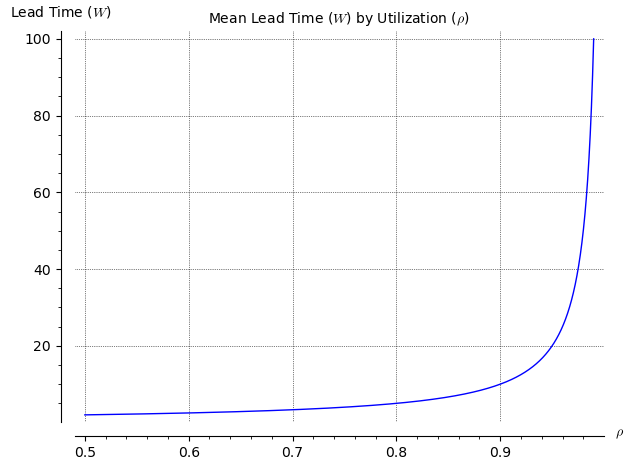
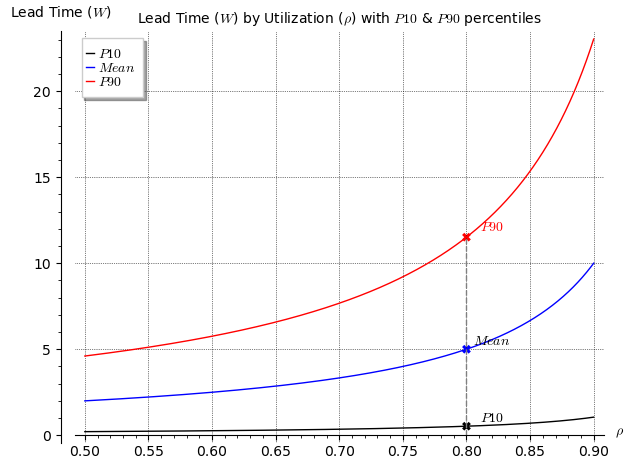
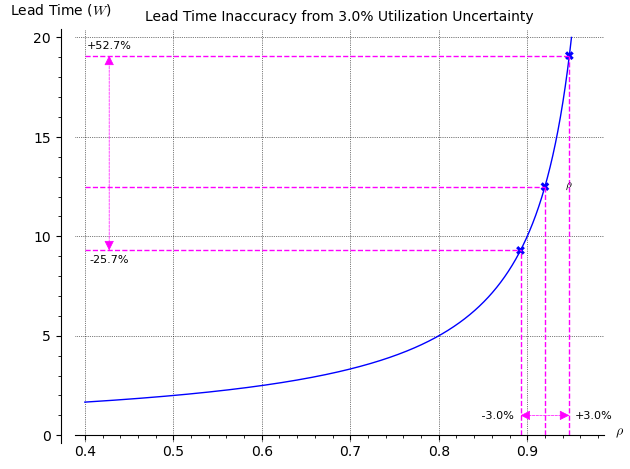
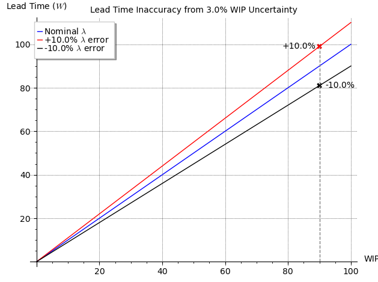

{{ draftMark }}

## The goals of performance measurement

### The Real Problem of Performance Measurement

In business or engineering the ultimate reason why performance is measured for any system or organization is to make decisions about how to best operate it to get the maximum value for the resources consumed. This simple formulation hides the main difficulties in performance measurement. How to define *value* and *resources* and what can be observed about the system that will accurately represent the value produced and the resources consumed.

The definition of value and resources is very dependent on the field of application. Some fields, like chemical plants can define it very clearly based on the volume or weight of products and reactants, while in others, like design or engineering activities, both the value and the resources are much harder to define and measure. They are sometimes measured by *story points*, design artifacts, hours of engineering, etc... There are many resources in different fields addressing this problem. In this article we are after a more modest goal to provide a systematic way to approach the measurement problem itself, provided that the value and resources definitions are clear, and that there are available signals that accurately represent them.

### Back to the source

As usual in the *Impractical Engineer* series, we want to ground ourselves on the foundational concepts. The definition of *Performance* by [Merriam-Webster, fourth meaning](https://www.merriam-webster.com/dictionary/performance) refers itself to [Perform](https://www.merriam-webster.com/dictionary/perform), which gives us the baseline for the context of performance measurement:

1. Carrying out something, typically a task or jobs.
2. Adhere to terms (as in a contract)

So we can adopt for our purposes:

> Performance is the execution of tasks or jobs subject to certain terms

Note that even this broadly accepted definition of performance leaves out how it maps to real world value and hides behind the generic terms of completion of *tasks* and the existence of a set of *terms* to judge outcomes.

Despite these limitations, this definition, and the framework that derives from it are powerful tools to structure and implement performance measurement mechanisms once these terms are defined for a particular field.

### Effectiveness and Efficiency

There are two aspects of Performance commonly considered.

Effectiveness
: How well is the job performed with respect to the given terms. That is how much or little the results of the job deviate from the expectations/terms.

Efficiency
: How many and what kind of resources are used in completing the jobs. Similarly, there may be expectations (terms) on the quantity and type of resources used that are considered when evaluating performance.

The immediate goal of Performance Measurement is to define and obtain metrics that allow to observe and evaluate the performance of a system (people, machines or combinations of both) when executing a task. Evaluation of performance in turn has an ultimate goal to understand the behavior of the system and be able to control and improve it by effecting changes in it.

## A Systems Model

To understand performance measurement in depth, it is useful to adopt a model to support the rigorous definitions that are needed to implement performance measurement systems.

The `System` to be measured and controlled performs `Jobs` that are presented to it as `Inputs` through a `waiting queue` and deliver the results of its activity as `outputs` if they meet the expected terms, or rejected as `scrap` if they don't meet the expected terms. The `System` consumes `Resources` to perform the jobs in its input queue.

The delivery of value is a function of the jobs successfully completed. The simplest interpretation is to assign a constant, uniform value to all jobs completed with more sophisticated models will evaluate it based on domain dependent characteristics of the completed jobs. In Agile software engineering this would be equivalent to assigning value based on the raw number of *stories* completed vs. the sum of their *story points*.

Value is then associated to how many jobs are completed in a unit of time, and how quickly a job is completed from start to finish.

### Observability

There are three key events in the processing of a `Job`, with their respective times when they happen:

- Jobs arrive to the system at the `arrival time`
- The System starts processing a Job (accepts it) at the `start time`
- The System completes processing a Job at the `completion time`

The system is observed by monitoring when jobs arrive, when they start processing and when they finish, as well as recording the outcome of the job processing (output successful/unsuccessful).

```plantuml
@startuml (id=OBSERVABLE_SYSTEM)

!include style.ipuml

skinparam ranksep 20

left to right direction

control "Inputs\n(Jobs)" as Inputs

rectangle Outputs
rectangle Scrap


together {
  rectangle Resources
  together {
    (arrival\ntime) as arrT
    (start\ntime) as stT
    (completion\ntime) as cT
    arrT -[hidden]-- stT
    stT -[hidden]-- cT
  }
together {
  queue waiting
  rectangle "\nSystem\nunder\nObservation" as SUO {
    portin accept
    portout done
  }
  circle entry as c1
  hexagon check as c2
  c1 --> waiting
  waiting --> accept
  done --> c2
  }
  SUO <-r- Resources
}
Inputs --> c1
c2 --> Scrap: unsuccessful
c2 --> Outputs: successful

arrT -> c1
stT -> accept
cT -> done

@enduml
```

### Control

Metrics are computed from the measurements and used to make decisions to act on the system to correct or improve its performance.

For Metrics to be effective in supporting decisions, they obviously need to represent accurately the delivery of value by the system, but they also need to be *well behaved* for control purposes. This *good behavior* requires:

- Timeliness: The metrics need to show changes promptly, without introducing delays and, if possible, be leading indicators of the expected delivery of value.
- Sensitivity: Metrics need to show variations for the smallest significant changes in value
- Linear Response: Variations in metrics need to correspond to equivalent variations in the production of value. Small variations should correspond to small changes and large variations correspond to large variations, with a correspondence between them as linear as possible.
- Range: The range of variation in the metric needs to be large enough to cover most if not all operational scenarios and situations.

```plantuml
!include ../../Projects/other-articles/performance-measurement/control-model.puml!CONTROLLABLE_SYSTEM
```

### Applications of the model

This simple model can capture the essence of operations for a very broad range of business and technical processes, a very short list of very common applications of this model include:

Call Centers
: The jobs here are incoming calls, the execution of the job is to respond to customers questions or requests, If the customer is satisfied, it is a successful outcome otherwise it is considered scrap.

Telecommunication Systems
: Jobs are either connection requests or data packets to be routed.

Supermarket Cashiers, Coffee shops, etc...
: Jobs are customer checkouts or services to render (serving coffee)

API Calls for information systems
: Jobs are API requests that can succeed or fail and take a time to produce a response (output) or an error (scrap)

Software or Engineering Design Teams
: Jobs are defined as "units of work" like Stories in agile methodologies or WBS tasks in more traditional project management.

Accounts Payable/Receivable
: Jobs are invoices that arrive when the accrual happens, they start when the invoice is issued and are complete when the invoice is settled or considered delinquent.

Manufacturing Processes
: This application (together with the telecommunication systems) is where the model originated, with jobs being actual jobs to create a product.

## Performance Indicators

As discussed above, this system model equates delivered value by the speed with which jobs are completed successfully and how quickly these jobs are completed. There are fields in which this is not a good model, like mineral prospecting, open heart surgery or nuclear plant maintenance. Fields in which the variability of outcomes of jobs is very big, or where the consequence of an unsuccessful job completion is unacceptable are not good fits for this model of performance measurement. With this in mind, we can define we can add rigor to the definition of performance given at the beginning by defining key indicators or values that we can observe in the model. These indicators provide guidance on what measurements and metrics need to be defined to rigorously assess the performance of the system.

### Effectiveness Indicators

- `Yield` is the first indicator of *adherence to terms* for the execution of a job. While the specific terms vary greatly from application to application, the system abstraction allows us to study the relative frequency of successful outputs vs unsuccessful scrap.
- `Throughput` is the rate at which the system generates *successful* outputs. Higher throughput drives higher value generation.
- `Wait Time` is the time elapsed between the arrival of a Job and when the system starts processing it. It shows the *idle* time that jobs must endure, and therefore potential loss of value or opportunity.
- `Processing Time` is the time a job spends between their start event and their completion event.
- `Lead Time` is the total time between the arrival of a Job and its completion event. It is important to qualify whether this is for all jobs or only successful ones. Lead time is the combination of `Wait time` and `Processing Time`. Its value as an indicator is to highlight the delay between the time when a commitment to spend resources is made (job arrival) and when the value associated with that job is realized.
- `WIP` (Work in Progress): An assessment of how many jobs are simultaneously being performed by the system. It can be a simple count of *active* jobs or calculations based on other values associated with a Job like the money value of a job, the number of individual items in the job (e.g. how many items in a shopping order), etc. As an indicator, it is a direct measure of how much value is *trapped* in the system at a particular point in time.

### Efficiency Indicators

- `Resource Usage per unit of Yield`: Usage of a specific kind of resource used either in the period or for a job. For simplicity, in the diagram above, there is no detail on the lifecycle of resources, but typically they have a *Consumption Event* with an associated time when a quantity of the resource is consumed (if it is discrete) or a *Consumption Rate* for continuous consumption (e.g. electricity)

## The Measurement Process

The definition of Indicators is a strong starting point, but they are not yet actionable to implement a performance measurement program. To do this, we need to define measurements and metrics, and the process to obtain them. To really understand what we are doing when implementing a performance measurement system, we need to lay the foundation of measurements, metrics, etc...

A [measurement](https://en.wikipedia.org/wiki/Measurement) is the *quantification of attributes of an object or event*. Measurements are obtain through by assigning numbers or other symbols to observed phenomena following a consistent set of rules. In keeping up with the rigor we aspire to, we will use the definitions:

Signal
: An observable phenomenon which can be continuous (e.g. the voltage of a battery) or discrete (e.g. arrivals of jobs to a system for processing). Clearly, signals are constrained by the observation technology available and the nature of the observed phenomenon. This obvious statement is important when designing observability tools and to understand the limitations of the observations. E.g. if a voltmeter is only able to take measurements every second, we'll never be able to properly measure oscillations in the Megahertz range and Measurements and Metrics built on these signals need to know these limitations to avoid mis-representing their results (e.g. a sinusoidal Mhz signal would show basically as zero in this example). More practical examples are that we won't be able to detect traffic surges to a website if we only count requests once an hour and similar situations.

Measurement
: The act of assigning a number, typically with an associated unit to a Signal associated with a particular moment in time. E.g. Using a voltmeter to read the number of *Volts* in the voltage signal above or counting the number of jobs in the waiting queue in the system. Assigning a single measurement to a signal is necessarily susceptible to inaccuracies and noise from the source of the signal itself, the measurement instrument, environment, etc. and it is important to consider the nature of this noise when designing the metrics that will use the measurement in order to minimize the effect of the expected noise.

Metric
: A Calculation based on one or multiple measurements that provides a value (a number or other symbol) that provides information about an Indicator. These calculations can be from an assignment of a color to certain values (Green-Yellow-Red) to sophisticated descriptive statistics of multiple measurements like means, percentiles, standard deviations, etc.

Metric Presentation & Evolution
: The presentation of how a metric changes over time to the end users that need to exercise judgments and actions based on the values of the indicator metrics.

Signals, Measurements and Metrics take place within the passage of time and, although theoretically some could be considered *instantaneous* or *continuous*,in any practical implementation, they all take a duration, or can happen only at particular moments in time. From the discussion above we need to identify the following time periods:

Measurement or Sampling Period
: The time between two consecutive measurements of the same signal. This needs to be short enough to capture the details we want from the underlying signal. A period of half the time of the smallest expected changes is a widely accepted value based on [Nyquist Theorem](https://en.wikipedia.org/wiki/Nyquist_frequency)

Calculation Period
: The time (or alternatively the number of consecutive measurements) that will be considered in the calculation of a metric value. The length of the calculation period is obviously bounded by the Measurement Period itself on the lower side and by the loss of resolution on the upper side. It needs to be long enough to reduce the expected noise in the measurements to an acceptable level. The distribution of the [Sample Mean](https://en.wikipedia.org/wiki/Sample_mean_and_covariance) is a good guide to decide how big this period should be.

Metric Interval
: The period between the calculation of two consecutive metrics. Although in many cases this is the same as the Calculation Period, some Metrics require different Metric Intervals. A well known example is the Monetary Annual Inflation that is reported every month (Metric Interval) but computed over the trailing 12 months (Calculation Period)

Reporting Period
: The length of time for which multiple metric values are displayed together for evaluation. This is the *length* of the $x$ axis in most graphs that show metrics over time.

With these concepts in hand, it is pretty much trivial to define the Measurement Process in simple steps:

1. The signal is observed during the sampling period and a value is obtained by an instrument or probe as a measurement associated with that time period.
2. A set of measurements (in general from one or multiple signals) are collected during the calculation period and, at its end, a calculation is performed to obtain the value of the metrics associated with that period.
3. Step #2 is repeated every Metric Interval
4. At the end of the Reporting Interval or later, all metrics for that period are collected and displayed together for analysis typically in the form of a table or graph.

## Performance Measurements and Metrics

Although the concepts of signals, measurements and metrics are applicable to continuous and discrete phenomena, for the type of system described above, the main interest is their application to discrete phenomena and signals.

### Measurement Definitions

For discrete processes, there are two types of measurements possible:

1. Snapshot measurements: Measuring the current count of jobs present in the system during the sampling period
2. Flow measurements: Measuring how many jobs arrive, start or complete during the sampling period.

Either measurement may be based on simple counts of jobs, or use another derived measurement that takes into account specific difference between jobs. E.g. in an Accounts Payable process it is customary to use the value of the payable invoices and the measurement of choice instead of the number of invoices themselves, while in a call center, it is much more likely to measure the number of calls answered or in process rather than other characteristics of the call. The choice of the measurement is driven by:

- The impact on performance of the variation between jobs (e.g. the value of invoices may vary a lot and has key impact on the performance assessment of the process)
- How difficult it is to observe other derived characteristics of the jobs
- How reliable are the observations of these derived characteristics.

For the system shown above, the measurements, to stay faithful to simply *assigning a number or symbol*, are restricted to counting jobs or simple derivations of job characteristics (e.g. the sum) during the sampling period. The possible measurements are, all referring to the sampling period:

- *Yield*
  - Number of jobs successfully completed in the period
  - Number unsuccessful jobs in the period

- *Throughput*
  - The same measuremetns as for *Yield*
  - Number of Jobs arriving to the system in the period
  - Number of Jobs started processing in the system)

- *WIP*
  - The number of jobs present in the system at the beginning or end of the sampling period. It is important to pick one of the two points and be consistent about using it to take measurements.
  - The number of jobs concurrently being processed by the system (jobs that have started by not completed)
  - The number of jobs waiting to start processing

- *Wait Time, Lead Time, Processing Time*
  - Time of each job to start processing since it arrives
  - Time of each job to complete since it starts processing
  - Time of each job to complete since its arrival

- *Resources Consumed*
  - Resources (by type, or aggregated through a common attribute like cost) consumed during the sampling period
  - Resources consumed in the processing of a specific job.

Note that in these definitions we are *simply counting* jobs and not trying to measure the value associated with each job or accumulating the multiple jobs into a "value measurement". The underlying assumption is that the variability of value between jobs is relatively small. If this is not the case, the most common approach is to divide the population of jobs into multiple *job classes*, each of them relatively homogeneous w.r.t. value and behaviors. Alternatively, a job may be attributed with additional characteristics which can then be used to compute value metrics.

#### Application to API or UI response performance

To ground these concepts, it is useful to see how a well known observability situation can be described and implemented using them.

Reactive computer systems, like those supporting websites, enterprise systems, or even control systems deliver value by responding to external inputs with correct information and internal changes to their state. Observability of API performance is a very common topic in DevOps practice and is a straight forward application of the concepts defined above.

##### Signals

The *job* signals available from an API are the events of request and responses for the API as captured in a log. A `JSON` example of such event indicating a job arrival may be:

```json
{
  "Id": "550e8400-e29b-41d4-a716-446655440000",
  "timestamp": "2020-02-08 09:30:26.123-08:00",
  "event": "REQUEST",
  "details: {
    "url": "https:/example.server.com/at/path",
    "operation": "GET"
    [...]
  }
}
```

and the corresponding event indicating a successfully completed job may be: 

```json
{
  "Id": "550e8400-e29b-41d4-a716-446655440000",
  "timestamp": "2020-02-08 09:30:27.383-08:00",
  "event": "SUCCESS",
  "details: {
    "code": "200",
    [...]
  }
}
```

The distinction between a job `arrival` and a job `start` is frequently ignored in API monitoring but it can be an important improvement in understanding the behavior of the system. Our preferred interpretation is to have the `arrival` event correspond to the arrival of the request to the HTTP protocol handler or Ingress component in an architecture and associate the `start` event with the moment the request begins processing by the business logic.

Resource signals depend a lot of the specifics of the architecture serving the API. Good candidates can be the number of IO operations associated with a job, the number of threads used and the CPU time and the memory consumed. These signals tend to be costly to obtain with the granularity of individual jobs, but can be obtained by sampling the state of the compute resources associated with the API at regular *Sampling Periods* with a record similar to:

```json
{
  "resource": "Threads",
  "period": {
    from: "2020-02-08 09:30:20.000-08:00",
    to: "2020-02-08 09:30:25.000-08:00"
  },
  "quantity": {
    "amount": 163
    "unit": "count"
  }
}
```

Showing a sampling period of 5 seconds and a signal of `163 count` threads during that period. The sampling mechanism itself will determine whether this number should be interpreted as the maximum, minimum, average, value at start/end of period, etc.

##### Measurements

Measurements are about assigning values to the signal events, to remove ambiguity without inventing a new notation, we can simply express the measurements as SQL statements against a table that has the `Id`, `Timestamp`, expressed as milliseconds since the Unix Epoch and the `event` label as a string. This is just for convenience of notation and implementations may vary depending on technology choices and other optimizations.

- *Yield*

  - Number of jobs successfully completed in the period:

  ```sql
  select count(1) from api_log where event = 'SUCCESS' and timestamp between $from and $to
  ```

  - Number unsuccessful jobs in the period:

  ```sql
  select count(1) from api_log where event = 'ERROR' and timestamp between $from and $to
  ```

- *Throughput*

  - Number of Jobs arriving to the system in the period:

  ```sql
  select count(1) from api_log where event = 'REQUEST' and timestamp between $from and $to
  ```

  - Number of Jobs started processing in the system: `select count(1) from api_log where event = 'START'`

  ```sql
  select count(1) from api_log where event = 'START' and timestamp between $from and $to
  ```

- *WIP*

  - The number of jobs present in the system at the beginning or end of the sampling period.

  ```sql
  select arrivals.n - completions.n from
    (select count(1) as n from api_log 
      where event = 'REQUEST' and timestamp <= $measurement_time) as arrivals
    (select count(1) as n from api_log 
      where event in ('SUCCESS', "ERROR") and timestamp <= $measurement_time) as completions
  ```

  - The number of jobs concurrently being processed by the system (jobs that have started by not completed)

  ```sql
  select starts.n - completions.n from
    (select count(1) as n from api_log 
      where event = 'START' and timestamp <= $measurement_time) as starts
    (select count(1) as n from api_log 
      where event in ('SUCCESS', 'ERROR') and timestamp <= $measurement_time) as completions
  ```

  - The number of jobs waiting to start processing

  ```sql
  select arrivals.n - completions.n from
    (select count(1) as n from api_log 
      where event = 'REQUEST' and timestamp <= $measurement_time) as arrivals
    (select count(1) as n from api_log 
      where event = 'START' and timestamp <= $measurement_time) as completions
  ```

- *Wait Time, Lead Time, Processing Time*

  - Time of each job starting processing since its arrival

  ```sql
  select s2.start_time - s1.arrival_time
  from
    (select timestamp as arrival_time from api_log where event = 'REQUEST') as s1
    (select timestamp as start_time from api_log 
      where event = 'START' and timestamp between($start_period, $end_period) as s2
  where s1.id = s2.id
  ```

  - Time of each job to complete since it starts processing

  ```sql
  select s2.completion_time - s1.start_time
  from
    (select timestamp as arrival_time from api_log where event = 'START') as s1
    (select timestamp as start_time from api_log 
      where event in ('SUCCESS', 'ERROR') and timestamp between($start_period, $end_period) as s2
  where s1.id = s2.id
  ```

  - Time of each job to complete since its arrival (can also be computed as the sum of the previous two):

  ```sql
  select s2.completion_time - s1.arrival_time
  from
    (select timestamp as arrival_time from api_log where event = 'REQUEST') as s1
    (select timestamp as completion_time from api_log 
      where event in ('SUCCESS', 'ERROR') and timestamp between($start_period, $end_period) as s2
  where s1.id = s2.id
  ```

Note that the measurements, as defined, consider only the jobs that have their *end event* recorded during the period and does not restrict when their *begin event* happened, otherwise it would only consider jobs with a maximum duration equal to the sampling period. When computing measurements for historical data, the conditions of what jobs to consider may be chosen differently. For example, measuring all the jobs that started during the sampling period instead, and allow the selection to peer into the *future* of the sampling period for the *end event* of the job.

- *Resources Consumed*

  To compute the resources consumed, we'll assume an additional table `resource_usage` of signals with the columns `period_end` being a unix Epoch, a `resource_label` to identify the resource being consumed and a decimal `amount` that represents the quantity of the resource consumed in a pre-defined unit of measure specific to the resource label (e.g. thread counts, memory Mbytes, CPU units, ...)

  - Resources (by type, or aggregated through a common attribute like cost) consumed during the sampling period

  ```sql
  select resource_label, period_end, sum(amount)
    from resource_usage
    group by resource_label, period_end
  ```

  - Resources consumed in the processing of a specific job: This is not possible with the data collection described above. It would require an additional column indicating the job `Id` which is not readily available in the most common observability frameworks. If this information were available, the computation would be similar, simply adding the `Id` as another grouping term. If alternately, the resource collection was based on job completion events, grouping by `period_end` would not be meaningful, requiring time conditions similar to the other job centric measurements above.

Any observation mechanism like the *event log* described here is itself subject to incidences and failures, so in addition to the measurements of the process as defined, it is interesting to measure the quality of the observation process by defining, for example, jobs that have *completion events* without their corresponding arrival or start event:

```sql
select count(s1.Id) as mismatches from
    (select timestamp as arrival_time from api_log 
      where event in ('SUCCESS', 'ERROR')
      and timestamp between ($period_start, $period_end)) as s1
    full outer join (select timestamp as completion_time from api_log where event in ('SUCCESS', 'ERROR')) as s2
      on s2.Id = s1.Id and s2.timestamp <= s1.timestamp
    full outer join (select timestamp as start_time from api_log where event = 'START') as s3
      on s3.Id = s1.Id and s3.timestamp >= s2.timestamp and s3.timestamp <= s1.timestamp
where s2.completion_time is NULL or s3.start_time is NULL
```

## Metrics

Metrics are the key artifact to support decision making. Of course metrics can also be defined to study phenomena, or even be *information only* metrics, but the original reason why metrics are defined, from the complex metrics to monitor a nuclear power plant to the probability of rain tomorrow is to support making decisions like whether to shutdown a reactor or to take the umbrella when we leave the house. The variation in the kinds of decisions is endless and so are the metrics to support them. It is not possible to prescribe a uniform set of metrics for performance measure that is applicable in all situations and use cases. As an alternative, we can look at broad kinds of metrics and their structure so that specific metrics can be defined relying on the given stereotypes for each kind.

The concrete expression of a metric is a collection of numbers or symbols and therefore lack any mea

To define a metric, we need to define the calculation to be performed on the available measurements, the different periods and intervals mentioned above and the presentation to decision makers. For the System model that we have considered here, several metrics are commonly used:

### Yield

Yield metrics are computed based on the Yield measurements for the period, the percentage of failures with respect to all completed jobs, $yield = N(unsuccessful) / N(successful)$

Depending on the volatility of this percentage, Yield can also be computed using a calculation period that covers multiple trailing sampling periods. In this case, multiple yield metrics can be defined attending to the maximum, average, or percentile thresholds. For these more advanced statistics, it is critical to consider the number of sample points available during the calculation period to ensure a representative value.

### Throughput

Throughput metrics tend to follow closely the measurements defined above, with similar qualifications regarding multi-sample period calculations that *Yield* metrics. Throughput metrics introduce and additional consideration of "reference" levels chosen based on the intended use of the metric:

- Target goals (e.g. desired visitors to a commerce web site) to measure some form of business performance or expectations.
- A longer period statistic, typically the historical average or a high percentile (e.g. p80, p90) to detect trends or changes in the behavior of the system or job arrival.
- An estimate of Capacity (See below as resources) of the system to serve as an alert signal that a resource or an internal process in the system may become bottlenecks and create problems. Capacity estimates are notoriously unreliable in most dynamic systems so they should be used with care, yet they are critical in safety driven operations like power plants that may have hard safety limits to the throughput (i.e. power output) they can support.

### Wait Time, Lead Time, Processing Time

These measurements are job specific and metrics are needed to get an aggregate view of the system behavior. The most common metrics are centrality statistics like median, average or mode across all considered jobs, dispersion statistics like standard deviation or *limit* statistics like P90 or P95 of the population of jobs compared to a desired benchmark or SLA.

### Resources Consumed

Although the specifics of resource consumption depend a lot on the particular application, all applications share the fact that the maximum throughput of the system is limited by the capacity of its *bottleneck*. A bottleneck is nothing else that the most scarce resource to the system when processing jobs. The *Capacity* of a *bottleneck* resource is the quantity available per time to be used to process jobs.

Based on this Capacity, once translated to the maximum theoretical throughput of the system, we can define the metric of *Utilization* with is simply the Throughput expressed as a fraction of the maximum throughput.

## Using Performance Metrics for System Design and Control

Systems are designed and implemented with an expectation of certain *Design Throughput* and *Design SLA* expressed in terms of some Lead time metric expectation, e.g. a P90 lead time. The design question is how many resources should be provided to the system to perform at that level. A naive approach would be to simply provide enough resources to make the *Capacity* equal to the *Design Throughput*. This is naive because it does not take into account any variability in job arrival or processing, not any error margins in the estimation of resource consumption by jobs.

To find the correct *Capacity* to provision and therefore the *Target Utilization* for a given throughput we need to understand, at least directionally the dynamic behavior of these systems in the presence of variability. Queuing systems theory provide tools for this analysis. Using a very simplified model ([M/M/1 Queue Model](https://www.win.tue.nl/~iadan/que/h4.pdf)) the behavior of these systems is characterized by looking at the Lead Time expressed as a function of the *Utilization* (symbol $\rho$) of the system.

{width=75%}

When designing the system one would like to dimension it as small as possible to minimize costs, resulting in high target utilizations. The highly non-linear behavior of theses systems under those conditions results in two very negative consequences:

1. The Lead time of the system is multiplied by a factor roughly proportional to $\rho/(1-\rho)$, which at high utilizations will vary between 5x and 50x times the basic processing time when the system is idle, just due to queuing effects. If the SLA is based on a P90 metric, the effects are even worse as shown below.

   {width=75%}

2. Any inaccuracies in the estimation of capacity or expected load will result is highly unstable SLA performance as shown in the following diagram, where an estimate error of 3% in the utilization of the system results in more than a 75% swing of mean lead time and worse if the SLA is based on a P90 metric.

   {width=75%}

These effects are made even worse if the variability of job arrivals (traffic [burstiness](https://en.wikipedia.org/wiki/Burstiness)) or processing time for different jobs increases. The first effect is determined by the target utilization of the system and can only be mitigated by lowering the target utilization using a P90 metric, either by reducing the traffic load or increasing the processing resources. The second issue is one of accuracy of metrics and control. Using Throughput or Utilization as the monitoring metric results in significant control problems as shown above. Monitoring should be done directly based on lead or wait times and use those to take action on the system by throttling the arrival of jobs or scaling resources accordingly. In many cases, monitoring Wait or Lead time is readily available through a job event log as described above. In some other systems, the arrival, start and completion events are more difficult to monitor (e.g. physical movement of jobs in manufacturing). In this case, a *Work In Progress (WIP)* metric can be used.

The relationship between *WIP* and Waiting or Lead times is linear and therefore much more suitable for using as control variable:

{width=75%}

Furthermore estimation or measurement errors in throughput also have limited impact on lead times

{width=75%}

## Further Thoughts

In the descriptions so far, the focus has been on measurements and metrics of outputs of the system, be it throughput or lead times. As the discussion about using *WIP* shows, in some cases it is advantageous to look at internal

- Statistical Process Control: Focus on the process, not the outcomes. --> https://ee-handbook.io/
- Error and Noise
- Continuous Improvement

---

## PROGRESS BOUNDARY ===================================

---

### Effectiveness

- Yield
- Throughput
- MTBF
- Lead Time
  - Arrival to Done
  - Acceptance to Done
- WIP
  - Waiting
  - Active
- Resource Usage

### Efficiency

- Resources per unit of output
- Resource WIP

## Developing Intuition

- M/M/1
- 

## Applications

### API Performance

### Streaming/Messaging System

### Software Development

### Manufacturing

### General Operations (Cust. Support, Cashiers, ...)

