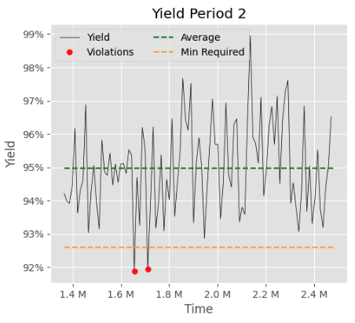
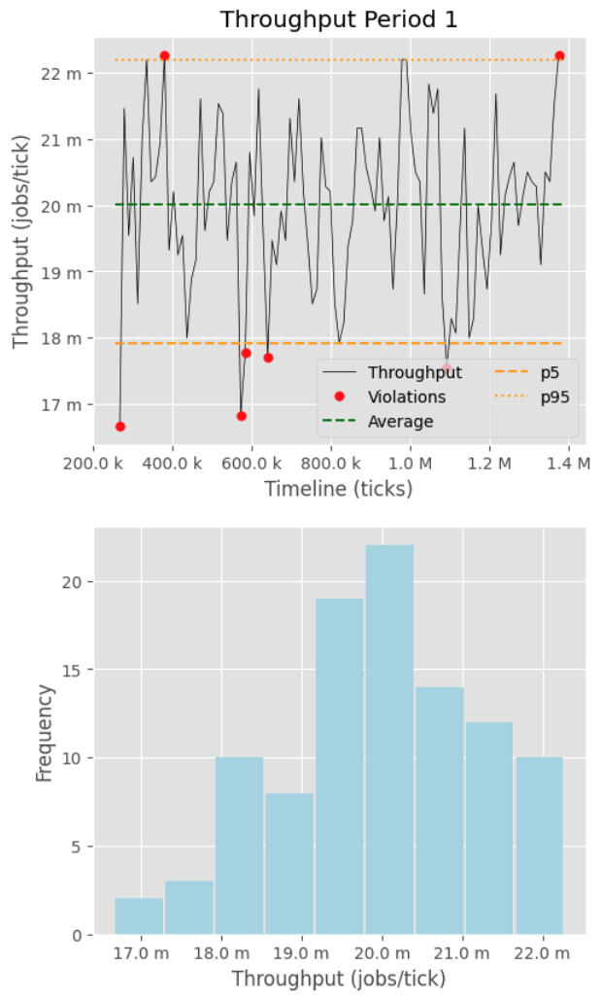
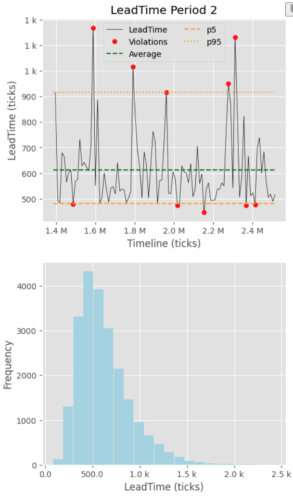
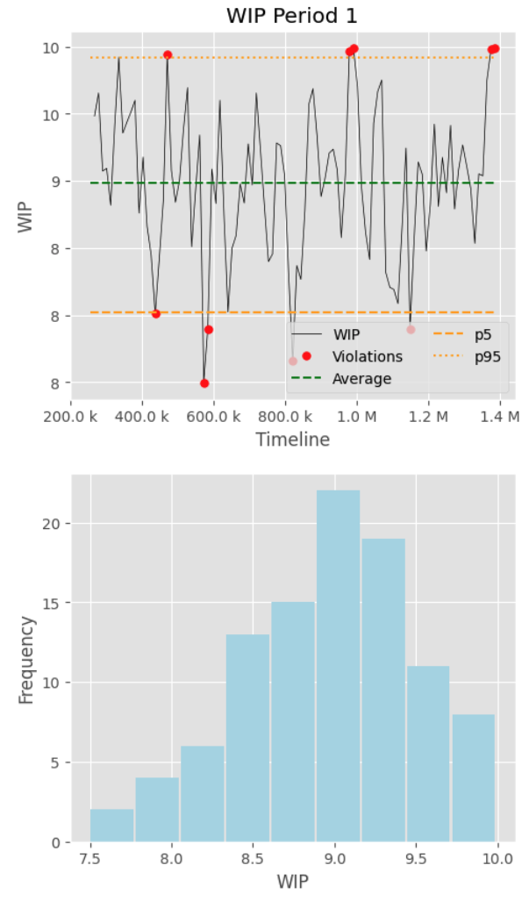
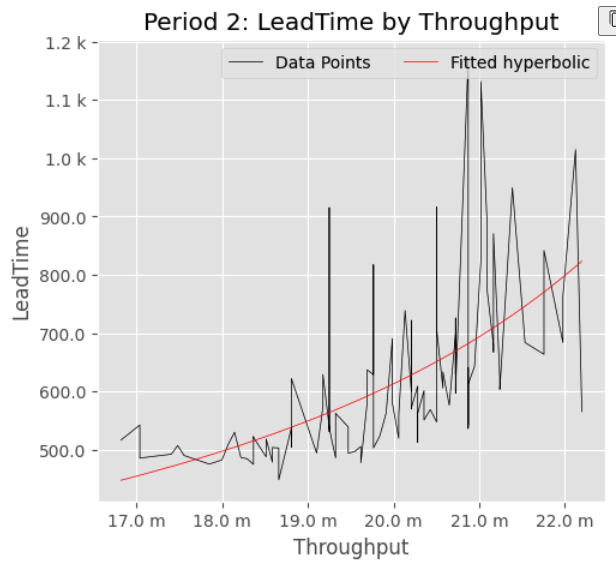
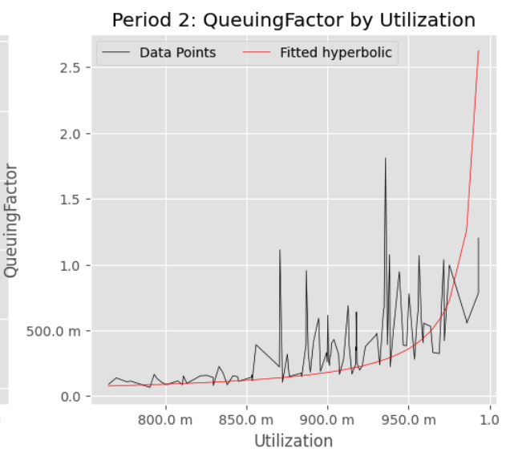
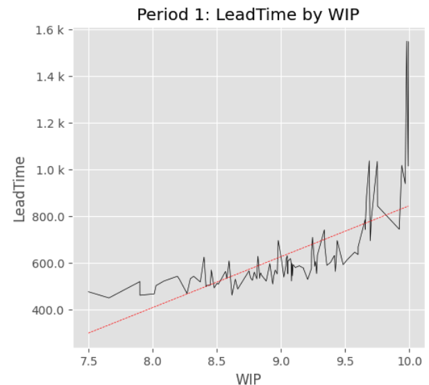

## Context

Measurement and metrics are essential for data driven management and operation of systems, organizations or processes.

As mentioned in the introduction article to [Performance Measurement](https://jmpicnic.github.io/obsidian-docs/Projects/other-articles/performance-measurement/introduction/), sometimes decision makers don't pay enough attention to how those all important metrics are obtained and how to properly interpret them.

The measurement process is the set of mechanisms, activities and calculations that take a system in operation and produce information to support decision making and improve the operation of the system itself.

To make the best decisions, it is not enough with seeing the metrics and reports, but also to understand what they mean and how they were produced. Pulling the thread from the desired results requires digging through four layers:

1. Decision makers consume reports, very frequently in graphic or chart form to decide what actions, if any need to be taken.
2. Reports are assembled by collecting and organizing aggregate data (metrics) that represent selected behaviors or performance of a system, organization or process.
3. Metrics provide meaningful indicators of behavior by computing statistics and combining measurements on the system over time.
4. Measurements are taken at points in time by observing and sampling signals that the system exposes.

Graphically:

```plantuml
!include ../../Projects/other-articles/performance-measurement/measurement-process.puml!MEASUREMENT_PROCESS

caption The steps to obtain reports from basic signals
```

## Recap of the System Model and Relevant Measurements

To explore how Reports are obtained from basic signals in the four layers describe above, it is useful to recall the simplified system model in the [introduction article](https://jmpicnic.github.io/obsidian-docs/Projects/other-articles/performance-measurement/introduction/#system-model-and-performance-indicators). The summary of the model as a *Job Flow* diagram:

```plantuml
!include ../../Projects/other-articles/performance-measurement/system-model.puml!OBSERVABLE_SYSTEM
```

Where the system processes jobs as they arrive, consuming resources in the process and with successful and unsuccessful outcomes. As the system is going to have some finite capacity, arriving jobs may have wait for resources to be available, in which case they would queue up before the system starts working on them.

The performance of this type of systems can be characterized by:

- *Yield*
  - Number of jobs successfully completed in the period
  - Number unsuccessful jobs in the period

- *Throughput & Utilization*
  - The same measurements as for *Yield*
  - Number of Jobs arriving to the system in the period
  - Number of Jobs started processing in the system
  - Utilization is equivalent to Throughput with its values normalized against a given *Capacity* which is intended to represent the maximum achievable throughput.

- *WIP*
  - The number of jobs present in the system at the beginning or end of the sampling period. It is important to pick one of the two points and be consistent about using it to take measurements.
  - The number of jobs concurrently being processed by the system (jobs that have started by not completed)
  - The number of jobs waiting to start processing

- *Service Times: Wait Time, Lead Time, Processing Time*
  - Time of each job to start processing since it arrives
  - Time of each job to complete since it starts processing
  - Time of each job to complete since its arrival

- *Resources Consumed*
  - Resources (by type, or aggregated through a common attribute like cost) consumed during the sampling period
  - Resources consumed in the processing of a specific job.

## Reports

Reports are directly consumed by decision makers, so they need to be concise, understandable and effective in conveying the intended information. [The Visual Display of Quantitative Information](https://www.linkedin.com/pulse/visual-display-quantitative-information-edward-r-tufte-miguel-pinilla-nohye/?trackingId=hGzLXVTUT9OhGzVjN1Mg0g%3D%3D) is a classic resource for designing effective reports in visual form.

There are several core principles shared by effective reports:

- They avoid decorations that don't directly convey information or that are redundant with other elements.
- Provide enough context to interpret them, for example by adding min-max ranges or markers for special conditions that require attention.
- Use visual clues to aid in the interpretation, for example providing trend lines that clarify otherwise noisy data.
- Avoid unnecessary variations across different reports in a report family. Use consistent styles and colors to minimize the cognitive load on the decision maker and allow them to concentrate on the interpretation of the reports rather than style elements.
- Provide quantitative information to aid interpreting the report when compared with other data or reports obtained independently. Axis should be labeled and scaled properly, time frames clearly visible and information about the report itself be available on demand (e.g when was the report produced, by who and what tools where used). Ideally, in our world of instant information access, all the data and computations used to produce the report are accessible as advocated by [Professor Donoho](https://statistics.stanford.edu/people/david-donoho) in his [Reproduicble Research in the Mathematical Sciences](https://stodden.net/papers/PCAM_20140620-VCS.pdf) paper.

The performance characteristics described in the previous section can be made concrete with a set of graphical reports that follow these principles. The specific values in the examples below are generated by using a simple [G/G/k Queue](https://en.wikipedia.org/wiki/Kendall%27s_notation) simulator that can be found as a [Jupyter Notebook](https://jupyter.org/) and associated python files in Github at [perf_measurements.ipynb](https://github.com/jmpicnic/jupyter-notebooks/blob/main/perf_measurements.ipynb)

For these examples, times are an arbitrary unit, different applications may user different units (e.g. milliseconds for API performance, hours for e-commerce fulfillment, ...). Each report covers a time period of observations of the system.

### Yield/Availability-Reliability Reports

Yield is the degree of success that a system has in producing its outputs. In the case of discrete outputs this is the simple percentage of successful outputs against the total number of jobs processed.

An example report is:



This report provides the following information:

- `Yield`: The percentage of success at specific points of time, computed as the number of jobs completed in a given period that ends at the time point represented in the report.
- `Average`: The average of the Yield over the complete reporting period to serve as a macro-value to anchor the report. This value can also be substituted by a linear or higher order curve fit (see example in the [Lead Time vs Throughput](#lead-time-vs-throughput) report below) to show macro time trends in the data.
- `Min Required`: A policy set value of what is the required level of performance for the Yield in this system, providing context for the decision maker. Note that in the case of yield, the maximum achievable is 100%, so no *upper control* is needed. In other reports, like the ones below, both a lower and a higher control levels maybe used.
- `Violations`: Point markers to visually draw attention of the decision maker to specific points that lay out of the acceptable results.

In addition, the report provides:

- A title that identifies the information presented (Yield) and the time of the report (Period2). In real applications, the identification of the system (e.g. an API name) would be provided and the period would be a calendar identification.
- The vertical axis is labeled with the actual values of the Yield percentage, making it explicit that the scale is not grounded in *0%*.
- The horizontal axis in this case is labeled simply with the `clock tick` value of the simulation, with the scale showing `M` to indicate millions of ticks. In real life, this would be a date-time value, ideally with additional context (e.g. the year for a month report or the timezone for time-of-day centered reports)

Reliability or Availability reports are very similar to Yield reports, but applied to a continuous output. The only difference is in the calculation of the percentage values in the report. In the case of continuous processes, the percent is computed by taking the quantity of acceptable product (or time in the case of pure reliability reports) against the total production of the period represented by the data point.

### Throughput Report

Throughput shows the amount of output produced by the system in the period. In these examples, it is simply represented by the number of tasks completed in the period. If the value from each task varies from task to task, this can be replaced by a sum of the values of tasks completed during the period.



The top chart is very similar in appearance to the yield report, with differences worth noting:

- In the case of yield, the values are adimensional percentages. In this case vertical axis needs to be labeled with the units in which throughput is expressed. In this case, jobs with the scale showing `m` to indicate `millis`, that is a thousandth of a job completed in each tick.
- The *control* levels in this case are given by the P5 and P95 percentiles to show an alternative use of these visual elements. In the case of throughput, both values are significative, so both are included in the report. Using percentile control levels provides information relevant to SLA commitments that are sometimes expressed in those statistics.

The lower chart shows a histogram distribution of the throughput values during the period. In the case of throughput and other indicators, variability is as important, if not more important than the average value. Presenting the statistical distribution of values gives the users valuable information on the behavior of the system, particularly when used in combination with yield or other quality reports. The vertical axis can be labeled with the raw count of instances that fall in each bin (Frequency) or alternatively with a percentage of the total number of occurrences in the report.

Distribution information can also be computed for each point in the report, as its value is itself computed from multiple measurements as we will see later. In this case, [Candlestick Charts](https://en.wikipedia.org/wiki/Candlestick_chart) similar to those used in stock pricing can be used, being careful to not overload a single chart with too much information that would make it too noisy.

### Time Reports

The service times indicators are all similar, taking the Lead Time as the example, the associated reports can be made almost identical to the Throughput ones:



The vertical scale in the timeline chart and the horizontal scale in the histogram are in time units (simulation ticks in the example). For service time reports, the control levels can represent directly externally defined service goals or percentiles of the data as information provided to the decision makers.

### Work In Progress (WIP) Report

Work In Progress follows the same pattern, with the units being the count of jobs currently in the system. Similarly to Througput reports, the simple count of jobs can be replaced by the sum of the value assigned to each job or other dimensions like the expected time or cost to process them.



### Correlation Reports

The reports described so far show the evolution of a metric of the system against time or a statistic (the distribution histogram) of that dimension. To understand the behavior of the system it is also useful to directly report on some relationships between dimensions. For dynamic systems, two reports offer particular insights.

#### Lead Time vs. Throughput

This is a key characteristic of dynamic systems. In general, the relationship is proportional to the inverse of the "spare capacity" of the system, which goes to zero as the throughput approaches the maximum that the system can support. As systems are all constrained by their resources, which imply their cost, they tend to operate at high utilization values, resulting in very high variability of lead times. As lead times are a key components in SLA's, it is particularly important to understand the actual values that the system is experiencing.



This report shows the Lead Time (time between arrival and completion) of jobs when plotted against the throughput in an interval. The Lead Time is computed as the average of all the jobs that complete in the specific interval. Similar reports could be done for the P95 value of the jobs lead times, or other relevant percentiles for SLA evaluation.

The report also shows a fitted curve that follows [Kingman's Formula ](https://en.wikipedia.org/wiki/Kingman%27s_formula)for [G/G/1 queues](https://en.wikipedia.org/wiki/G/G/1_queue):

$$
W_t = \tau\frac{1}{1-\rho}\left(\frac{c_a^2 + c_s^2}{2}\right)
$$

While this formula is not useful for predicting the behavior of more complex systems, it is a decent tradeoff to use it as a relatively simple curve shape to summarize noisy metric data.

When using the Utilization instead of the throughput, the limit effect of maximum capacity becomes very easy to see.



#### Lead Time vs. WIP

The second important insight is tied to the behavior of lead time against the WIP in the system. This is a useful report because the statistical behavior of these two dimensions follows [Little's Law](https://en.wikipedia.org/wiki/Little%27s_law) ($W_t = L\lambda$) for most systems, resulting in a linear relationship between them where the slope estimates to the long running average of the system's throughput. Deviations from this estimate indicate temporary changes to the job arrival rate or service times.



The fitted line is a linear regression. Note that the choice of the curve to fit to the data is driven by a-priori knowledge or assumptions on the behavior of the system (hyperbolic for the previous two, linear for this one). This way deviations from these assumptions can be spotted in the report by ill-fitting curves. Although not provided here, information associated with the report itself should include a measure of the curve fit (e.g. $R^2$) and information to help interpret its shape and meaning. In the example above, the fit is less than perfect, particularly in the lower WIP levels, which may indicate an issue with the simulation being properly "warmed up", showing transient effects in the data.

## Metrics

Metrics provide the values that get presented in the reports. The implementation of a metric results in a collection of numbers or symbols and represents a characteristic of the operation of a system. Metric values are associated with a time interval in which the metric is computed and a point in time which is the end of that interval.

To define a metric, we need to define the calculations to produce its values based on the information available during an interval. For the System model considered above, several metrics are commonly used:

### Yield

Yield metrics are computed based on the Yield measurements for the period, the percentage of failures with respect to all completed jobs, $yield = N(unsuccessful) / N(successful)$

Depending on the volatility of this percentage, Yield can also be computed using a calculation period that covers multiple trailing sampling periods. In this case, multiple yield metrics can be defined attending to the maximum, average, or percentile thresholds. For these more advanced statistics, it is critical to consider the number of sample points available during the calculation period to ensure a representative value.

### Throughput

Throughput metrics represent the value created per unit of time by the system. This can be as simple as counting the number of successful jobs completed in a period, or adding a measure of value associated with each successful job.

The main Throughput Metric for a time interval $(T_s, T_e]$ is commonly represented by the $\lambda$ greek letter. The calculation is the sum of the value measurements of each job ($V(J)$) that is completed in that interval. Formally, for interval $i$:

$$
\lambda_i = \frac{1}{T_e(i) - T_s(i)}\sum_{J_i}{V(J_i)}\\

\forall J_i \mid T_s(i) \lt t_c(J_i) \leq T_e(i)
$$

Throughput metrics can also be expressed as an *Utilization* value by normalizing them against a stated Capacity for the system during the same interval, with Utilization being 100% when throughput reaches that value. Utilization is commonly referred to as $\rho$ in the operations literature. It is important to select the Capacity number so that utilization never surpasses 100% so that it can be fitted with curves with a shape following $1/(1-\rho)$ without singular points.

Throughput metrics are frequently associated with business goals, leading to the definition of target or reference levels for the system performance like:

- Target Throughput (e.g. desired visitors to a commerce web site) to measure some form of business performance or expectations.
- A high percentile (e.g. p80, p90) of historical throughput to detect trends or changes in the behavior of the system or job arrival.
- Estimates of the Capacity (maximum expected throughput) of the system to serve as an alert thresholds that resources or an internal processes in the system may become bottlenecks and create problems. Capacity estimates are notoriously unreliable in most dynamic systems so they should be used with care, yet they are critical in safety driven operations like power plants that may have hard safety limits to the throughput (i.e. power output) they can support. These estimates should be informed by an a-priory model of the system to be able to chose the best curve shape to fit the data points to.

### Service Times: Wait Time, Lead Time, Processing Time

Time metrics represent lengths of time that specific jobs or tasks take along their processing by the system and they are computed as statistics of those periods measured for a population of jobs. The population of jobs is typically all the jobs that complete in a given interval of time, which usually coincides with the data points presented in the reports above. In some cases the interval considered for the population of jobs is longer than the gap between consecutive report points leading to *trailing average* type of statistics, intended to smooth over noisy data or eliminate high frequency components of the measurement itself. Commonly used statistics for time metrics include centrality statistics like median, average or mode across all considered jobs, dispersion statistics like standard deviation or *limit* statistics like P90 or P95 of the population of jobs compared to a desired benchmark or SLA.

There are three specific metrics for a *single stage* system as the one shown above: Lead time ($W_t$), Processing Time ($\tau$) and Wait time ($W_w$):

- Lead time, also called *Sojourn* or *Dwell Time* is the end-to-end time from arrival ($t_a$) to completion ($t_c$) of a Job.
- Processing Time is the time the system spends actively working on a job from start to complete.
- Wait time is the duration between job arrival and when the system starts active work.

Their formal definition:

$$
\begin{array}{}
W_t(i) &=& \frac{1}{N_i}\sum_{J_i}{t_c(J_i)-t_a(J_i)}\\
\tau(i) &=& \frac{1}{N_i}\sum_{J_i}{t_c(J_i)-t_s(J_i)}\\
W_w(i) &=& \frac{1}{N_i}\sum_{J_i}{t_s(J_i)-t_a(J_i)}\\
N_i &=& count(J_i)\\
\forall J_i &\mid& T_s(i) \lt t_c(J_i) \leq T_e(i)\\
\end{array}
$$

From their definitions it is obvious that $W_t=\tau+W_w$

### Work In Progress (WIP)

Work in progress is evaluated at the end of the interval over which the metric is computed. It is a simple count of the number of jobs that have arrived but have not completed yet. In the Operations literature, it is commonly designated as ($L$). Formally, for an interval $I_i=(T_s(i), T_e(i)]$ :

$$
\begin{array}{}
WIP_i &=& count(J_i)\\
\forall J_i &|& t_a(J_i) \leq T_e(i) \lt t_c(J_i)
\end{array}
$$

## Signals and Measurements

Signals and Measurements is where the interface with the real-life system happens. To make the description more concrete, let's assume that the system is an API Endpoint in a system and we will be producing the metrics and reports described above with API calls being the jobs in the system.

Reactive computer systems, like those supporting websites, enterprise systems, or even control systems deliver value by responding to external inputs with correct information and internal changes to their state (its successful outcomes) or occasionally producing an error due to incorrect inputs or internal conditions (its scrap). Observability of API performance is a very common topic in DevOps practice and can be formulated as a straight forward application of the concepts defined above.

This simplified model can be criticized as not covering information processing in multiple steps or more complex communication topologies, still the core ideas stay applicable and are easily extended to cover those cases.

The metric definitions in the previous section rely on being able to identify Jobs, their arrival, start and complete times and fixing the metric intervals where the metrics themselves are calculated. The basic information for each job can be represented by a table with one row per job and the following values as columns:

- $Id$: A unique identifier for the Job in the row
- $t_a$: The time when job arrives to the system
- $t_s$: The time when the job is started to be worked on by the system (resources start being used)
- $t_c$: The time when the job is complete by the system.
- Success: A boolean value indicating whether the job completion was successful (an output) or not (scrap)
- Value $V(J_i)$: If the value of jobs varies from Job to Job and a simple count is not acceptable to use as throughput, each job needs to have a value assigned to it.

Running systems don't produce this neat representation directly. Observability tools usually produce a stream of events as a Job is being processed through the system. These events are the signals that the system emits.

### Signals

The *job* signals available from an API are the events of request and responses for the API as captured in a log. A `JSON` example of such event indicating a job arrival may be:

```json
{
  "Id": "550e8400-e29b-41d4-a716-446655440000",
  "timestamp": "2020-02-08 09:30:26.123-08:00",
  "event": "REQUEST",
  "details: {
    "url": "https:/example.server.com/at/path",
    "operation": "GET"
    [...]
  }
}
```

and the corresponding event indicating a successfully completed job may be:

```json
{
  "Id": "550e8400-e29b-41d4-a716-446655440000",
  "timestamp": "2020-02-08 09:30:27.383-08:00",
  "event": "SUCCESS",
  "details: {
    "code": "200",
    [...]
  }
}
```

The distinction between a job `arrival` and a job `start` is frequently ignored in API monitoring but it can be an important improvement in understanding the behavior of the system. A very useful interpretation is to have the `arrival` event correspond to the arrival of the request to the HTTP protocol handler or Ingress component in an architecture and associate the `start` event with the moment the request begins processing by the business logic or back-end component.

The determination of *Value* for the job is dependent on the contents of the `details` section and the measurement system will need to perform a domain specific calculation to obtain it.

Resource signals depend a lot of the specifics of the architecture serving the API. Good candidates can be the number of IO operations associated with a job, the number of threads used and the CPU time and the memory consumed. These signals tend to be costly to obtain with the granularity of individual jobs, but can be obtained by sampling the state of the compute resources associated with the API at regular *Sampling Periods* with a record similar to:

```json
{
  "resource": "Threads",
  "period": {
    from: "2020-02-08 09:30:20.000-08:00",
    to: "2020-02-08 09:30:25.000-08:00"
  },
  "quantity": {
    "amount": 163
    "unit": "count"
  }
}
```

Showing a sampling period of 5 seconds and a signal of `163 count` threads during that period. The sampling mechanism itself will determine whether this number should be interpreted as the maximum, minimum, average, value at start/end of period, etc.

### Measurements

Measurements are about assigning values to the signals, to remove ambiguity without inventing a new notation, we can simply express the measurements as SQL statements against a table that has the `Id` of the job, `Timestamp`, expressed as milliseconds since the Unix Epoch the `event` as a `VARCHAR` and the details as additional columns. This is just for convenience of notation and implementations may vary depending on technology choices and other optimizations. Popular choices for signal collection and storage are log analysis services like [Splunk](https://www.splunk.com/) or [New Relic](https://newrelic.com/). The natural key of such table would then be `(ID, TIMESTAMP)` as no two events for the same job should be simultaneous.

With this convention, the measurements that can be directly obtained from the stream of events:

- *Yield*

  - Number of jobs successfully completed in the period:

    ```sql
    select count(1) from api_log where event = 'SUCCESS' and timestamp between @from and @to;
    ```

  - Number unsuccessful jobs in the period:

    ```sql
    select count(1) from api_log where event = 'ERROR' and timestamp between @from and @to
    ```

- *Throughput*

  - Number of Jobs arriving to the system in the period with an interval `[@from, @to)`:

    ```sql
    select count(1) from api_log where event = 'REQUEST' and timestamp >= @from and timestamp < @to;
    ```

  - Number of Jobs started processing in the system:

    ```sql
    select count(1) from api_log where event = 'START' and timestamp >= @from and timestamp < @to;
    ```

- *WIP*

  - The number of jobs present in the system at the beginning or end of the sampling period.

    ```sql
    select arrivals.n - completions.n from
      (select count(1) as n from api_log 
        where event = 'REQUEST' and timestamp <= @measurement_time) as arrivals
      (select count(1) as n from api_log 
        where event in ('SUCCESS', "ERROR") and timestamp <= @measurement_time) as completions;
    ```

  - The number of jobs concurrently being processed by the system (jobs that have started by not completed)

    ```sql
    select starts.n - completions.n from
      (select count(1) as n from api_log 
        where event = 'START' and timestamp <= @measurement_time) as starts
      (select count(1) as n from api_log 
        where event in ('SUCCESS', 'ERROR') and timestamp <= @measurement_time) as completions;
    ```

  - The number of jobs waiting to start processing

    ```sql
    select arrivals.n - completions.n from
      (select count(1) as n from api_log 
        where event = 'REQUEST' and timestamp <= @measurement_time) as arrivals
      (select count(1) as n from api_log 
        where event = 'START' and timestamp <= @measurement_time) as completions;
    ```

- *Wait Time, Lead Time, Processing Time*

  - Time of each job starting processing since its arrival

  ```sql
  select s2.start_time - s1.arrival_time
  from
    (select timestamp as arrival_time from api_log where event = 'REQUEST') as s1
    (select timestamp as start_time from api_log 
      where event = 'START' and timestamp between(@start_period, @end_period)) as s2
  where s1.id = s2.id;
  ```

  - Time of each job to complete since it starts processing

  ```sql
  select s2.completion_time - s1.start_time
  from
    (select timestamp as arrival_time from api_log where event = 'START') as s1
    (select timestamp as start_time from api_log 
      where event in ('SUCCESS', 'ERROR') and timestamp between(@start_period, @end_period)) as s2
  where s1.id = s2.id;
  ```

  - Time of each job to complete since its arrival (can also be computed as the sum of the previous two):

  ```sql
  select s2.completion_time - s1.arrival_time
  from
    (select timestamp as arrival_time from api_log where event = 'REQUEST') as s1
    (select timestamp as completion_time from api_log 
      where event in ('SUCCESS', 'ERROR') and timestamp between(@start_period, @end_period)) as s2
  where s1.id = s2.id;
  ```

The measurements, as defined, consider only the jobs that have their *end event* recorded during the period and does not restrict when their *begin event* happened, otherwise it would only consider jobs with a maximum duration equal to the sampling period.

!!! note Effects on time variant processes
    Taking the measurement based on *complete* events gives us the desirable property that the measurement will be *stable*, that is, it will not change when data from new signals become available.On the other hand, this makes the measurement a *lagging* indicator for changes in the signal, potentially for multiple sampling periods if typical processing times are much longer than the sampling period.

When computing measurements for historical data, the conditions of what jobs to consider may be chosen differently. For example, measuring all the jobs that started during the sampling period instead, and allow the selection to peer into the *future* of the sampling period for the *end event* of the job.

- *Resources Consumed*

  To compute the resources consumed, we'll assume an additional table `resource_usage` of signals with the columns `period_end` being a unix Epoch, a `resource_label` to identify the resource being consumed and a decimal `amount` that represents the quantity of the resource consumed in a pre-defined unit of measure specific to the resource label (e.g. thread counts, memory Mbytes, CPU units, ...)

  - Resources (by type, or aggregated through a common attribute like cost) consumed during the sampling period

    ```sql
    select resource_label, period_end, sum(amount)
      from resource_usage
      group by resource_label, period_end;
    ```

  - Resources consumed in the processing of a specific job: This is not possible with the data collection described above. It would require an additional observation indicating the job `Id` which is not readily available in the most common observability frameworks, although they are increasingly appearing in *trace* capabilities of certain frameworks. If this information becomes available, the computation would be similar, simply adding the `Id` as another grouping term. If the resource collection was based on job completion events, grouping by `period_end` would not be meaningful, requiring time conditions similar to the other job centric measurements above.

Any observation mechanism like the *event log* described here is itself subject to incidences and failures, so in addition to the measurements of the process as defined, it is interesting to measure the quality of the observation process by defining, for example, jobs that have *completion events* without their corresponding arrival or start event:

```sql
select count(s1.Id) as mismatches from
    (select timestamp as arrival_time from api_log 
      where event in ('SUCCESS', 'ERROR')
      and timestamp between ($period_start, $period_end)) as s1
    full outer join (select timestamp as completion_time from api_log where event in ('SUCCESS', 'ERROR')) as s2
      on s2.Id = s1.Id and s2.timestamp <= s1.timestamp
    full outer join (select timestamp as start_time from api_log where event = 'START') as s3
      on s3.Id = s1.Id and s3.timestamp >= s2.timestamp and s3.timestamp <= s1.timestamp
where s2.completion_time is NULL or s3.start_time is NULL;
```

or similarly, start events that don't have a completion event within a given *timeout*, which may indicate a failure of the data collection or an error/exception in processing the job that is not captured by the system.

## Taking a Step back: The Measurement Process

The previous sections started showing what kinds of charts or reports are useful in assessing a systems performance and then walked through the metrics that support them and how to compute these metrics from measurements on the observable signals of the system. This structure of *Signals/Measurements/Metrics/Reports* underlies all of performance measurement methodology and it is worth formalizing explicitly to make it easier to understand and apply to other systems. Refer to the diagram above, in the [Recap section](#recap-of-the-system-model-and-relevant-measurements) for a graphical view of these concepts.

[Measurement](https://en.wikipedia.org/wiki/Measurement) is the *quantification of attributes of an object or event*. Measurements are obtained by assigning numbers or other symbols to observed phenomena following a consistent set of rules. In keeping up with the rigor we aspire to in the *Impractical Engineer series*, we will use the definitions:

Signal
: An observable phenomenon which can be continuous (e.g. the voltage of a battery) or discrete (e.g. arrivals of jobs to a system for processing). Clearly, signals are constrained by the observation technology available and the nature of the observed phenomenon. This obvious statement is important when designing observability tools and to understand the limitations of the observations. E.g. if a voltmeter is only able to take measurements every second, we'll never be able to properly measure oscillations in the Megahertz range and Measurements and Metrics built on these signals need to know these limitations to avoid mis-representing their results (e.g. a sinusoidal Mhz signal would show basically as zero in this example). More practical examples are that we won't be able to detect traffic surges to a website if we only count requests once an hour and similar situations.

Measurement
: The act of assigning a number, typically with an associated unit to a Signal associated with a particular moment in time. E.g. Using a voltmeter to read the number of *Volts* in the voltage signal above or counting the number of jobs in the waiting queue in the system. Assigning a single measurement to a signal is necessarily susceptible to inaccuracies and noise from the source of the signal itself, the measurement instrument, environment, etc. and it is important to consider the nature of this noise when designing the metrics that will use the measurement in order to minimize the effect of the expected noise.

Metric
: A Calculation based on one or multiple measurements that provides a value (a number or other symbol) that provides information about an Indicator. These calculations can be from an assignment of a color to certain values (Green-Yellow-Red) to sophisticated descriptive statistics of multiple measurements like means, percentiles, standard deviations, etc.

Metric Presentation & Evolution
: The presentation of how a metric changes over time to the end users that need to exercise judgments and actions based on the values of the indicator metrics.

Signals, Measurements and Metrics take place within the passage of time and, although theoretically some could be considered *instantaneous* or *continuous*,in any practical implementation, they all take a duration, or can happen only at particular moments in time. From the discussion above we need to identify the following time periods:

Measurement or Sampling Period
: The time between two consecutive measurements of the same signal. This needs to be short enough to capture the details we want from the underlying signal. A period of half the time of the smallest expected changes is a widely accepted value based on [Nyquist Theorem](https://en.wikipedia.org/wiki/Nyquist_frequency)

Calculation Period
: The time (or alternatively the number of consecutive measurements) that will be considered in the calculation of a metric value. The length of the calculation period is obviously bounded by the Measurement Period itself on the lower side and by the loss of resolution on the upper side. It needs to be long enough to reduce the expected noise in the measurements to an acceptable level. The distribution of the [Sample Mean](https://en.wikipedia.org/wiki/Sample_mean_and_covariance) is a good guide to decide how big this period should be.

Metric Interval
: The period between the calculation of two consecutive metrics. Although in many cases this is the same as the Calculation Period, some Metrics require different Metric Intervals. A well known example is the Monetary Annual Inflation that is reported every month (Metric Interval) but computed over the trailing 12 months (Calculation Period)

Reporting Period
: The length of time for which multiple metric values are displayed together for evaluation. This is the *length* of the $x$ axis in most graphs that show metrics over time.

With these concepts in hand, it is pretty much trivial to define the Measurement Process in simple steps as shown in the diagram:
*********

1. The signal is observed during the sampling period and a value is obtained by an instrument or probe as a measurement associated with that time period.
2. A set of measurements (in general from one or multiple signals) are collected during the calculation period and, at its end, a calculation is performed to obtain the value of the metrics associated with that period.
3. Step #2 is repeated every Metric Interval
4. At the end of the Reporting Interval or later, all metrics for that period are collected and displayed together for analysis typically in the form of a table or graph.

-----
## END-OF-CONTENT
-----
## Other ideas

- SPC
- Toyota "tails"


## Application to API or UI response performance

To ground these concepts, it is useful to see how well known observability requirements can be described and implemented.


#### Resources Consumed

Although the specifics of resource consumption depend a lot on the particular application, all applications share the fact that the maximum throughput of the system is limited by the capacity of its *bottleneck*. A bottleneck is nothing else that the most scarce resource to the system when processing jobs. The *Capacity* of a *bottleneck* resource is the quantity available per time to be used to process jobs.

Based on this Capacity, once translated to the maximum theoretical throughput of the system, we can define the metric of *Utilization* with is simply the Throughput expressed as a fraction of that maximum throughput.

```text
<<<<<<<<<<<< EDITING BOUNDARY >>>>>>>>>>>>
```

### Reports

#### Tracking and Trends

- Bar Graphs
- Line Graphs
- Stacked Graphs

#### Statistical Process Control

- Regression
- Min-Max, candle charts

#### Correlation

- X-Y & Scatter Charts
  - Utilization-Lead Time
  - WIP-Lead Time
  - Yield - Throughput
- Q-Q Charts
- 
