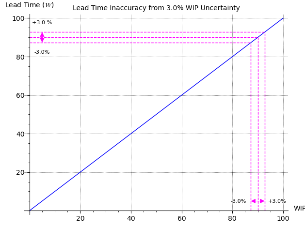

{{ draftMark }}

## Using Performance Metrics for System Design and Control

Systems are designed and implemented with an expectation of certain *Design Throughput* and *Design SLA* expressed in terms of some Lead time metric expectation, e.g. a P90 lead time. The design question is how many resources should be provided to the system to perform at that level. A naive approach would be to simply provide enough resources to make the *Capacity* equal to the *Design Throughput*. This is naive because it does not take into account any variability in job arrival or processing, not any error margins in the estimation of resource consumption by jobs.

To find the correct *Capacity* to provision and therefore the *Target Utilization* for a given throughput we need to understand, at least directionally the dynamic behavior of these systems in the presence of variability. Queuing systems theory provide tools for this analysis. Using a very simplified model ([M/M/1 Queue Model](https://www.win.tue.nl/~iadan/que/h4.pdf)) the behavior of these systems is characterized by looking at the Lead Time expressed as a function of the *Utilization* (symbol $\rho$) of the system.

{width=75%}

When designing the system one would like to dimension it as small as possible to minimize costs, resulting in high target utilizations. The highly non-linear behavior of theses systems under those conditions results in two very negative consequences:

1. The Lead time of the system is multiplied by a factor roughly proportional to $\rho/(1-\rho)$, which at high utilizations will vary between 5x and 50x times the basic processing time when the system is idle, just due to queuing effects. If the SLA is based on a P90 metric, the effects are even worse as shown below.

   {width=75%}

2. Any inaccuracies in the estimation of capacity or expected load will result is highly unstable SLA performance as shown in the following diagram, where an estimate error of 3% in the utilization of the system results in more than a 75% swing of mean lead time and worse if the SLA is based on a P90 metric.

   {width=75%}

These effects are made even worse if the variability of job arrivals (traffic [burstiness](https://en.wikipedia.org/wiki/Burstiness)) or processing time for different jobs increases. The first effect is determined by the target utilization of the system and can only be mitigated by lowering the target utilization using a P90 metric, either by reducing the traffic load or increasing the processing resources. The second issue is one of accuracy of metrics and control. Using Throughput or Utilization as the monitoring metric results in significant control problems as shown above. Monitoring should be done directly based on lead or wait times and use those to take action on the system by throttling the arrival of jobs or scaling resources accordingly. In many cases, monitoring Wait or Lead time is readily available through a job event log as described above. In some other systems, the arrival, start and completion events are more difficult to monitor (e.g. physical movement of jobs in manufacturing). In this case, a *Work In Progress (WIP)* metric can be used.

The relationship between *WIP* and Waiting or Lead times is linear and therefore much more suitable for using as control variable:

{width=75%}

Furthermore estimation or measurement errors in throughput also have limited impact on lead times

{width=75%}

## Further Thoughts

In the descriptions so far, the focus has been on measurements and metrics of outputs of the system, be it throughput or lead times. As the discussion about using *WIP* shows, in some cases it is advantageous to look at internal

- Statistical Process Control: Focus on the process, not the outcomes. --> https://ee-handbook.io/
- Error and Noise
- Continuous Improvement

---

## PROGRESS BOUNDARY ===================================

---

### Effectiveness

- Yield
- Throughput
- MTBF
- Lead Time
  - Arrival to Done
  - Acceptance to Done
- WIP
  - Waiting
  - Active
- Resource Usage

### Efficiency

- Resources per unit of output
- Resource WIP

## Developing Intuition

- M/M/1
- 

## Applications

### API Performance

### Streaming/Messaging System

### Software Development

### Manufacturing

### General Operations (Cust. Support, Cashiers, ...)

