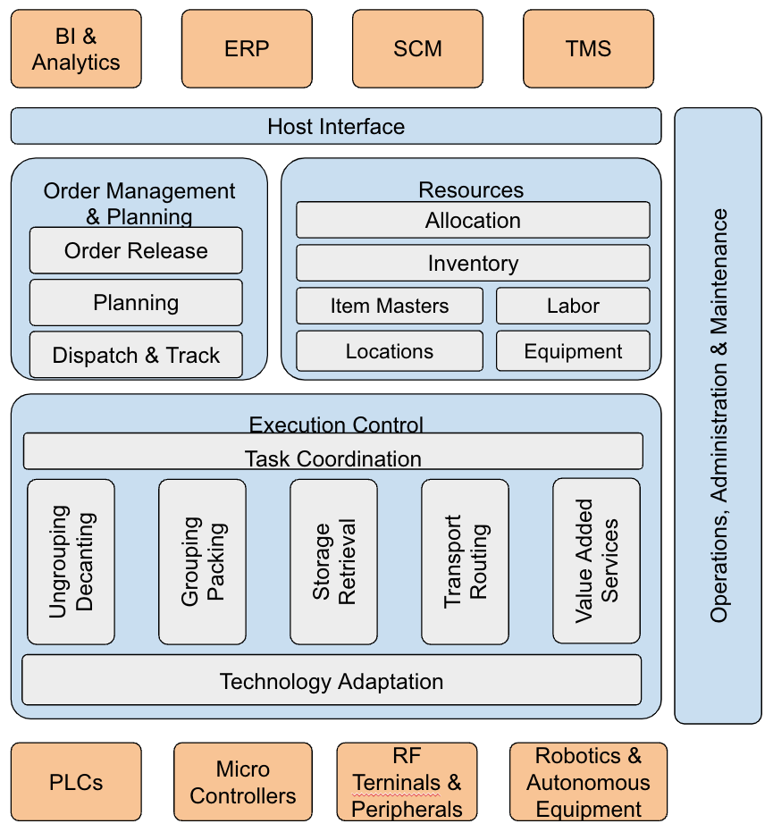

In the article about the [Fragmentation of Supply Chain Information Systems](../scac-system-fragmentation/article.md) we highlighted the emergence of a new class of systems that combine functionality from WMS's and WCS's under the name of *Warehouse Execution System* but did not give any further details on these systems. WES have a cohesive set of Functionalities and Behaviors that allow to define a generic Functional Reference Model that gives an idea of what their anatomy is. This article is extracted out of Chapter 12 of the book [The Warehouse Revolution](https://www.amazon.com/Warehouse-Revolution-Automate-Terminate/dp/1637425732) recently published.

## Functionality

Warehouse Execution Systems provide functionality that directs and supports activities taking place in warehouses and fulfillment centers. Their functionality includes:

- Acquisition of real time signals and the control of material handling movements.
- Coordination of tasks within the equipment that performs a material handling function or synchronization across functions.
- Administration and management of the resources available to the warehouse for fulfillment operations, including labor, equipment, locations, and inventory.
- Planning and optimization of end-to-end operations in a warehouse, including receiving, storage, and fulfillment, and other enabling functions like counting and moving inventory.
- Handling exceptions when executing fulfillment plans, replanning, and taking corrective actions where appropriate.
- Receiving orders from ERP systems, e-commerce sites, or other demand origination systems, prioritizing the orders and releasing them for fulfillment.
- Collect information associated with the fulfillment processes and relaying it to the ERP or other order generating systems.
- Monitoring equipment and managing faults, maintenance windows, and activities, integrating the resulting status into planning and tracking functions.
- Operation and administration of each piece of equipment and of the complete system, for provisioning, configuration, performance measurement, and security management.
- Providing access to its historical records for analytics systems to use in business intelligence functions or for continuous analysis and improvement of standard processes executing in the warehouse.

## Behavior

In effective fulfillment operations, as soon as an order is accepted by the e-commerce site, it is placed in a pending order queue. From this point forward, the order progresses through the fulfillment process.

Release and planning can be done in groups of orders or as individual orders, depending on whether the operation is set up to work in waves or through continuous fulfillment. Orders are released according to committed delivery dates and a varied set of optimization parameters. Released orders are assigned the inventory that will be used to fulfill them, which also determines the pick locations. Selection of inventory and locations in modern systems depends on the current state of the equipment and on orders already in process. Picking instructions are then sent to equipment or operators through the control software and scheduled for execution. Subsequent operations of consolidation, packaging and labeling are scheduled to minimize wait times and to maximize the productivity of the warehouse. As operations complete, the control software collects the signals from the equipment or RF terminals and updates the state of the order until it is shipped. In the case of unexpected incidents or deviations with respect to the planned tasks, the control software reacts to correct them by replanning locally or by communicating with a higher-level controller. If the deviation cannot be corrected, perhaps because there is no actual inventory, the incident is reported back to the ordering system.

Warehouse Execution Systems also monitor and manage the automation equipment in the warehouse. They receive signals from the equipment to determine potential failures and use diagnostic logic, potentially including machine learning, to determine the best time to perform maintenance activities. By taking advantage of the integrated nature of a WES, fulfillment operations can be re-routed to bypass equipment that is out of service. When it recovers, work is rerouted to it once again.

## Anatomy

Warehouse Execution Systems have become the core systems supporting most of the functions described above and most are built in a modular way. Modularity in WESs serves two purposes: (1) it allows them to easily adapt their deployment to support multiple configurations of physical layout, equipment, and processes; (2) it enables developers and vendors
to create and maintain the system more easily and efficiently. Figure 12.5 shows the key modules of a WES and how they relate to each other. Not all WES software systems include all of these modules. This reference model is conceptual in order to describe the operation of these systems more clearly.

The WES manages and controls the activities of the warehouse in response to inputs received from ERP, SCM, and TMS systems, such as fulfillment orders and transportation delivery information. It replies back with receipt confirmations, inventory counts, resource usage, labor statistics, as well as any exceptions related to these activities. In addition, it sends regular data updates to data warehouses for historical recording and analysis. This is done through the Host Interface module, where it receives requests from external systems and dispatches them to the appropriate functional module. Additionally, it sends messages to the host system to notify it of any relevant updates in the warehouse. Finally, this module is responsible for adapting the communication protocols used by
external systems.

The Order Management and Planning module decides how orders are released to the warehouse. It uses information from the Resources module to determine the status and allocation of inventory, equipment, and personnel. Orders considered for release have resources allocated to them and related operations are sequenced and scheduled via a plan
to fulfill them. The planned operations are dispatched for execution once they become feasible (e.g., the resources become available and all preconditions are met).

{: width=70%}

The resources module acts as a bookkeeper for the system, recording the status and availability of the resources available for order fulfillment or other activities. An operation planned as part of order fulfillment may involve performing multiple tasks in a prescribed sequence by different operators or equipment. The Task Coordination Module decomposes each operation into its individual tasks and uses the specialized modules in varying material handling functions to perform them. These specialized modules in turn dispatch discrete instructions to equipment and labor using the appropriate controller software, accessed through dedicated interfaces and protocols.

At the same time that this top-down flow of instructions takes place, the lower layers of the system, PLCs and RF terminals are transmitting signals upward to the control modules. These signals are used to update the state of resources, evaluate the progress of orders, or take corrective actions when incidents occur. This flow of events enables a WES to implement near-real-time planning, dispatching, and execution. This differentiates a WES from the top-down control prevalent in earlier MRP systems and wave-based WMSs.

The final element in the functional blocks is Operation, Administration, and Maintenance, which affects all the layers in the system. It is responsible for configuring and provisioning all the equipment and receives health and performance metrics to detect actual or predicted failures, schedule maintenance interventions, and update the configuration as needed. Analytics is not included in the description of the WES, despite metrics and performance analysis being an essential part of modern operations. The reason is that these systems typically integrate warehouse and fulfillment operations with additional data from e-commerce sites, sales, and financials, and are implemented outside the scope of the WES. A WES contributes to this function by providing access to its operational data stores. With the increasing use of microservices-based architectures, and increasingly sophisticated information structures in the WES, direct access to its databases is rarely granted. Instead, best practices favor a dedicated “data stream” interface that the WES makes available for use by the data warehouse. Multiple technologies are available to build these streaming connectors and to publish the data collected by the WES in a safe and secure way.
