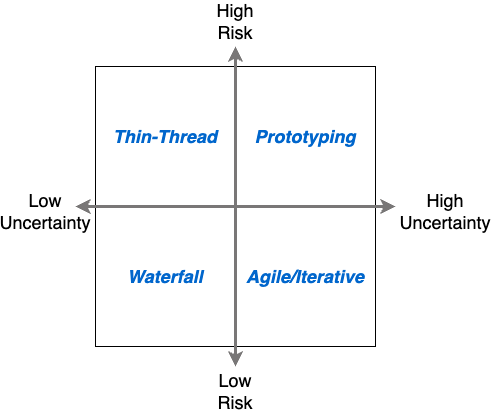

{{ draftMark }}

As a manager or executive responsible for any non-trivial Supply Chain system development or implementation project you are guaranteed to go through at least one *doom* episode where the project feels out of control, impossible to understand and hopelessly out of track. Rest assured that if the project could talk, it would tell you *It is not you, it is me*. Large projects are always challenging, and Supply Chain Systems projects are among the most challenging as they sit at the intersection of information, people and physical processes. A combination that very few other projects exhibit.

## What do Supply Chain Systems Projects Look like?

There are many definitions of system like the one in [Wikipedia](https://en.wikipedia.org/wiki/System)[@SystemWiki2024], my preference is to use the one from W. E. Deming[@demingNewEconomicsIndustry1997]. Slightly paraphrased it is:

> A system is a network of interdependent components that act together to accomplish a well-defined outcome.

The outcome is what Deming calls *the aim of the system*. The *aim* is not part of the system, it is given externally and drives the design of the system itself.

The aim of Supply Chain Systems is to support the operations, people and assets that drive the movement of materials and goods both within facilities (warehouses, distribution centers, factories, ...) and between those and the final consumers. They also play a role in managing the commercial, legal and financial activities associated with those movements, including changes of custody, ownership and jurisdiction.

Originally, supply chain systems could be neatly classified into *Material Handling* and *Management Systems* projects. These two disciplines have since converged into systems that combine both. Traditional *Management Systems* [don't handle well the real-world, real time data feeds of Supply Chains](../erps-cannot-handle-supply-chains.md) and *Material Handling* systems are [incorporating logic that once belonged to management systems](../scac-system-fragmentation/article.md).

Sitting at the intersection of the worlds of information, people and the physical processes require integrating mechanical, hardware and software technologies, people, organizations and operational processes. The projects to design, implement and deploy these systems frequently require a much broader set of disciplines than other comparable systems with the associated risks of failure and difficulty to manage, control and oversee. Successfully executing these projects require a set of skills that is only available to very large companies or organizations specialized in these projects.

Most Operations Managers and Executives usually don't have access to the complete set of skills, either in themselves or in their staff to understand and evaluate all the aspects of these projects. It is little surprise that when these projects run into difficulties they feel under-equipped to respond to those difficulties effectively.

## What we mean by a Supply Chain System Project

### Project as a System itself

A project can itself be considered a *System* by the definition above with its components being its activities, resources and people and its aim the creation and deployment of a specific Supply Chain System.

Looking at these projects as systems, we quickly can identify four *interdependent components* for it:

Goal Definition
: Activities, documents and knowledge that define what the *aim* of the target Supply System will be and how to know when it is ready.

People
: The staff, with their motivations, skills and interactions, that will execute the project together with the organizational structure that organizes them. People must include not only the technical staff designing and implementing the system, but also stakeholders, intended users and maintainers of the system, business sponsors, etc...

Process
: The set of practices and rules that govern the interaction of people and define deliverables, oversight and decision criteria to be used in the project.

Technology
: Tools and pre-existing capabilities that will be used in the execution of the project. The word *Technology* is sometimes associated exclusively with *Information Technology* or software. Supply Chain systems involve physical systems and people. *Technology* in this context is meant to include mechanical and electrical components in addition to the common elements of databases, networks, user interfaces, etc...

Although given in the definition of *System*, it is worth emphasizing that these *Components* of the project are **interdependent** and although distinct from each other, they cannot be considered in isolation from one another.

There are plenty of books and articles that provide guidance for how to deal with each of these components including requirements management, high performance teams/organizations, project management and specific technologies, etc... When applying them to a particular project, they need to be adapted and tuned to work together. No two projects are the same. Like any other system, the project itself needs to be designed, operated and monitored. It is the responsibility of the project leadership to ensure that it is done in an integrated way and with the highest possible professional standards.

### And then everything changes

It would be an error to think that a project as a system can be defined and implemented at the beginning and expect that it will remain unchanged during its lifetime. Staff changes, requirements evolve due to business changes or learning by the team, technology changes with ever-increasing pace and processes need to adapt and follow a *continuous improvement* discipline.

Part of the project design itself must be to choose how these changes will be identified and how the project will adapt to them. As an example, at this time it is a truism that any technology chosen for a project is obsolete the moment the project starts. At the same time a project that constantly tried to keep up with any new applicable technology would never make any progress towards its goal. A well-designed project will have a clear way to evaluate technology changes and make decisions on whether and how to incorporate them. Similarly, a well designed project will have defined succession plans for key staff positions and skills to minimize the impact of the inevitable personnel changes.

Without getting into specifics of how change management needs to be incorporated in a project, it is still important to note it is an essential part of a well-designed project.

## Characterizing Project Failures

A definition of *failure* useful in many fields is a variation of *[...] when a system does not do what it is supposed to do [...]*[@SystemsSystemsFailure2009;@berkSystemsFailureAnalysis2009]. Hidden in this definition is the assumption that what a system *is supposed to do* is well-defined and can be reliably measured.

Treating projects as systems themselves helps bring them close to fulfilling that assumption by requiring that an *aim* or goal of the target system is defined, yet it is usually not enough.

The goals of the system to be developed may (even unconsciously) incorrectly substitute for the goals of the project, leading to a mis-identification of real failures of the project and fatal delays in detection because the behavior of the system can only be assessed once it is at least partially built. To avoid this problem, the best practice is to  have explicit statements of goals for the project itself and define associated monitors and reports.

The traditional definition also assumes that the system itself and the environment in which it operates do not change much. This is a reasonable assumption for systems that are *built* and then *operated*. For Projects, both themselves and the environment in which they operate are much more variable and uncertain. The definition of Failure needs to include how the system, in this case the project, copes with this uncertainty and change. A deviation of the initial parameters of the project like time or budget may or may not represent a real failure of the project depending on what changes have taken place since the reference parameters were defined. The definition of failure conditions need to:

1. Be revised at a defined frequency or when certain changes happen in the project.
2. Incorporate logic about how long a condition is present (e.g. a projected delay) before it is considered a failure, giving the project regular operation an opportunity to *self-correct*

Finally, following the emphasis that Dr. Deming makes on *Method* vs *Results*[@demingNewEconomicsIndustry1997], monitoring and detection of failures need to include deviations of prescribed processes, even above deviations of expected results. The action to take when a deviation is detected can be changes to the project operations (add resources, change the order of activities, re-balance workloads, ...) and may also require to changes to the design of the project itself (People, Process, Technology) including its monitoring mechanisms and failure criteria.

This last statement is the foundation of building a *learning* culture in the project and the best tool to deal with the high uncertainty and variability that these projects encounter.

## How Failures Happen

Viewing Projects as systems themselves helps in identifying how failures can happen in a project and what kinds of failures to look for.

Failures in systems may arise in three ways:

1. A mismatch between the capabilities of the system and the environment, including the definition of its *aim* or goal. This mismatch may appear if the environment changes, or it presents conditions that were not originally foreseen in the design of the system. This is the common occurrence of *edge cases*. Conditions that are rare, difficult to predict or specify that are frequently missed in the initial specification of a system.
2. Issues in the interaction between the components of the system. Even in the case that each component operates within its design parameters, the interaction between them may lead to system failures. Similar to the first point, these failures occur at the boundaries of the specification of the components involved, maybe in how they react to an exceptional condition or configurations that appear after a long sequence of complex state changes.
3. Internal Component Failures when a component starts behaving outside its expected operation.

Projects experience these kinds of failures. As an example of the first type, a project may rely on the availability of a certain number of engineers or skilled installers, which may not be possible if the labor market is very tight in the area or the hiring process cannot scale to make them available in the right time frame. A technology may be a good match for a project, and staffing may be adequate. A mismatch in the training or expertise on that particular technology will appear as an inter-component failure.

This classification helps project leadership be systematic in defining and designing the project and also provides guidelines for how to handle them. For the first kind of failure, the reaction may be a change to the project goals to incorporate a changing environment or previously missed details, or it can be exerting more control over the environment itself, e.g. implementing a triage process to review any changes to requirements from stakeholders.

## Inter-Component Failures

In a project, mismatched choices among its components are the source of failures that are difficult to identify and diagnose when they appear, and doubly difficult to correct because of the large number and scope of changes that fixing them require.

The most obvious coupling is that of Technology choices to the Goal of the project. After all, this is one of the main outcomes of the design of the target system. Despite this, many projects don't make that connection explicit. Not tying them explicitly effectively discards design information that is later needed when evaluating changes to the target system, as it is not clear why a technology may have been chosen and what capabilities are important to preserve vs. which ones are ancillary. Even more harmful is the effect of adopting a technology that afterwards is used in an unintended way introducing couplings and constraints in the system that make its maintenance more difficult and expensive. As an example, the choice of a relational database as an storage technology for the operational system, if unconstrained may open the door to create custom reports from it, which make it very hard to upgrade the database or change its schema later.

Technology choices are also heavily influenced by the People component in the project. The skills, training and experience of the available staff may be the overriding factor in these decisions to the point that they may not even be considered as decision points at all. In many cases this is justified. Even in these cases the responsible approach is to document the decision. By documenting it, the decision becomes explicit and therefore subject to review later which again enables learning in the project and organization. It also helps separate the cases where it is justified from others that may be less clear. The interaction between choice of technologies and people can be expressed as a tradeoff between choosing the best fit technology and the cost, time and disruption that upgrading the team would require through a combination of hiring, training and replacements.

Project leadership needs to ensure and maintain close alignment of the *People* to the *Goal* of the project. Clearly this needs to start with a clear vision and communication of the goal, but it also works the other way around. The goal needs to be influenced by the skills, availability and motivations of the people in the project. In some cases, these considerations may be unavoidable as when union contracts are involved, in other cases they may be more subtle but not less important. It would be unwise to try to staff a national defense project with pacifists and vice-versa, accept such a project if your workforce is already composed of pacifists. This may feel *fluffy* when compared to hard engineering choices, but we have seen in the news repeated cases of employee activism tying projects to political positions in areas like privacy, animal rights, etc. Without judging the merits of these positions, responsible project leadership needs to ensure strong and sincere alignment of the people to the goals of the project for it to be successful. Alignment and engagement must also be continuously monitored and reinforced in the presence of changes in the staffing of the project, their internal motivations and attitudes or the goals themselves.

Processes and People interactions are determined by the culture of the team and how the processes leverage that culture. The processes that are effective in a military organization where chain-of-command is central to the culture of the group are very different from those that will work in an academic setting where each professor is their own boss.

The processes that a project can adopt are also influenced by the technologies that will be used. Technologies may impose constraints on the sequence of tasks or activities effectively precluding some forms of agile methodologies that rely on an assumption of mostly independent small *stories* that can be performed in almost any order. Technology choices may also introduce hidden couplings of activities that require specific reviews or communication between teams in ways that are easy to miss. The design of the layout of a warehouse may depend on the fire suppression technology chosen, requiring or not communication with the rack layout design.

Finally, the interaction between the choice of processes for a project and the project's goal is determined by the balance of uncertainty and risk that the project can tolerate. As indicated in the figure below, for low risk, low uncertainty projects, traditional project management processes work well and usually deliver the most predictable and efficient outcomes, unfortunately these situations rarely occur in non-trivial projects. When uncertainty grows, but the impact of failures can be easily absorbed or corrected, agile or iterative processes are effective at the cost of potential need for re-work (refactoring in software) or backtrack of partial results. If the uncertainty stays moderate but the risks are higher, a *Thin-Thread* approach where one or several *thin-threads* of the system that span the goal end-to-end. The system is built around a core that spans the project end-to-end and act as the guide to build the rest of the system around it. The name is taken from the technique of spinning the main cables of suspension bridges in-place over a pilot wire[@SpinningMainCables]. When both Risk and Uncertainty are high the project needs to foresee building multiple prototypes and test models as it is done in space programs for new vehicle or mission designs.

{: width=70%}

## Component Failures

Each of the components of the project can also experience its own specific failures

### Goal Definition Failures

Failures in the definition of the Goal (Requirements) of the target system have the highest impact on the result of the project. It is well known that somewhere around 80% of costs and risks of engineering projects are baked in during the definition and early conceptual design steps, when a full project organization may not even be in place. Failures in requirements definition arise when the scope of the project is vague or does not have a clear boundary. This can be because the full extent of the operations that the target system needs to support is not well known to the requirements team or because it is so well known that it is part of the background knowledge and not documented. In either case the result is ambiguity on what the target system needs to perform resulting in scope creep, cost overruns and delays. Well-structured and clearly documented requirements reflect the Supply Chain processes and activities that the target system must support. Goal definition will fail if these processes and activities themselves are not mature and change frequently no matter how thoroughly requirements are collected and documented at a point in time. Attempting to mechanize or automate processes that themselves are not mature increases the risk to the project enormously. The project can still mitigate this risk by explicitly adding goals and requirements on flexibility and adaptability of the target system, but these requirements usually require very high project effort to incorporate configurability, extensibility, etc. which are difficult to estimate and frequently ignored.

Requirements Capture and management are very difficult activities that require highly sophisticated skills in both the domain (Supply Chain processes) and all components of development projects as described in this article. On top of this, documenting these requirements in an articulate and clear way requires strong communication skills. When an organization does not have individuals or teams that have this synthesis of skills, the result is incomplete or ambiguous requirements, particularly specifying the expected behaviors of the system in edge cases or in the presence of errors or anomalous conditions. Given the difficulty of this task and the scarcity of talent that can perform at the level of integration required, projects need to ensure that the requirements process is not a *one and done* effort at the beginning of the project but rather embedded along its whole lifetime and that those responsible for requirements are in constant interaction with stakeholders and the technical team as catalysts of learning and to ensure that the project reacts quickly to any changes.

The requirements that capture the goal of the target system are frequently described in terms of functionality or behavior at a reasonably high level to be able to cover the scope of the system. This leaves room for ambiguity about how to determine whether a particular requirement is met or not by the system. Defining the Goal of the target system is not complete unless there are clear *acceptance criteria* for all requirements that can be verified objectively with a minimum of interpretation. In the ideal case, acceptance criteria map directly to tests that can be performed on the target system with a clear yes/no result and possibly using automated test harnesses and drivers.

### People & Organization Failures

Despite the label, People failures are rarely attributable to individuals but rather to the difficulty of finding the right match of talent to the needs of the project or to divergent motivations with respect to the goal of the project. They may arise when the staff contributing to the project either don't have the skills needed or their motivation does not support the effort the project requires. From the point of view of the project, skills can be hired, or they can be trained. A project failure is to gloss over gaps of skills and *hope* that staff will pick them up *on-the-job*. Motivation is the result of a sense of shared ownership of the project and an alignment of the goals of the project with the incentives offered to staff members (from compensation to career progress or other intrinsic motivations) and values. A strong *mission alignment* results when all three point in the same direction. While it is very difficult to have perfect alignment, project leadership can make a significant difference by simply considering these aspects and being open in their communication with the staff.

At an organizational level, it goes without saying that not providing adequate resources invites failure. Beyond that an organization structure that promotes short and open lines of communication and reporting and has clear sponsorship from senior management will minimize chances of failure and recover faster when they happen.

A critical aspect of People and Organization that needs to be given as much attention as any critical activity is implementing a comprehensive change management plan to educate staff and stakeholders and minimize the negative impacts that the project will have even if completely successful. All projects are undertaken with the goal to effect change in some aspect of an operation. These changes will inevitably result in some changes that are negative to stakeholders. They may result in loss of specific jobs, geographic displacements, obsolescence of certain skills and requirements to acquire new skills. If the project does not address these negative impacts effectively it will face active and passive resistance that could lead to failure with extreme cases resulting even in active sabotage of equipment or willful neglect of maintenance or operating procedures that may result in downtime, or damage to equipment or data.

### Process Failures

A lot of attention has been devoted to project management methodologies, processes and practices with different recommendations to improve the chances of success. Trying to summarize the process aspects, in our view, fall in four distinct areas, strongly influenced by the CMM model[@CapabilityMaturityModel2023]:

- Requirements Management which is addressed extensively as part of the [Goal Definition Component](#goal-definition-failures).
- Task Execution that includes all aspects of managing the specific tasks that need to be performed as part of the project.
- Quality Assurance dealing with the verification of both the results of the project and the adherence of the tasks to best practices and project standards.
- Release Management to clearly identify and manage the deliverables for the project, including labeling, versioning and inventorizing them.

#### Task Planning and Execution Failures

Task Execution includes Planning and Tracking the activities that will generate the results expected from the project. Complex projects are notorious for the mismatch between the estimates that are part of planning and the actual values obtained by tracking those activities. In the case of Supply Chain Systems projects, the difficulty is compounded by the added uncertainty coming from the need for integration with physical processes and equipment.

A planning horizon that is too long is frequently at the root of these problems. It is hard enough to estimate the effort that needs to go into *shovel-ready* tasks where all the details are defined, resources lined up and preconditions met. As planning tries to peer into the future, the uncertainty grows, and it becomes little more than an educated guess based on experience, which is not clear is directly translatable to the current project. Long execution horizons are also to blame for defective tracking, as *verifiable* results and deliverables are frequently available only towards the end of the planning period and measurements along the way are based on subjective assessments by middle management, with its own set of problems including lack of enough visibility, incentive conflicts and lack of objective numbers from the individual contributors.

The preferred approach to this issue is to adopt a fixed cadence for the planning-execution-tracking cycle. This cadence should be short enough that the staff directly performing the tasks feel comfortable providing their estimates of effort and at the end of each period progress can be assessed by number of tasks completed or available deliverables, minimizing or removing middle management subjective assessment.

This execution cadence is specific to each organization, but it typically varies between one and four weeks depending on the industry, discipline and available tools.

These short periods are clearly not enough to manage the kind of complex, large projects that Supply Chain systems frequently are. Senior management, financial controls and coordination with suppliers and other external stakeholders (e.g. for training, user acceptance testing, go-live, process changes, etc.) require planning horizons longer than 1-4 weeks. The right solution to this requirement is not to extend the basic period or slow down the cadence, but to nest several of these periods in a higher level planning and execution cycle. This higher level period will have less details and more uncertain estimates beyond the current core period, the benefit is that this uncertainty is explicitly highlighted by the multi-level structure of the planning, which allows senior management to interpret the estimates better.

This nesting of planning-execution periods can scale to very large projects and organizations. The R&D portfolio planning for a public global company with more than 30K employees was successfully done with four levels of execution cadences:

1. **Strategic Planning** with a planning horizon of 3-5 years, with some extended horizons for basic technology and research projects.
2. **Operational Planning** that matched the fiscal year, with the added advantage of synchronizing the R&D activities with the financial cycles of the company.
3. **Tactical Planning** done quarterly and coordinated with Quarterly Business Reviews
4. **Team Planning** between 2 and 4 weeks depending on the specific teams, software teams tended to choose shorter periods while mechanical teams tended towards longer periods to allow for the physical lead times of fabrication, prototyping, and durability testing.

This structure brings several desirable side effects:

- It naturally integrates the technical activities in the regular business cycles (quarters, years) without incurring in paperwork overhead.
- Traceability of objectives between strategic priorities and individual tasks is a byproduct of regular work planning and easy to support by tools. Adoption of management systems like OKR's[@doerrMeasureWhatMatters2018] is integrated and does not require additional busy work.
- Each level may operate at a different level of detail, providing the scope of planning for the lower level and aggregating information from it for tracking and monitoring.
- Assessment of progress can be much more objective as deliverables and tasks are completed in the inner cycles and propagated outwards as needed.
- Fixed cadences force a regular schedule of progress reviews and opportunities for replanning or corrections.

Perhaps the most beneficial consequence of adopting this approach is that it enables the project organization to implement robust learning or continuous improvement practices at the end of a period at any level. Project Planning and Tracking that relies exclusively on critical path or dependency networks without fixed cadences don't offer a *natural* point in time for the organization to look back and learn from the experience accumulated. Even when this is done at significant milestones, they are too different from each other to develop a structured learning practice.

Fixed-cadence processes have their own set of difficulties and are not straightforward to implement. Tasks or deliverables that would take longer to complete than the period need to be split into smaller ones that can be completed separately and verified independently. Sometimes this is an actual benefit forcing management and those responsible for requirements to take a fresh look at the goals of the project and reformulate them to define smaller, self-contained units reducing risk and complexity in the process. In some other tasks, it may be intrinsic to the nature of the task like procurement from external suppliers, certain durability or aging tests and similar. In these cases it is still beneficial to introduce some artificial *in-progress checks* to be performed in multiple periods. In-progress checks provide visibility to management of potential incidences or alerts and avoid delays in detecting issues. Dependencies between tasks and critical path monitoring becomes more difficult as they require a separate attention when planning and tracking each period. A period that completes all planned tasks except one may be seen as successful but it can be disastrous if that task happens to be in the critical path of the project or have a cascading effect in other parts of the project that have not yet been planned in detail. Dr. Goldratt in his *Critical Chain*[@goldrattCriticalChain2001] book offers some techniques to elegantly handle these constraints, but it is still upon project leadership to ensure that they are taken into account.

#### Quality Assurance Failures

In the '80s, when manufacturing transitioned to Lean Practices[@mondenToyotaProductionSystem2012], the quality assurance function shifted from testing finished products to intermediate products and the processes that created them[@wheelerUnderstandingStatisticalProcess2010]. This reorientation of the quality function is not yet widely adopted in project or product development work leading to failures due to the delay in detecting issues that waiting for the final product implies and the amount of wasted effort that is applied to a deliverable only to find out it is defective later.

Project work, being less repetitive than manufacturing and having a much lower level of automation is harder to monitor from a Statistical Process Control point of view. The main tool jto apply is implementing frequent peer reviews across the project team and, if possible, even with external experts or teams. Peer reviews are an extraordinarily powerful practice to improve the quality of deliverables and to improve the learning in the organization but need to be implemented carefully. Under no circumstances the results of peer reviews should be used in staff performance assessments. Project leadership and organization management must do everything possible to ensure that they are a *safe space* for giving and receiving honest feedback with broad participation of staff. If these conditions are not met, peer reviews end up inhibiting communication and promote toxic behaviors and culture.

The practices inspired by Statistical Process Control can be applied independently of the fixed cadence practices described above but are much easier to adopt when they are followed. Fixed cadences lead to smaller, repeatable tasks that lend themselves to frequent inspection and statistical aggregation of their results.

#### Release Management Failures

Taken as a unit, Projects, as opposed to Product Development or other Operations have a defined start and, more importantly, a defined end with the appearance that it is not necessary to keep track of versions in a rigorous way. After all, there is a single release of the final deliverable when the project is finished and that is the end.

Complex projects have multiple different modules or components with interdependencies among them. Uncertainty and variability is pervasive in these situations too, which forces the adoption of prototyping and iterative development for at least some modules and components. Finally, *big-bang* deliverables at the end of a project are a sure-fire way to make a project fail because it delays the detection of any issues or discrepancies with stakeholder expectations until it is too expensive to correct them and there is no time to do it.

A project needs to be able to support:

1. Prototyping or iterative development of the modules with high technology or requirements risk.
2. Interdependencies between modules for design, implementation and testing
3. Incremental delivery to the users for testing and to minimize the risks associated with *big-bang* launches

Introducing release and version control practices in the project is a first step in supporting them. By identifying each deliverable at the module level and tracking their version or iteration, ideally being able to support multiple versions for testing or being able to reproduce versions for diagnosis or troubleshooting is an essential ability to allow teams working on separate modules to work with autonomy of each other while keeping them coordinated towards the final integrated system.

### Technology Failures

Project failures associated with technology depend on the specific technologies that the project uses and can be idiosyncratic. Looking across multiple projects we can still identify some patterns that are common causes of these failures.

Adopting new, cutting edge technologies add risk to a project. It is well known that aerospace applications, particularly when related to human spaceflight, use computing technologies that are considered ancient compared to what is in use in consumer applications to minimize the risk of malfunctions or finding issues that may not been yet surfaced if the technology in question has not been in use for enough time. Newer technologies are attractive because they either reduced costs for a given capability or enable functionalities that are not possible with older technologies, but they come at a cost:

- The full range of failure modes of the technology may not have surfaced yet in its applications.
- Best practices for its use and application are not available
- Expertise may not be available in the team or even in the industry.
- In the case of manufactured technologies, the manufacturing processes themselves may produce higher defect rates than more mature technologies.

To minimize this failure mode, the project should implement transparent and well accepted practices to evaluate and adopt new technologies which include resources and time in the schedule for prototypes, learning and training, and critically, always evaluate multiple options to ensure there are no dead-ends should some technologies be unacceptable.

On the opposite end of the spectrum, a project team may try to use technologies that are inadequate to the problem at hand because of organizational inertia or other barriers like outdated or rigid company policies that mandate certain platforms or technologies, familiarity of the team with certain technologies or lack of awareness of newer options. This is the well known effect of seeing nails everywhere if you only have a hammer. This failure mode is more common when schedules for a project don't include any buffer for evaluating design options or prototypes. Development organizations are always under schedule pressure and it is the job of leadership to identify the parts of the project that need the extra buffer to resolve technology risks and ensure that the team has access to the breadth of expertise needed to make the best decisions in selecting tools and technologies.

A particular failure mode indication in Supply Chain and Enterprise systems is the degree of *Customization* that the final implemented system has with respect to the baseline platform the project uses. Any customization implies that there is a business process or operation that needs to be supported, not only by the system itself, but also by the organization that will perform it. The effort required to formulate, document and implement those *custom processes* is always underestimated. These custom processes also tend to change more frequently than more industry-wide standard processes, requiring modifications to the system and leading to an endless cycle of maintenance costs and new defects introduced in the system with each modification. Well-designed and implemented customizations of a baseline system should always use published interfaces and specifications of the baseline system. Even when this is done, the natural evolution of platforms and products will end up making changes that *break* the customizations. The cost to *upgrade* the customizations to the new version of the baseline grows to be prohibitive resulting in a barrier to improvements and soaring maintenance costs.

## Avoiding Surprises

Any complex project will experience failures in all areas described above no matter how much care is dedicated to planning and designing it or how talented leadership and team are. A project, like any engineering system, cannot be considered complete unless we don't have proper instrumentation to observe and monitor it. Similar to how inventory in warehouses is kept up-to-date by doing regular checks (i.e. *cycle counts*) and less frequent end to end audits (i.e. *physical counts*), project leadership should adopt practices for both continuous oversight and in-depth audits.

### Continuous Project Oversight

Practices, tools and mechanisms to monitor a project are often not given enough attention. Similarly to how it would be unthinkable to deploy a complex industrial system without robust, well-designed sensors, monitors and alert systems, a project design needs to include equivalent monitoring capabilities to detect potential failures and deviations from expected operation as early as possible. The value of continuous project oversight is to minimize delays between the time an issue appears and taking corrective action to solve them. It is widely acknowledged that speed of response is an essential characteristic of high performance organizations, even codified in the OODA[@OODALoop2024] acronym of combat operations.

Too frequently these elements are considered mostly an *accountability* mechanism for project management. Nobody would think of blaming a boiler if the pressure gauge shows unexpected changes. Instead, it is read as information to make decisions on how to change the operation of the boiler, reduce the power applied, vent pressure, etc. Similarly, project monitoring should focus on identifying and reporting signals for decision-making and to be reviewed in a *safe* environment to ensure that information is transparently available across the project and diligently acted on.

Continuous project oversight should follow the spirit of Statistical Process Control[@wheelerUnderstandingStatisticalProcess2010] with its emphasis on monitoring the parameters of the activities performed (the processes) instead of focusing only on results. Activities in Supply Chain Systems Projects are mostly knowledge and people intensive and the best measures and monitors are those that are equally people-centric. Also, unlike industrial processes, there are no good *probes* to measure what is inside the heads of people, which is the essence of knowledge-intensive activities, so it is not effective to rely on *process control* staff separate from the core project team other than as coaches and facilitators. In fact, these external process teams may be counterproductive by stymying the essential communication and collaboration within a project team.

While it is possible to define some *mechanical* measurements for projects, as described in the article [The Drunk, their keys and a lamp post](../../other-articles/performance-measurement/introduction.md), those need to be considered just the *vitals* of the project and interpreted to be of use to the project's staff and leadership. It is unavoidable to tap into the knowledge of the actual team members involved in the project in order to gain deep insight into its progress and status. At the same time, overloading the team with additional *reports* to management, etc. wastes the time of staff and always ends as the worst kind of *red tape*.

The best way to surface the needed information must:

1. Use the same cadences used in task execution to generate the monitoring information. At the end of each period, and as part of the transition to the next one, the team should produce a summary of what happened in the period. The practice of agile retrospectives, if conducted properly is a great way to achieve this.
2. The first *customer* of this information needs to be the team itself, and any actions identified from this information needs to be incorporated in the project tasks as any other task to complete. This closes the loop with the team that is responsible for the tasks in the period and reinforces the usefulness of the practice. (avoid the *red tape* perception)
3. Monitoring information should **NEVER** be used in performance assessments of individuals or teams, otherwise we'll obtain biased results and destroy any usefulness of the practice.
4. The information needs to reference specific tasks, deliverables or other actions. This is important to keep the feedback process focused, and also to make sure that it is focused on customer value and not in *keeping the boss happy*
5. Each team that completes a review needs to communicate deviations with respect to the goals of the period, the state of any dependencies it has from other teams and any need for external assistance to correct any issues found.
6. Every task, deliverable should be subject to *peer* and *consumer* reviews. Peer reviews will focus on improving the professional standards that the team uses and how they are applied to each task. Consumer reviews act as an organic acceptance gate that occurs much more frequently and in detail that any formal quality assurance of testing activity will ever be able to achieve.
7. The role of process coaches and experts is to facilitate these practices, train staff on how to conduct them better and, importantly, record and report that they are conducted. If an organization performs these practices regularly, it will put itself on a path of continuous improvement.
8. Senior management should monitor that these reviews are performed and focus on resolving dependencies and providing the teams what they need to correct the issues they find.

If a project adopts clear cadences as described earlier, creating this oversight is a natural byproduct of the work and imposes minimum overhead on the team. It has the added advantage to expose every staff member to management priorities and practices with built-in training of new managers and leaders.

### Nuts-to-Bolts Project Evaluation

No matter how well run a project is, *The best plans of mice and men go oft awry*[@Mouse2023] and in these cases, exceptional measures need to be taken to assess the state of the project, diagnose the problems and take actions to minimize the damages or correct the issues. An in-depth evaluation of the project may need to be conducted, sometimes by an external organization or team to bring unbiased perspectives and additional expertise to bear on the problem. The continuous oversight practices described in the previous section work best to make adjustments to the operations of a project but are not well suited to diagnose and correct fundamental issues with a project. Only an in-depth audit can identify those changes. 

Even when staff external to the project are tasked with the audit, it is essential that the project team remains involved. They are the best source of knowledge on the project as Peter Naur described in his seminal article *Programming as Theory Building*[@NAUR_1985]. Similarly to continuous oversight practices it is even more important, in the presence of an external *audit* team, to ensure that information will be easily available and without bias. This can only be done if staff members don't feel defensive about the audit.

The structure of this article points to how to structure such in-depth audit of a project by focusing on the four top level project components and how they can fail:

- Goal Definition
- People and Organization
- Process
- Technology

For each of these areas, the *Capability and Maturity Model"[@paulkCapabilityMaturityModel1993] offers a useful generic checklist of aspects to look at the organization (project) level:

Activities Performed
: What are the activities that the organization undertakes as part of the Component and how they relate to widely accepted best practices. E.g. For Goal definition, it could identify the use of Use Cases or formal specification standards like they exist in electronics board design.

Commitment To Perform
: Determine the organization's commitment to perform and support the activities identified. Are resources provided for them, is there senior management commitment/sponsorship, are they treated as tasks in the project, etc...

Ability to Perform
: Does the organization have the ability to perform those activities? Does staff have the right skills available, including access to specialists or training where needed etc...

Measurements and Analysis
: Are the activities well characterized and measures defined on them to be able to assess how they are performed?

Verifying Implementation
: Are there feedback loops defined and active to respond to the measurements and analysis of the activities?

The level and rigor to use in conducting the audit may vary depending on the type and size of project, characteristics of the organization and culture of the company. An audit process that costs more than the project it is trying to audit defeats its purpose but even if the analysis is done by a single person over a limited time, it is useful to keep these checklists in mind when collecting information and organizing findings and recommended actions.

Live projects, by their very nature, cannot be expected to have perfect or completely up-to-date documentation. Any documentation, no matter how good, won't capture the true essence of the project as this is in the collective *theory* that the team forms of the project and the system they are building. Any audit of a project needs to include extensive and in-depth interviews with the project team and other stakeholders. These work sessions can be very disruptive and need to be structured to minimize their impact by thorough preparation from the auditor stating clearly the objective of each session, making materials and questions available in advance to participants and providing them with prompt summaries and feedback.

Auditing a project and its team is always expensive beyond the audit resources themselves in disruption to the team, stakeholders and planned tasks. In-Depth audits are infrequent, and they are an opportunity to look at a project with new perspectives that should not be wasted. The worst result of an audit effort is a collection of *platitudes* that everybody already knew going in. Sometimes even this is a valuable result as written validation by an external party, but its not an excuse to stop the analysis there. The audit team needs to follow root cause analysis techniques (e.g. five why's, fishbone diagrams, etc.) to find actions that will improve the project in a radical way.

## Wrapping up

Projects that define, design, implement and commission Supply Chain Systems are themselves very complex systems of interacting and interdependent goals, people, organizations, processes and technologies. Applying a *systems'* lens to them can help us execute and manage them. Although they can go wrong in many ways, there are some key principles that minimize these failures. Establishing a clear cadence or nested cadences for execution help establish OODA Loops and foster learning in the organization. Actively managing goals and requirements instead of considering them a static *given* help manage uncertainty and allows the project team to identify changes and react to them better. Explicit consideration of technology risks and how to introduce and adopt technologies eliminates a lot of blind spots and miscommunications between technical staff and management and a relentless focus on communication among staff, peer reviews and transparent decision-making create a shared *theory* of the system that is much more robust to disruptions. Actively managing all these aspects through continuous feedback ensures the best chances of successful delivery and building strong teams in the process.

## References

\bibliography
