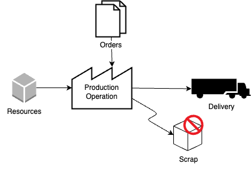
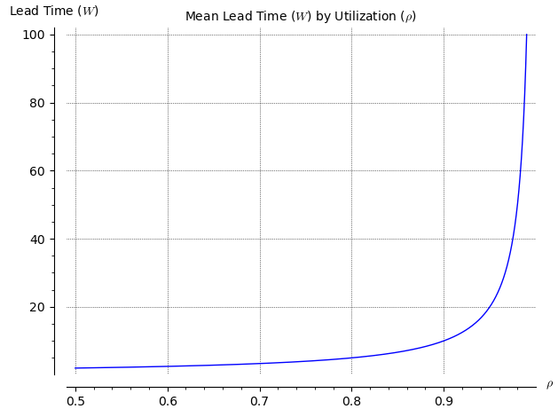
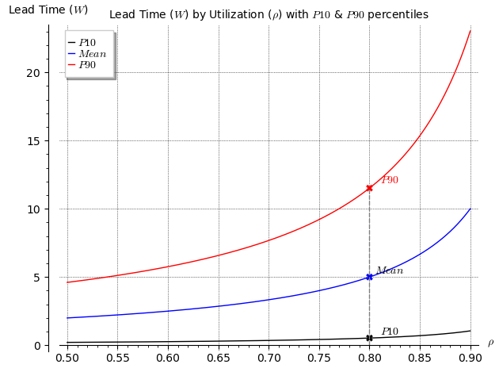
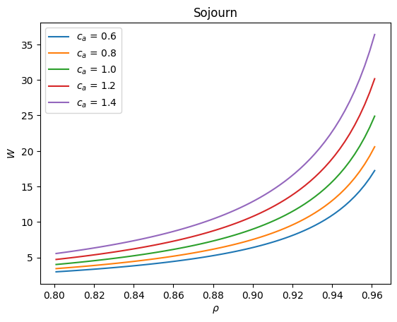
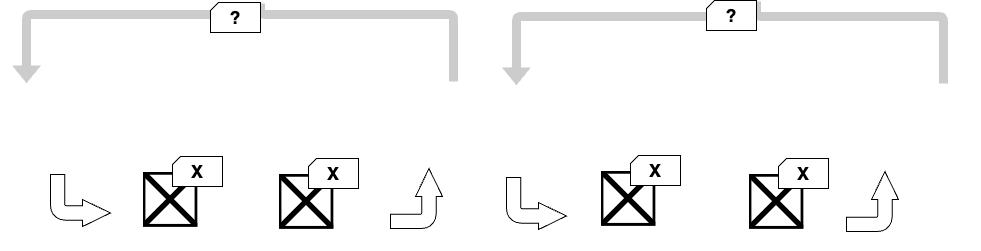
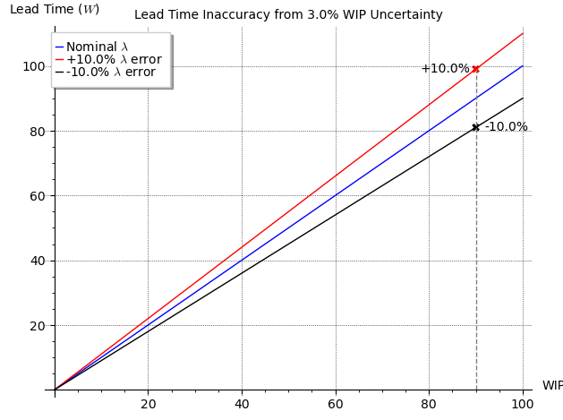

{{ draftMark }}

Pull systems in operations are nothing new. Toyota pioneered them in their renowned *Toyota Production System*[@onoToyotaProductionSystem1988] decades ago. A quick search in google for *pull systems*, *lean manufacturing*, *waveless operations* or similar prompts render a wealth of references. Technical books like Hopp & Spearman's excellent text[@hoppFactoryPhysics2011] provide in depth insights on the behavior of these systems, even the new AI Assistants like Google's Gemini know about the differences between Pull and Push systems when asked the right question:

> *\[\[Push operations produce based on forecasts, while pull waits for actual demand. Push keeps buffer stock,
> pull uses just-in-time inventory. Choose push for stable demand, pull for flexibility and lower costs.\]\]*

Despite all this information and knowledge, whole industries like warehousing or supply chain management are still trying to adopt them and even in manufacturing planning, the dominant ERP systems still cling to *Top-Down*, *Plan-and-assign* paradigms that characterize push systems.

## The nature of operations systems

Push and Pull policies aim to manage the performance of discrete item processing networks, a simplified view, but still very useful to reason about these systems includes:

1. Demand is received from an external source, typically in the form of orders to deliver a product or set of products by certain time. Orders arrive over time. In the technical lingo, *inter-arrival time* is the time elapsed between two consecutive orders arriving.
2. An *order release policy* selects the demand to be worked on and in which sequence.
3. Orders are processed by the system, consuming resources and taking up *processing time* until they are completed and delivered. To do this, the system must assign resources and capabilities (materials, labor, machine time, ...) to prepare the order.
4. Processing of an order may be successful, or may result in a failure to meet the product requirements. The ratio of successful completions over a period of time is called the *yield* of the operation.

This very simple view is surprisingly powerful to gain insight into a broad range of operations. A coffee shop as an example, receives orders as customers walk in, processes them with a First-In-First-Out policy by the cashier and then the barista, and delivers the finished orders to the customer waiting to pick them up. Complex supply chains with multiple companies can also be analyzed in this way for an aggregate view of their operation.

These systems have been thoroughly studied by the Operations Research and Management Science community, In a first approximation, their performance is characterized by three magnitudes related through two statistical relationships.

At the risk of getting too technical, it is worth delving into these, as they will be critical to understand the difference in behavior between pull and push systems.

- The *throughput* (symbolized by $\lambda$) is the quantity of *value* (units, orders, money, ...) that the system generates per unit of time.
- The *cycle time*, also called *sojourn* or *lead time* (symbolized by $W$) is the amount of time that the system takes to produce a unit of value.
- The *Work In Progress* (symbolized by $L$) is the amount of *value* (units, jobs, orders, ...) that is being processed by the system at a point in time.

These concepts are familiar to anybody with a management accounting background with concepts like like *Inventory Turns*, "Payable days" and similar.

Little's Law[@karlsigmanNotesLittleLaw2009] expresses a very strong relationship among these three quantities:

$$
L = \lambda W
$$

stating that, for a stable system:

> Over a long enough time period, the average of WIP is the product of throughput times cycle time

Little's law is a well-behaved linear relationship between throughput and cycle time for a give level of work in progress.

The second relationship is not nearly as rigorous as Little's law. Different system configurations or policies (e.g. FIFO, LIFO order releases, etc...) yield different specific values, many times without a known analytical expression, having to resort to Montecarlo simulations to obtain them. Yet, for most real-life systems, it is safe to say that their behavior follows a curve of the form:

$$
\begin{array}{}
W = K \frac{1}{1-\rho}
\end{array}
$$

That relates the long term average of cycle times with the long term average of utilization ($\rho$) and is proportional to a measure of the combined variability in demand and intrinsically present in the system operation ($K$). Utilization is equivalent to the throughput of the system ($\lambda$) normalized against the maximum potential throughput that the system can produce (symbolized by $\mu$, i.e. $\rho = \lambda / \mu$).

This relationship shows that cycle time grows unbound as the throughput of the system approaches the maximum that a system can achieve.

{: width=67%}

## Traditional Operations Planning

Traditional operations planning and execution, as implemented by MRP and ERP systems, is, in essence a three-step process:

1. Collect all the information on the demand to fulfill, the resources available and the processing instructions (e.g. process sheets, BOM's, etc.) for the required products.
2. Create an optimized production schedule containing the required tasks to be performed and the assignment of those tasks to resources and times.
3. Release the production schedule to the shop for execution of the assigned tasks.

The optimization of the plan can usually be expressed as:

> *Minimize the cost of the operation processing a given set of orders while complying with all the order demand conditions (including delivery times and quality)*

This formulation leads naturally to batching orders together to accommodate transportation constraints, minimize or eliminate set up times, tool changes, re-calibrations, etc., as well as stocking enough resources to complete at least one batch. This is the familiar solution adopted by how traditional MRP systems.

The core problem with this approach is hidden in the definition of the problem statement itself. It makes a number of assumptions that that end up creating a number of problems:

1. Demand is considered considered independent and unaffected by the characteristics of the operation. In reality, operations that deliver orders earlier will see their demand grow as the market realizes their advantage.
2. *A set of orders* is known to optimize against. In most real operations, demand will be composed of a number of *firm orders* mixed with a *demand forecast* that may have different levels of certainty depending on the industry, product mix, etc.
3. The condition and availability of resources is known and relatively stable from the time planning starts until the set of orders is complete. Provisioning for rush orders, disruptions, order cancellations, re-work etc. is done outside the planning process by using safety stocks, reserved capacity, etc. that degrade the performance of the *optimal* solution as a whole.
4. The processing capacities and processing times of the operation are also well known and stable over time. Note that this is a particularly tricky assumption, as processing capacity of any process is really difficult to assess in real-live conditions, yet it is an essential input to MRP systems.
5. The *yield* or quality of the operation is independent of the size of the batch or how much work in progress there is at any point in time.
6. Ramp-up and Wind-down of activities for a batch are short and do not represent a significant portion of the time resources are dedicated to a batch of orders, or alternatively two batches can overlap during these periods without significant impact to the operation.

Running an MRP style plan results in a well optimized solution for the conditions and assumptions on which the plan is based. It is well known that MRP systems suffer from *Nervousness*[@wikipediacontributorsMaterial_requirements_planning2024], meaning that small changes to the input conditions produce large changes in the resulting plan. Or to rephrase it differently, the resulting plan is very fragile in the presence of changes to its conditions.

The bogey man hiding behind these problems is that MRP plans do not handle well the effects of variability on the performance of the system, or as Hopp & Spearman call it out, *The Corrupting Influence of Variability*[@hoppFactoryPhysics2011]. The *Plan-and-assign* approach for tasks is inherently problematic in the presence of variability because of its lack of real-time feedback mechanisms to adjust tasks and assignments to the conditions on the shop floor and variability of demand.

The plans, by their very goal to minimize the cost to fulfill demand, will drive the system to operate with as high utilization as possible. Otherwise, resources would be wasted. In this situation, any deviation from the conditions of the optimization problem will result in big swings in the performance of the operation. In the simplest possible system (an M/M/1 queue[@Queue2023]), when working at 95% of its capacity, a $\pm 3\%$ deviation results in an uncertainty of ***average*** cycle time $-25.7\% \to +52.7\%$, making the system performance in essence unpredictable.

This problem is further compounded by the fact that businesses cannot make commitments to their customers based on their *average* cycle time, or they would not be meeting them most of the time, they need to make commitments on an expectation of 90-95% cycle time. The corresponding  

{: width=67%}

Two further effects compound this problem. The example above is for the very simple *M/M/1* queue which has a variability constant $K=1.0$. If this constant changes, cycle times will further change (**NOTE TO UPDATE SYMBOLS TO MATCH REST OF ARTICLE) as illustrated by another simplified system (The G/G/1 queue[@Queue2023a]:

{: width=67%}

When the variability can be mitigated, as it used to be the case with predictable production schedules and cycle time commitments where not demanding, traditional systems managed to produce and implement their production plans effectively. In the current environment where order delivery times are a competitive advantage and flexibility in the marketplace is an asset, these systems are increasingly challenged to support competitive companies.

## The Pull Revolution

Toyota's production system was developed in the late 1940s and early 1950s by Taiichi Ohno and Eiji Toyoda and rolled out at scale in Toyota at the beginning of the 1960s. It became known to other manufacturers in the late 1970s and it is now recognized as the leading approach to organize operations across many industries. Toyota's system contains many interlocking practices that reinforce each other. The one most relevant to our discussion is the introduction of the *Kanban* (*Card* in Japanese) system to control when production tasks are initiated, in contrast with the prescribed *schedule* of tasks that MRP systems generate.

The core concept of the *Kanban* system is that a processing station will only become active and produce its deliverables when presented with a *demand card* or *Kanban* by a downstream station that requires them. The number of cards in circulation for a particular item is fixed in the system during normal operation, only changed when the company wants to change its production mix, capacity or plant layout.

Cards are attached to the Work In Progress inventory when it is produced and detached when consumed. They are then *sent back* as requests for more items when they are needed by the consuming station. For the last station in the Kanban loop the *request cards* are provided by the order release process, also subject to a predetermined maximum number of cards in circulation. The common Kanban implementation uses cards between any two stations in a production process. Other variations, like CONWIP[@hoppFactoryPhysics2011] use a global number of cards for an end-to-end process or *loop*.

The kanban system differs from traditional planning in two critical ways:

1. It uses the amount of "Work In Progress", represented by the number of cards in the system as the primary control variable, while traditional planning, with its emphasis in setting the tasks schedule, defacto uses throughput as its control variable.
2. Work only starts when a card is presented to a station, and this depends on the real-time status of work downstream. Kanban relies on this *signalling* mechanism to determine the final schedule of tasks, again in contrast with the traditional push approach that "pushes" the start of tasks on the shop floor based on a pre-computed ideal schedule.

The effects of these two differences are dramatic on the real world performance of the system. By adapting the start times of tasks based on the downstream status of the shop floor and demand, the composite variability of processing times across multiple stations is greatly reduced, moving the operating curve or the system to the lower variability ones in the previous figure.

Using the amount of Work in progress as the control variable moves the system from the volatility of a hyperbolic curve (as shown above) to a linear relationship dictated by Little's law.

{: width=67%}

## Performance Comparison between Push and Pull

TO-DO create a simulation of a simple tandem system and show differences.

`Q: Eliminate if it takes too long...`

## What is holding back adoption

With decades since the principles of Kanban and pull systems came out of Toyota and countless books, courses and academic papers available, the adoption of these principles is still, with notable exceptions, constrained to large companies and production facilities. Implementation depends on being able to afford the expertise, in-house systems and proprietary software development to support their implementation. Despite marketing claims, the large ERP vendors are still largely bound to MRP methodologies. In the logistics and warehousing industry, the term that has been adopted for pull systems is *Waveless Fulfillment* and, except for industry leaders like Amazon and Walmart, very few other operations use these methodologies and very few systems vendors have a mainstream offering that supports them. Looking at supply chains and intercompany operations, the situation is still worse. Supply Chain Management Systems still rely on the "Plan and Command" paradigm to determine inventory levels, placement, etc... as described in [this previous article](https://jmpicnic.github.io/obsidian-docs/Projects/scac-technology/erps-cannot-handle-supply-chains/)[@miguelpnillaERPsCannotHandle],

There are several reasons for this ...

`MORE TO COME...`

