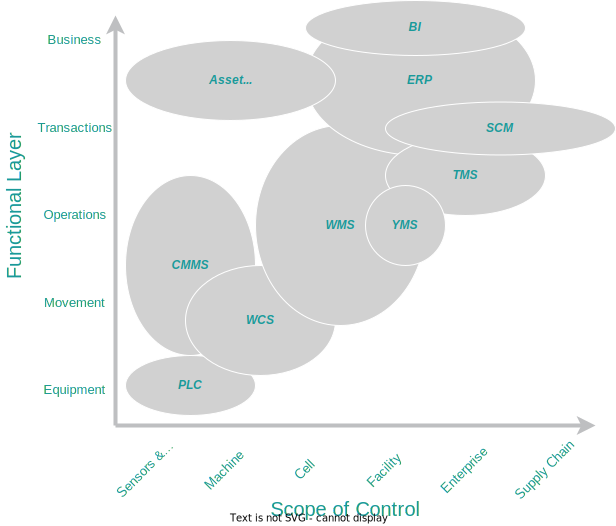
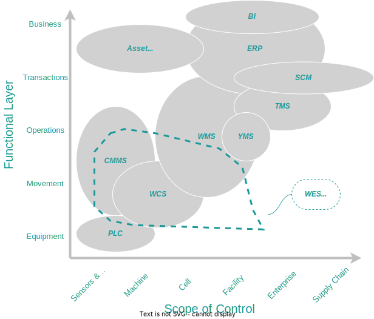

The *Supply Chain Management* expression hides a dizzying number of business processes, disciplines, technologies, tools and skills ranging from hard-engineering disciplines like real time control systems, robotics, etc.. to core business functions like procurement or sourcing that are at the intersection of the physical and information worlds. Supply chains, by their very nature, always involve multiple independent parties working together. Suppliers, Providers, Carriers, Insurers, Brokers, etc... all need to coordinate to make supply chains work. The information systems that support all these activities also reflect all this complexity with an overwhelming alphabet soup of systems like WCS, WMS, TMS, SCM, ERP, ...

A way to organize this is to look at Supply Chain activities based on the [*Functionality* they manage](../02_supply-chain-information-structure/Overview.md) and at the *Scope* they cover, from single devices (sensors, actuators) to complete supply chains. The levels of functionality to consider are:

- **Equipment**: The physical resources that support Supply Chain Activities
- **Movement**: The isolated actions performed by machines or operators
- **Operations**: Workflows of Movements that result in a well defined state of the system (e.g. Shipping, Counting, ...)
- **Transactions**: Commercial activities of a company or between parties in the supply chain
- **Business**: The overall performance of companies and their interrelationships that frame the transactions they engage on.

And with respect to scopes, supply chain elements can be described in terms of:

- **Devices**: Sensors, actuators and controllers that are the basic construction blocks for interactions between the system and the environment.
- **Machines**: A self-contained mechanism that perform a distinct activity (e.g. Package Sealing) in response to tasks/commands assigned to it.
- **Cell**: A Set of machines that are integrated together to perform a complex set of tasks. For example a storage unit with multiple cranes, conveyors and other ancillary equipment.
- **Facility**: A discrete node in the supply chain that processes the flow of goods through it, receiving them, storing them and shipping them as needed.
- **Enterprise**: The set of facilities and other assets that a company controls in their operations.
- **Supply Chain**: The resources that multiple companies put together to execute supply chain process from origin to destination.

With this double classifications, the picture of activities and systems that support supply chains becomes much clearer, or at least somewhat understandable to navigate the sea of acronyms for systems that vendors promote to support supply chain activities:

{width=75%}

## The systems that support Supply Chains

The letter soup of systems in the diagram is not complete, only highlighting the most common ones:

- **PLC:** *Programmable Logic Controllers* are industrial computing platforms that provide essential real time services for developing equipment control and monitoring logic like safety protocols, reliable communications, environmental ruggedized enclosures, ...
- **WCS:**: *Warehouse Control Systems* provide task execution and coordination across multiple machines or operators with specialized adaptors to their technologies (e.g. Pick-To-Light drivers, RF terminals, ...)
- **CMMS:**: *Computerize Maintenance Management Systems* are specialized software applications that centralize maintenance information and facilitates the processes of maintenance operations.
- **WMS:**: *Warehouse Management Systems* manage the inventory and flow of goods in warehouses including order input, EDI integrations, shipping planning, etc... They are frequently deployed together with one or multiple WCS that handle the detailed execution of the plans and activities.
- **YMS:**: *Yard Management Systems* are another specialized software system to manage and control the traffic of trucks, containers and trailers in the yards that are usually associated with a warehouse.
- **TMS:**: *Transportation Management Systems* Plan and monitor the routes and trips that transportation resources (trucks, trains, ships, ...) perform when moving goods between facilities.
- **SCM:**: *Supply Chain Management* systems have been deployed as a planning and control layer that integrates with the ERP, TMS and WMS and provides coordination and planning among them.
- **ERP:**: The main software that supports most business operations in a company. Originated in *MRP* systems, it is now built around a Financial and accounting core with specialized functionality for manufacturing planning and other functional areas.
- **Asset Management:**: *Asset Management* systems are specialized software to identify, track and manage permanent and semi-permanent assets of a company. In many cases they are part of either the *CMMS* or the *ERP*
- **BI:**: *Business Intelligence* systems designate a broad array of technologies to collect and present information regarding company operations to decision makers. They started as a *Reporting Database* extension to ERP's and evolved to Data Warehouses, Data Lakes, Report Portals and lately incorporate Machine Learning and AI models to extract information and make sense of it.

This is a very fragmented industry. Fragmentation partially explains why it is so hard to build well coordinated supply chains even at this time of cloud systems, networks and ubiquity of devices and computing power. Clearly this state of things is not because of malice or incompetence from vendors or practitioners but the result of over four decades of technology evolution that started under very different conditions and goals. The environment in which these systems were developed was populated by companies that where much more integrated and under single control. They collaborated on the time scale of weeks or months, mostly domestic supply chains and whose *problems to solve* were mostly within their own internal processes. At around the same time that these systems were defined, modern automation technologies were emerging and the *best practices* for how to deploy them and what capabilities they had were not yet fully understood. Finally, unlike in manufacturing when Toyota introduced their [lean manufacturing practices](https://www.amazon.com/Machine-That-Changed-World-Revolutionizing/dp/0743299795), the pressure to reduce inventories and support Just-in-time delivery was not strongly felt in distribution and fulfillment networks.

In the last ten to twenty years, supply chains have seen the emergence of consumer e-commerce in the style of [Strategic Networks](https://www.amazon.com/Strategic-Networks-J-Carlos-Jarillo/dp/1138156590), the extension of JIT practices to the edges of B2B supply networks, a massive shift away from vertically integrated enterprises to networked companies and the extension of supply chains across the globe. A radical consequence of this transformation in supply chains is a switch from batch oriented operations, where the main goal is to reduce the handling cost, to a relentless focus on customer service times where the main performance metric is the lead time SLA and predictability.

The impact of these changes in supply chain information systems is that traditional planning and execution time frames are orders of magnitude too long and planning results are useless by the time they are ready to execute. Information systems designed for this new environment need to use near-real-time information and decisions that covers all companies involved in the chain, not single companies one at a time.

## The Challenges of Traditional Supply Chain Systems

The difficulties that companies are experiencing to adapt to this new world stem from the way traditional systems work, as they were designed for a world where there is ample time to plan and execution conditions change slowly.

Traditional systems operate on a top-down *Plan and Command* style with little bottoms-up feedback to adapt the plans to changing conditions.

```plantuml
scale 300 height
!include Projects/scac-technology/scac-system-fragmentation/assets/mrp-planning-stack.puml
```

In *Plan and Command* operation, the first step collects the *Orders* to fulfill and supplements them with additional requirements from a forecast to create an expected Demand. With the sanctioned demand, the system then performs [Rough-Cut Capacity Planning](https://docs.oracle.com/cd/A60725_05/html/comnls/us/crp/rccp.htm) to create a tentative schedule of operations (The [Master Production Schedule](https://en.wikipedia.org/wiki/Master_production_schedule)). From this schedule, the system will select a batch of demand to be released to the floor. Resources are then assigned to the fulfillment of the different orders or their components and concrete tasks are planned for those resources. The result of this planning stack is then released to the shop floor for execution.

This process is very successful in optimizing operations in environments where the uncertainty of demand and execution were relatively low for the given planning horizon, but it breaks down when either demand or task execution encounter variability within the planned scope. Without going into too much detail, we can identify the key reasons for the break down:

- To effectively optimize, the planner needs to be given a large enough pool of demand, which implies longer planning horizons. This forces the planner to rely more on forecasted demand than on actual orders, with the ensuing variability degrading the quality of the plan.
- Longer planning horizons may also result on long lead times for orders depending on how the optimizer works. Putting stricter constraints on order fulfillment times reduces the quality of the optimization.
- Processing demand in batches introduces an additional batch delay in fulfillment. Newly arriving orders may need to wait until the next run of the planner (next batch), or be expedited outside of the plan leading to inefficiencies and other problems
- Resource capacity, a key input to the process is notoriously hard to estimate which results either in wasted resources or unforeseen queuing delays.
- Tasks are planned according to a state of the operation that may be out of date due to equipment failures, labor availability or other reasons that are outside of the data provided to the planner. The resulting plans will necessarily be incorrect to some degree.

These are all significant shortcomings of this paradigm in the presence of uncertainty. Yet, the main challenge is the difficulty to accept feedback from the floor or changes to demand after the plan has been produced. Any changes to the environment result in degradation of the operation and emergencies for the execution team and systems or will require re-planning and a disruption of operations in progress.

## The Path Forward: Horizontal Signalling to replace Vertical Planning

To support Supply Chain operations in the current environment with short delivery times and high uncertainty companies have been busy at work adapting concepts from lean manufacturing and [pull systems](https://www.lean.org/lexicon-terms/pull-production/) pioneered by Toyota. In a pure pull system, the tasks that a resource on the shop floor performs are not fully determined by a global plan, but rather by *demand signals* that originate downstream in the fulfillment chain, following the philosophy of [Kanban](https://en.wikipedia.org/wiki/Kanban) manufacturing.


Each processing resource has an associated local controller that manages it. This controller receives demand signals from downstream operations and decides how they will be fulfilled by controlling the resources assigned to it and relaying derived demand signals upstream to its own suppliers, eventually drawing from inventory or a source producer.

At the boundary of these systems, orders are received, collated and released as demand for the first node in the network by an order management system.

All local controllers and the order management system receive information on the state of their resources or congestion signals from the network to inform their decisions.

This local controller approach has the advantage to be adaptable to control a single machine or group of operators in a warehouse as well as scale up to complete supply chains where the *nodes* and resources are distribution centers or warehouses.

The technology and architecture of the systems needed to support this shift in paradigm are very different that what is currently available from vendors. In contrast to the fragmentation shown in the figure above, we foresee an evolution of the industry towards horizontal layers following the  [Information Structure of Supply Chains](../02_supply-chain-information-structure/Overview.md). Some of this evolution is already happening with the emergence of Warehouse Execution Systems (WES) that cover the movement and operations layers across complete facilities, displacing legacy WCS and WMS in the process.

{width=75%}

The fastest evolution of these systems is happening as internal developments of Supply Chain leaders like Walmart and Amazon which implemented waveless fulfillment almost 15 years ago as described in by [Bishop and Todd](https://dspace.mit.edu/handle/1721.1/63083) already in 2010. The software systems that underlie these capabilities have, for the most part, remained proprietary and locked within corporate walls, with only some vendors able to offer commercial systems.

Apart from corporate secrecy, there are non trivial barriers to the development of commercial solutions that arise from the increased needs of information sharing between the distributed controllers. For integrated supply chain operators, communication between nodes is easier because those nodes participate in the same corporate network and there are no restrictions on sharing private/public information of their operations. Multi-Enterprise networks need to solve communication at three levels:

1. Network connectivity: The ubiquity of the internet and cloud computing has made this achievable for most companies, as closed networks and VPN's can be easily interconnected, but it is still a challenge to do so securely.
2. Standardization of data exchange protocols: EDI is still the prevalent data format to exchange supply chain information. This is a protocol that dates back to the 1970's with a lot of drawbacks when compared to modern REST or even SOAP protocols. Some organizations like the [Digital Container Shipping Association](https://dcsa.org/) are advancing in the definition of more modern API's, but they are still far from widespread adoption.
3. Private/Public Information: To effectively coordinate a distributed network, nodes need to share information that some companies may consider private like congestion levels, capacities, lead times, etc. It is not clear at this point how to overcome these barriers, although application of [Market-Based Controls](https://www.amazon.com/Market-Based-Control-Paradigm-Distributed-Allocation/dp/9810222548) ideas may point to the way forward.

  Closely related to the Private/Public information challenge is how to assess or guarantee the quality and trustfulness of the data exchanged between nodes. In today's supply chains, even public information like the location of physical assets has contradictory information depending on the data source. The protocols that eventually get adopted need to support ways to assess the reliability of the information exchanged, either through a central trusted authority or using distributed systems like blockchain.

The widespread accessibility and acceptance of cloud systems, microservices architectures, integrated real-time automation modules for distribution nodes like those provided by [Autostore](https://www.autostoresystem.com/) and more flexible interfaces, sometimes powered by AI models that are able to interpret human-centric documents are opening the way to enable this interconnectivity and the evolution of legacy systems to integrate in this interconnected world.

## Conclusion

Managing supply chains is challenging because of the breadth of disciplines it touches and the large number of components, actors and processes involved in its operations.

The current supply chain software systems landscape is the product of decades of evolution. It is very fragmented and it is very hard to adapt them to the emerging needs of ever shorter fulfillment times and supply chains that span multiple continents, jurisdictions and companies.

The *Plan-and-Command* paradigm that has served the industry in the past is not adequate to address these challenges and a new conception of supply chains as distributed systems with autonomous agents that communicate horizontally is needed.

Although some proprietary solutions seems to be operating in closed environments, the industry still needs to resolve matter of protocols, data formats and information sharing to make adopt the new paradigm at scale.

These topics and challenges are difficult by themselves and merit deeper discussion that what this article and some follow up articles will dig deeper into them.