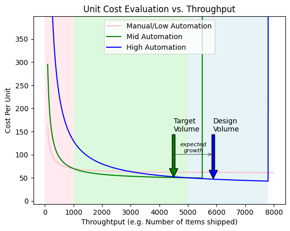
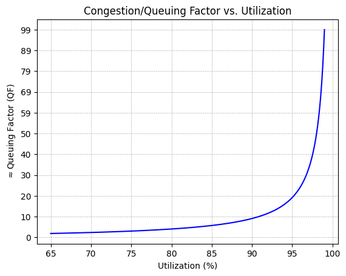
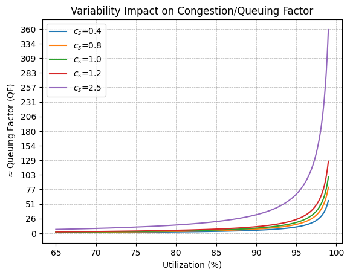

{{ draftMark }}

The last 10 years have seen unprecedented investment levels in supply chain and distribution capabilities. Giants in distribution and logistics have poured prodigious amounts of capital to compete in the race to support e-commerce fulfillment. As examples of this effort [Amazon](https://finbox.com/BIT:AMZN/explorer/capex/), [Walmart](https://finbox.com/NYSE:WMT/explorer/capex) and [UPS](https://finbox.com/NYSE:UPS/explorer/capex) alone total around $300 Billion dollars in capital expenditures over the last 5 years, which although not all of them are dedicated to their supply chain, a substantial portion is.

Customer expectations in e-commerce can be summarized in two sound bites that we have used in the past. *The Tyranny of Now* and *The Infinite Shelf* reflecting the value that customers put on ever shortening *click-to-door* times and the availability of any product one can ever look for, while at the same time having zero tolerance for mis-shipped goods.

The *Tyranny of Now* and *Infinite Shelf* demands from customers affect not only the fulfillment centers as the last stage of distribution chains, but is increasingly felt by upstream nodes in distribution, wholesale and origin facilities as the overall *product-to-market* time shrinks and the variety of products offered by each provider grows.

This pressure is qualitatively altering the way supply chain operations are designed and measured. Traditionally *Throughput* of a facility and its *Cost per shipped unit* where the main performance metrics for logistics operations. In the new conditions, the metrics to optimize are order lead time and fulfillment accuracy or yield. The ROI calculations were almost exclusively based on reducing the Operational Cost or increasing the volume for a given cost or capital investment (e.g. in buildings). Now the calculation is much more complicated because the returns are derived from estimates of customer retention or satisfaction based on proxy operational metrics of SLA or accuracy.

For modern logistics nodes the calculation of the return on automation investments varies from case to case and the first step is to decide what business goals the investment is attempting to achieve. These business goals fall into a few broad categories:

- Increased Productivity either as cost reduction or as an increase of output for the same facility and cost levels.
- Increase or protect the revenue stream by increasing the accuracy and speed of shipments, or increasing the variety of products that a facility can handle.
- Improve the operational capabilities in resilience, reliability, security, shrinkage reduction, etc.
- Maintain or achieve compliance against industry specific regulations at an acceptable cost (e.g. Pharma, cold-chain, etc.)
- Some other specific goals that sometimes are not explicitly discussed by decision making executives like reducing dependencies on specific suppliers, service or transportation providers, unions, ...

## Reducing Cost

This category has been widely taught in business schools and multiple books on warehouse or supply chain design, nevertheless it is useful to highlight some points that may be glossed over on a first pass.

A successful investment in automation will reduce operational costs. The investment will also shift the cost structure of the operation and consequently on its risk profile.

A complete cost calculation for an operation will take into account variable and fixed operational costs as well as depreciation and capital costs.

$$
C_T = C_v + C_f + C_d + C_c
$$

With the variable cost in turn being an estimate of Unit Cost times the expected volume $C_v = c_u \hat{V}$.

An Automation project will generally:

1. Decrease the unit cost $c_u$, typically by a reduction of the direct labor required to ship all the items in an order.
2. Increase the fixed operational cost $C_f$ as the cost of maintaining and running the automation equipment increases with maintenance staff, software licenses or subscriptions, etc which are mostly independent of the actual throughput or utilization of the facility.
3. Add depreciation costs for the investment
4. Increase the capital cost either through obvious financial cost if debt needs to be used, or the harder to estimate opportunity cost.

The result is a non-trivial shift from variable costs that can be easily adjusted to varying volume requirements (e.g. seasonal, promotions, etc.) to costs that are much more difficult or even impossible to adjust. This problem is compounded by the way cost allocation is usually done, which ends up hiding these effects or at a minimum delaying information to decision makers.

When using the generally accepted [Absorption Costing](https://www.investopedia.com/terms/a/absorptioncosting.asp) a *per unit* cost $c_a$ is computed based on the expected volume $\hat{V}$ for the facility or operation:

$$
c_a = \frac{C_f+C_d+C_c}{\hat{V}}
$$

and then reformulating the total cost as:

$$
C_T = (c_u + c_a)\hat{V} +C_{abs}
$$

$C_{abs}$ is the *Absorption Cost*. It is an accounting adjustment to capture the over or under allocation of cost when the actual volume is different than the estimated volume. If the difference is small, this adjustment is not material, but in current supply chains with hard to predict volumes and incidences the adjustment may be significant. The problem is not the accuracy of the cost, because at the end of the day, a cost is a cost whether you account for it in one place or another, but the timing when this information is made available to decision makers. Variable costs can be collected and reported almost in real-time, but absorption costs are usually only computed at the end of each accounting period, when it is too late to make any adjustments, even if they were technically feasible.

Aside from the impact in the cost structure, automation systems also have much harder limits on the possible throughput for a given configuration. Increasing the capacity in manual or low automation situations is a matter of adding shifts or hiring additional operators. In more automated facilities increasing capacity beyond the design limits of the system is very difficult.

When deciding the level of investment, we need to take into account the variable and fixed costs of the proposed solution and what is their maximum throughput. It is convenient to render these considerations visually to gain intuition on the decisions to make.

{: width=67%}

In the figure, the pink like represents the cost profile of a manual or low automation, the green line a medium automation solution and the blue one a hight automation solution. The bands of the corresponding colors signal the throughput ranges where each solution is preferred.

The vertical green and blue lines represent the maximum throughput that the automated options have.

Based purely on cost, the decision for the target volume in the example (green arrow) would be a Medium Automation system. Apart from cost we need to consider:

1. What is the uncertainty on the estimation of the target volume including growth projections. If the uncertainty makes it cross the maximum throughput of the selected solution, or even the cost cross-over point with another solution, the actual design volume of the solution needs to be adjusted.
2. What are the limits on Capital expenditures for the project. Even if cost wise a high automation solution might be optimal, the capital availability, or put another way, the risk tolerance to large investments, may not afford it.
3. What is the expected variability of volumes in operation as it may have a big impact on the actual unit costs even if they are hidden by the practice of Absorption Costing. In the graph we see that for a given throughput, a high automation solution has a steeper curve than a medium or low automation option, indicating that it is much more sensitive to variability in volume.

## Increase or Protect Revenue

Customer fulfillment operations are extremely sensitive to customer satisfaction. Customers are always a click away from choosing a competitor if they don't find exactly the product they are looking for, the delivery times are perceived as too long, or the delivered products are incorrect or damaged. These satisfaction drivers are very dependent on the SLA of the facility in terms of *order-to-ship* lead time and order accuracy.

Automation influences *order-to-ship* lead time in three critical ways:

1. It increases the capacity of the facility when compared with manual operations, which for a given order throughput reduces congestion delays.
2. Automated equipment is less variable in its operations than people, reducing the overall variability of the *inventory-to-shipment* processes.
3. Automation and its integration into the order management systems enable *Waveless Fulfillment*. This is also possible in manual warehouses but harder to implement because the reaction times to changes of people is slower than automated equipment and it requires RF or Voice Picking implementations. Paper based warehouses need to operate in *Batch* mode due to the nature of printed pick and pack lists and instructions.

The third effect is very important, but merits a separate article, which will be coming. If you are not afraid of more academic papers, I recommend looking at the seminal paper by [Bishop and Todd from MIT](https://dspace.mit.edu/handle/1721.1/63083)

### Increasing Capacity & Productivity

Congestion and Queuing delays are roughly inversely proportional to the *spare capacity* of a system. That means that lower utilizations result in dramatically emallerThis is strictly true for the idealized [M/M/1 Processing queue](https://en.wikipedia.org/wiki/M/M/1_queue), and it holds directionally for real systems as they tend to have a defined bottleneck point. So the delays due to queuing when compared to the *raw* lead time when the system only needs to handle one order (the queuing factor *QF*) is

$$

QF \approx K \frac{\rho}{1 - \rho}

$$

Which results in a very steep curve at the utilizations that companies usually like to operate facilities (*> 80%*):

{: width=67%}

This means that any variability in utilization will cause big swings in congestion delays.

By using automation to increase the capacity of a facility, we move the utilization operating point to the left and reduce the sensitivity.

### Reducing Variability of fulfillment operations

The curve shown above is drawn for the [M/M/1 Processing queue](https://en.wikipedia.org/wiki/M/M/1_queue) as a simple representative of the overall shape of the utilization/congestion response. A bit more general model, the [G/G/1 Queuer](https://en.wikipedia.org/wiki/G/G/1_queue) can be approximated using [Kingman's Formula](https://en.wikipedia.org/wiki/Kingman%27s_formula):

$$
QF = \frac{\rho}{1-\rho}\left(\frac{c_a^2+c_s^2}{2}\right)
$$

Where $c_a$ and $c_s$ are the variability of order arrival and service (fulfillment) times respectively. The corresponding Congestion/Utilization response curves change with the variability of the fulfillment times:

{: width=67%}

shows that reducing the variability of the fulfillment operations has a dramatic effect on congestion delays, with more pronounced impact at high utilizations. When SLA's are expressed as a 95 or 99 percentile of orders fulfilled in a specific time frame, this impact of service times variability by itself may determine if a facility may achieve it or not.

## Improve Operational Capabilities

Apart from the very direct goals of capacity, productivity and reduced variability, other operational capabilities have a sizable impact on the performance of a facility. We should not be deterred from considering them in the evaluation of investments because they maybe somewhat harder to measure or relate directly to the investment spend.

Shipping accuracy is a critical factor in the customer satisfaction and revenue and even faulty shipments that are caught before they are actually shipped have a very negative effect on the performance of a fulfillment center. The reasons for them include damaged product, inventory shorts, picking errors, incorrect dimensions, etc. Automation facilitates better inventory accuracy, is more consistent in picking operations and, by requiring more precise product data (dimensions) also eliminates errors. Sensor that are incorporated in automation equipment for its operation can also be used as data sources for early detection of problems (e.g. scales, bar code readers, etc...) creating a double benefit that is not directly accounted for in straight capacity or lead time measurements.

Security, Shrinkage and damage to inventory are also greatly improved by reducing the touchpoints between operators and product, which in turn results in better shipment yields.

Finally, the capacity of a well run and maintained automated facility is much more predictable than a manual one. Interruptions or degradation of operations because of absenteeism, strikes or even pandemics as the recent COVID-19 lock downs demonstrated are either avoided or mitigated in automated warehouses. Not only because they require less direct labor, but also because the jobs that are required to run it can sometimes be performed centrally or even remotely which expose workers to fewer hazards and strenuous situations.

## Support Industry Specific Compliance

For certain industries, automation is no longer an optional investment if they want to meet regulatory requirements or do so at a reasonable cost. Industries like pharma that have stringent security, quality and tracking requirements are finding it increasingly difficult to remain compliant without introducing automation. Cold chain distribution is quickly becoming another example of *Functional Automation Requirements* where the justification for the investment is not a quantitative difference in the performance of a facility but a qualitative difference in its processes by reducing the exposure of workers to hostile conditions, minimizing the time outside refrigeration that inventory spends and being able to accurately track expiration dates, temperature profiles and history with handling unit precision, etc.

There are many other examples like hazardous material handling, high value serialized products, etc. each with their specialized requirements.

## Conclusion

Investing in automation projects is an important decision for any company not only because of the size of the investment itself but also because it usually implies significant changes in its internal processes, skills required from its workforce, requirements on their data and information systems and material changes in their cost structures.

Understanding these impacts and quantifying them, even through estimates, should be a given as an input to decision makers. Cost reductions need to be evaluated against the trade-offs in flexibility and need for accurate growth estimates. Modern fulfillment operations have also a role to play in protecting and increasing revenue by supporting customer satisfaction with reduced lead times and increased order accuracy. Automation projects also support other capabilities of supply chains and are indispensable in certain highly regulated industries, all aspects to consider and weight when evaluating the investment.

The application and execution aspects of automation investments are critical to the ultimate results of these projects and we'll address them in follow up articles. If you are interested in these, please subscribe to the [Supply Chain Essentials Newsletter](https://www.linkedin.com/newsletters/7168774727367409664/) where they will be posted.