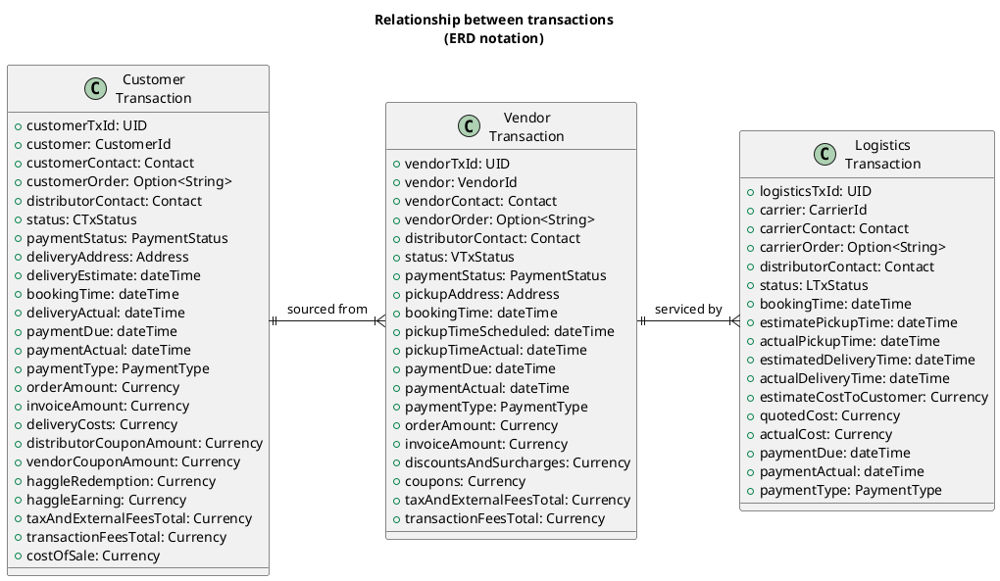

## What is *Just-In-Time Distribution*

*Just-In-Time Wholesale Distribution* is designed to execute commercial and logistics transactions where goods are transferred from an originating vendor to a final customer without intermediate inventory at rest. The End to End transaction is composed of the following elements:

1. Vendor Transaction: The goods are sold by the Vendor to an intermediate entity that owns them until they are delivered to the customer.
2. Customer Transaction: The Customer buys goods from the intermediate entity for delivery on certain terms and conditions.
3. Fulfillment: The Fulfillment entity arranges for the goods to be obtained from the vendor, and without intermediate inventory storage, delivered to the customer. The pick-up an delivery may be executed by additional 3rd parties.

Certain aspects regarding the model may not jump out from the succinct description above follow

### Order of actions/operations in the transactions

The order of operations is not determined and may vary depending on business decisions. A couple of options:

#### Customer Order Driven Sequence

1. The Customer places an order with the Distributor. Payment may happen up-front, through credit, upon delivery, etc. depending on contract terms.
2. The Distributor decides which vendors should provide the goods and places one or multiple orders with them. Similarly, payment depends on contract terms between distributor and vendors.
3. The Distributor dispatches Fulfillment to a logistics entity (which can be a department of the same company or not)
4. Fulfillment entity arranges for pickup from vendors, re-packaging/cross-docking/consolidation if necessary and delivery to customer.
5. Customer takes delivery of goods and the transaction is finalized (with the caveat of potential delayed payment terms)
6. Fulfillment entity provides proof of pickup and delivery to distributor.

#### Forecast Driven Sequence

Note that payments are also subject to terms and conditions as in the first option

1. The Distributor places an order with Vendor for goods that are not yet needed to fulfill a customer order. This may happen, for example if there is a firm forecast of sales, or the Distributor decides to overbuy goods that are requested by another order to achieve better prices from vendors at the risk of not selling the excess in a timely manner.
2. The Vendor commits to the provisioning of the purchased goods on certain terms and conditions.
3. A customer places an order that matches the "pre-purchased" goods.
4. The distributor matches the order and dispatches Fulfillment to a Fulfillment entity.
5. The Fulfillment entity arranges pickup and delivery as in option #1
6. Customer takes delivery of the goods
7. Fulfillment entity provides proof of pickup and delivery to distributor.

#### Recurring Order (Same note about payments as above)

1. A Customer places a recurring order with the Distributor to deliver certain goods over time in multiple deliveries.
2. Distributor creates a schedule of orders with vendors to provide the goods. Distributor may chose to place orders right away (ensuring availability) or "just-in-time" for each delivery.
3. Distributor dispatches each individual delivery to the Fulfillment entity
4. Fulfillment entity arranges for the individual pickup and deliveries as above
5. Customer takes delivery of the goods specified in each individual order
6. Fulfillment entity provides proof of pickup and delivery for each individual order.

### Legal Entities participating in the transaction

Note that in the actions described above, there are potentially multiple entities that play different roles in the transaction. Multiple of these roles may be played by the same legal/commercial entity, but it is not strictly necessary and may vary depending on business decisions and activities. For example, the Distributor as the description above implies is responsible for choreographing the different activities in the transaction, managing the order flow and also it also takes ownership of the goods between the vendor and the customer. Other arrangements may dissociate these roles of market maker (order management), intermediate owner and transaction coordinator to other entities or to the vendor or customer directly.

### Other Ancillary aspects of the transaction

As many other aspects in supply chain management, there are other ancillary aspects of a transaction like track & trace, commercial insurance, inspection, regulatory compliance (e.g. chain of custody for food products), etc. that may need to be taken up by one of the entities participating in the transaction. These are not explicitly addressed in this analysis.

## Underlying Operational Model

For the definition of the performance dashboard, the model adopted is the first one described above with the following transactions and principals.

### Principals

**Customer**
: The entity that buys the goods and takes ownership of them at the end of a Transaction.

**Vendor**
: The entity that sources the goods specified in the transaction.

**Distributor**
: The entity that takes orders from Customers, procures the goods from vendors to fulfill those orders and arranges for the physical transfer of the goods. In the scenario applicable for this dashboard, the Distributor takes legal ownership of the goods for the duration of the transaction.

**Carrier**
: Also referred to as *Logistics Provider* or *Fulfillment Services Provider*, it is the entity that performs the physical movement and handling of goods to fulfill the transaction under the direction and contract of the Distributor.

### Transactions

#### Customer Transaction

Also referred to as *Master Transaction*

1. **Customer Order Booking**: The customer orders goods from the distributor
2. **Fulfillment**: The Distributor arranges for fulfillment of the order, including delivery details (Place, time, ...)
3. **Accrual**: The Customer accepts delivery (fulfillment) or the order, which triggers accrual of revenue in the distributor
4. **Payment**: The Customer pays the Distributor either at time of order or as invoiced by the Distributor. The payment medium may be Credit Card, ACH and others.

#### Vendor Transaction

1. **Vendor Order Dispatch**: The Distributor places an order with the Vendor
2. **Fulfillment**: The Distributor arranges for pickup of the goods from the Vendor.
3. **Accrual**: The Distributor or its agents (see Logistics Transaction below) pick-up the goods from the vendor which triggers accrual of revenue in the vendor and incurring cost by the Distributor.
4. **Payment**: Distributor pays the Vendor according to separately agreed Terms and Conditions.

#### Logistics Transaction

1. **Delivery Order Booking**: Distributor contracts with a Carrier (which can be directly a carrier or a broker of logistics services) the pickup of goods from vendor and delivery to customer, compliant with the Customer and Vendor Transaction Fulfillment arrangements.
2. **Fulfillment**: Carrier performs the pickup, transportation and delivery of the goods
3. **Accrual**: Carrier provides documentary evidence of acceptance by Customer, which triggers revenue accrual by the carrier and incurs cost by the Distributor.
4. **Payment**: Distributor pays the Carrier based on separately agreed Terms and Conditions.

## Transaction Details

!!! warning
    Note that the columns/fields of each transaction are not complete at this time

**Note Current limitations**

- This model does not support Vendor transactions that can be used to fulfill multiple Customer Transactions
- This model does not support Freight Consolidation (One Logistics Transaction) for multiple Vendor or Customer Transactions.
- Each type of transaction will have a lifecycle that needs to record its dates, for now a simplified collection of dates will be specified with a more comprehensive definition to be developed later, including history, etc...
- Although the model formally allows for multiple Logistics Transactions to service a vendor transaction, the calculation of dates and their recording is not fully specified and in current practice, the relationship is 1 to 1.

### Common Fields

`<party>TxId`
: (customerTxId, vendorTxId, logisticsTxId) is a unique identifier in the system for the relevant transaction.

`<party>`
: (customer, vendor, carrier) is the identifier in the system of the relevant party in the transaction.

`<party>Contact`
: (customerContact, vendorContact, carrierContact) The contact information for the person to interact with regarding the transaction at the appropriate party. It may be used for invoicing, exception resolution, etc...

`<party>Order`
: (customerOrder, vendorOrder, logisticsOrder) is an optional external identifier of the order for interaction with the relevant party (customer, vendor or carrier)

`distributorContact`
: The person that acts on behalf of the distributor in the transaction.

`status`
: The state of the lifecycle for the transaction. Specific for each type of transaction, see below for details

`paymentStatus`
: The state of payment regarding the transaction

`bookingTime`
: When the transaction was commercially created.

`paymentDue`
: When the payment for the transaction is due. It may be blank if not yet determined.

`paymentActual`
: When the payment was made. blank if not made yet.

`paymentType`
: The mechanism to be used for payment. Initially it can be one of a set of values like: `CC`, `ACH`, `PO`, ...

`orderAmount`
: The total list price for the goods in the order, agreed between the distributor and the affected party.

`invoiceAmount`
: The total that the buying party (Customer for Customer Transactions, Distributor for Vendor Transactions) is expected to pay after all applicable adjustments are made

`taxAndExternalFeesTotal`
: The money that needs to be collected as part of the transaction to comply with taxes, fees and regulations (e.g Sales Tax, Redemption Values, etc...)

`transactionFeesTotal`
: Any other money amount added to the transaction independent of the goods. E.g. Payment type fees for credit cards

### Customer Transaction Specific fields

`deliveryAddress`
: The location where the goods are to be delivered and the customer will take custody of them.

`deliveryEstimate`
: The date & time when the delivery is expected to be complete (last delivery in the case of multiple logistics transactions). Typically this is the value communicated to the customer for SLA purposes.

`deliveryActual`
: The date & time when the delivery is actually complete. Blank if not delivered yet

`deliveryCosts`
: The costs of transportation and delivery that are communicated to the customer and will be part of the invoice

`distributorCouponAmount`
: The value of coupons that are sponsored by the distributor to be applied against the orderAmount for the benefit of the customer.

`vendorCouponAmount`
: The value of coupons that are sponsored by the vendor (or other third parties like the manufacturer if different than the vendor) of the products contained in the order to be applied against the orderAmount for the benefit of the customer.

`haggleRedemption`
: The value of haggle rewards that are applied against the orderAmount

`haggleEarning`
: The value of haggle rewards earned by the customer as a consequence of placing the order.

`costOfSale`
: Money to be paid to others (e.g. commissions) by the distributor that are associated with the order.

### Vendor Transaction Specific Fields

`pickupAddress`
: The location where the goods are to be picked up from the Vendor

`pickupTimeScheduled`
: The date and time initially agreed between the vendor and the distributor to pick up the goods. To serve as the basis for vendor SLA. In the case of multiple pickups for a vendor order, this is the last one that completes the pickup

`pickupTimeActual`
: The date and time when the goods are actually picked up. In the case of multiple pickups for a vendor order, this is the last one that completes the pickup

`discountsAndSurcharges`
: The value of the discounts and surcharges applied by the Vendor towards the list price for the Distributor

`coupons`
: Value of coupons that will be applied to the final price paid by the Customer for the goods. Pass-through to the Customer Transaction.

### Logistics Transaction Specific Fields

`estimatedDeliveryTime`
: When the carrier estimates the delivery will be made.

`actualDeliveryTime`
: When the carrier actually completes the delivery

`estimatedPickupTime`
: When the carrier expects to pickup the goods from the vendor

`actualPickupTime`
: When the carrier actually picks up the goods from the vendor

`estimateCostToCustomer`
: The cost, as estimated by the Distributor and communicated to the Customer. The sum of `estimateCostToCustomer` for all the logistics transactions involved in a Customer Transaction should add to the `deliveryCosts` of the customer transaction.

`quotedCost`
: The cost of the logistics services in the transaction as quoted by the Carrier (or broker)

`actualCost`
: The actual cost of the logistics services in the transaction.

### Calculation relationships between fields and transactions

!!! note
    For notation, `<Prefix>`.`<FieldName>` means the `FieldName` or the `Prefix` transaction with `C`, `V` and `L` respectively for Customer, Vendor and Logistics Transactions

#### Customer Transaction Balance

$$
\begin{array}{ll}
C.invoiceAmount = & C.orderAmount\\
&+ C.deliveryCosts\\
&+ C.taxAndExternalFeesTotal\\
&+ C.transactionFeesTotal\\
&- C.vendorCouponAMount\\
&- C.distributorCouponAmount\\
&- C.haggleRedemption
\end{array}{}
$$

**Logistics Costs Rollup**
$$
C.deliveryCosts = \sum_{ltx}{L.estimateCostToCustomer}
$$

#### Vendor Transaction Balance

$$
\begin{array}{ll}
V.invoiceAmount =& V.orderAmount \\
&+ V.costAndSurcharges \\
&+ V.taxAndExternalFeesTotal \\
&+ V.transactionFeesTotal \\
&- V.coupon \\
\end{array}{}
$$

#### Pickup and Delivery Dates

$$
\begin{array}{lcl}
C.deliveryEstimate &=& \max_{ltx}{(L.estimateDeliveryTime)} \\
C.deliveryActual &=& \max_{ltx}{(L.actualDeliveryTime)}\\
V.pickupTimeScheduled &= &\max_{ltx}{(L.estimatePickupTime)} \\
V.pickupTimeActual &= &\max_{ltx}{(L.actualPickupTime)}
\end{array}{}
$$

## Dashboards

### Customer Dashboard

!!! warning "TODO"

### Vendor Dashboard

!!! warning "TODO"

### P&L Dashboard

!!! warning "TODO"

### Carrier Dashboard

The following metrics are defined for Carriers:

Volume
: Measuring how much business was done with a carrier or a group of carriers during the period.

- **Booked Shipments**: Count of the number of Logistics Transactions for the carrier in the period based on `bookingTime`.
- **Completed Shipments**: Count of the number of Logistics Transactions for the carries in the period based on the Actual Delivery, if it exists, or the estimated delivery otherwise.
- **Booked Value**: Sum of the Vendor Transaction `orderAmount` for all Vendor Transactions serviced by the Carrier Logistics Transactions in the period base on `bookingTime`
- **Delivered Shipments**: Sum of the Vendor Transaction `orderAmount` for all Vendor transactions serviced by the Carrier Logistics Transactions in the period, based on `actualDeliveryTime` if it exists or `estimateDeliveryTime` otherwise.

Performance
: Measuring how a carrier or a group of carriers perform. Measured over the set of transactions that are delivered in the period based on their `actualDeliveryTime`

- **Delivery Lead Time**: The Average and P90 statistic of the difference between the `estimateDeliveryTime` and the `estimatePickupTime` of the Logistics Transaction. Note that this may need to be sliced based on origin and destination to be representative, based on the zip codes of the vendor pickup address and the customer delivery address, or a normalized "distance" between them.
- **Delivery Lead Time Variance**: The Average and P90 statistic of the value:

$$
\begin{array}{ll}
LTV =& (estimateDeliveryTime - estimatePickupTime) \\
    &- (actualDeliveryTime - actualPickupTime)
\end{array}{}
$$

- **Delivery SLA**: The Average and P90 statistic of the `actualDeliveryTime` minus `estimateDeliveryTime`
- **Pickup SLA**: The Average and P90 statistic of the `actualPickupTime` minus `estimatePickupTime`

Cost
: Measuring the cost performance of a carrier or group of carriers based on their `bookingTime` in the period except where indicated.

- **Total Cost in Period**: The sum of `quotedCost` for all Transactions in the period
- **Cost Deviation in Period**: The Difference between the `Total Cost in Period` and the sum of `actualCost` for all Transactions in period, **based on their `actualDeliveryTime`**, Provided in absolute value (Dollars) and in % of the `Total Cost in Period`
- **Margin Impact**: The sum of `quotedCost` for the Logistics Transactions expressed as a percentage of the `C.orderAmount` of the Customer Transaction they are related to.
- **Estimate Accuracy**: The sum of `quotedCost` for the Logistics Transactions of the Customer Transaction they are related to compared to the `C.deliveryCosts` and expressed as a percent difference.

