{{ draftMark }}

## A Small Markdown File

Text with {--deleted--} suggestion, {++added++} suggestion or {~~replaced~>with this~~}
with additional {==Highlighting==} and {>>some comments<<}

### Plantuml

With a plantuml diagram

```plantuml
@startuml (id=SAMPLE)
skinparam defaultTextAlignment left
!$include_path = %getenv("plantuml.include.path")
title 
= FINDING THE VALUES FOR THE ENVIRONMENT
VERSION:\t\t\t [%version()]
$PROFILE:\t\t [%getenv("PLANTUML_SECURITY_PROFILE")]
$LIMIT_SIZE:\t\t [%getenv("PLANTUML_LIMIT_SIZE")]
$HOME:\t\t\t [%getenv("HOME")]
$PWD:\t\t\t [%getenv("PWD")]
%dirpath:\t\t [%dirpath()]\t\t\t << Should be here.
%filename:\t\t [%filename()] 
!if ($include_path != "")
Include Path is __set__ 
!else
Include Path is __**NOT** set__
!endif
end title 

!$toggle_local = 0

!if ($toggle_local == 1) 
  !$toggle_relative_path = 1
  !if ($toggle_relative_path == 1)
    !include sampleclass.puml
  !else
    !include /Users/jmp/Documents/obsidian-docs/docs/hidden/sampleclass.puml
  !endif

  !$should_be_dirpath = "/Users/jmp/Documents/obsidian-docs/docs/hidden"

  !$toggle_composite = 0
  !if ($toggle_composite == 1) 
    !include $should_be_dirpath/sampleclass2.puml
  !else
    !include /Users/jmp/Documents/obsidian-docs/docs/hidden/sampleclass2.puml
  !endif
!else
  note as N
  = NOT TESTING
  end note
!endif
@enduml
```

## Suggestions

[See Criticmarkup](https://github.com/CriticMarkup/CriticMarkup-toolkit)

An addition: {++ To add this ++}

## Insert a Draw.io file produced with the VS Code plugin

