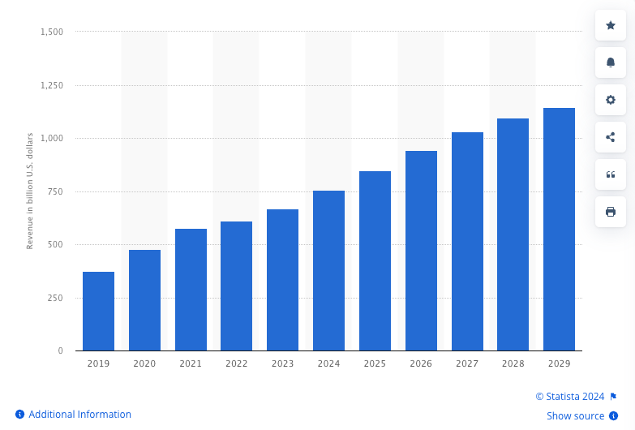
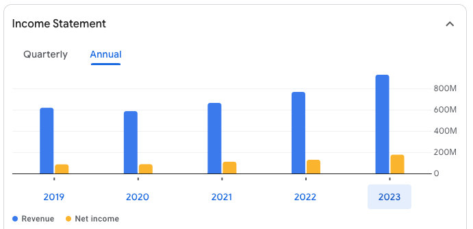

## E-Commerce Sales

[Statista US E-Commerce Revenue](https://www.statista.com/statistics/272391/us-retail-e-commerce-sales-forecast/)

{: width=75%}

## Manhattan Associates as a representative

[Manhattan Associates Financials](https://www.google.com/finance/quote/MANH:NASDAQ?sa=X&ved=2ahUKEwi0pPL-lvKFAxWjIDQIHZrsBZgQ3ecFegQIIRAX)

{: width=75%}

## What is happening?

- Proprietary Systems in FaaS?
- WES masked by automation vendors?
- ???